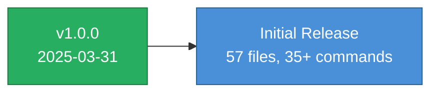

# Changelog

All notable changes to Access to Business will be documented in this file.

## [1.0.0] — 2025-03-31

### Added
- Initial release as `access-to-business` (Pillar 7 of the Access To initiative)
- Rebranded from `skandy` / `mostart` to align with Access To family conventions
- 57 files across 10 reference directories
- 35+ slash commands across 3 command groups
- 11 playbooks covering full startup lifecycle
- 11 template categories with 100+ copy-paste-ready templates
- 6-file pitch generator system (coaching, deck design, copy, one-sheets, toolkit)
- 6-file compliance directory (HIPAA, SOC2, GDPR/CCPA, FERPA, PCI-DSS, security)
- 7-file contracts directory (SaaS, MSA, DPA/NDA, marketing, operational, negotiation)
- 3-file accounting directory (bookkeeping, tax calendar, CPA guide)
- 3-file IP directory (patents, trademarks, trade secrets, copyright)
- State-deployable regional architecture with Missouri as reference implementation
- React intake assessment app (self-contained HTML)
- Eval test set for skill triggering verification
- GitHub repo infrastructure (README, LICENSE, CONTRIBUTING, CHANGELOG)

### Changed (from skandy/mostart)
- Renamed from `skandy` → `access-to-business`
- Generalized Missouri-specific content into `references/regional/missouri.md`
- Added state deployment guide in `references/regional/README.md`
- Updated all command help text to reference Access to Business
- Added Access To family context and cross-pillar references
- Added educational-information disclaimers for legal/financial content
