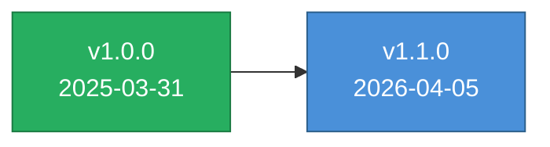

# Changelog

All notable changes to Access to Business will be documented in this file.

## [Unreleased]

### Added
- `CODE_OF_CONDUCT.md` (Contributor Covenant v2.1) — replaces the 3-line stub previously embedded in `CONTRIBUTING.md`
- `README.md` — table of contents, "What's Inside" inventory, FAQ, "Getting Help" section, CI status badge
- `README.md` — third install option (Claude Code CLI) and clarified existing options
- `README.md` — `Interactive Apps` branch in the architecture diagram and a new `Interactive Tools` row in the capabilities table linking the 4 HTML apps
- `GETTING_STARTED.md` — `Interactive Tools` section documenting the 4 browser apps
- `MANIFEST.json` — `evals: 80` and `apps: 4` fields for machine-readable inventory

### Changed
- `README.md` — repository-structure diagram now shows all 12 reference directories (added `advisor`, `decisions`, `integrations`) and lists Missouri, California, and Texas as reference state deployments
- `CLAUDE.md` — eval count corrected from 51 to 80 (matches `evals/eval-set.json`); regional list now includes Texas
- `CONTRIBUTING.md` — Code of Conduct section now links to the standalone file

### Fixed
- Documentation drift: eval count, state deployment list, and reference-directory count are now consistent across `README.md`, `CLAUDE.md`, `MANIFEST.json`, and disk

---

## [1.1.0] — 2026-04-05

### Added
- 10 new playbooks: first-revenue, customer-discovery, pricing-strategy, competitive-intelligence, network-building, ninety-day-sprints, automation, tool-stack, funding-types, time-blocking
- Routing tables in SKILL.md for advisor toolkit (4 files), decision flowcharts (4 files), integrations (3 files), checklists, and glossary
- 17 new eval test cases (atb-026 to atb-042) covering all previously untested content
- 3 additional apps documented in file tree: pitch-timer, runway-calculator, unit-economics-calculator

### Changed
- Split 8 oversized playbooks into progressive-disclosure pairs (main + advanced), bringing most under the 300-line convention
- Updated MANIFEST.json: playbooks 11→21, commands 35→36, added 3 reference directories
- Updated playbooks/README.md with all 21 playbooks in two tables (core + specialized)
- Replaced Missouri-specific content in fundraising.md with generic regional pointer
- Bumped version from 1.0.0 to 1.1.0

---

## [1.0.0] — 2025-03-31

### Added
- Initial release as `access-to-business` (Pillar 7 of the Access To initiative)
- Rebranded from `skandy` / `mostart` to align with Access To family conventions
- 57 files across 10 reference directories
- 35+ slash commands across 3 command groups
- 11 playbooks covering full startup lifecycle
- 11 template categories with 100+ copy-paste-ready templates
- 6-file pitch generator system (coaching, deck design, copy, one-sheets, toolkit)
- 6-file compliance directory (HIPAA, SOC2, GDPR/CCPA, FERPA, PCI-DSS, security)
- 7-file contracts directory (SaaS, MSA, DPA/NDA, marketing, operational, negotiation)
- 3-file accounting directory (bookkeeping, tax calendar, CPA guide)
- 3-file IP directory (patents, trademarks, trade secrets, copyright)
- State-deployable regional architecture with Missouri as reference implementation
- React intake assessment app (self-contained HTML)
- Eval test set for skill triggering verification
- GitHub repo infrastructure (README, LICENSE, CONTRIBUTING, CHANGELOG)

### Changed (from skandy/mostart)
- Renamed from `skandy` → `access-to-business`
- Generalized Missouri-specific content into `references/regional/missouri.md`
- Added state deployment guide in `references/regional/README.md`
- Updated all command help text to reference Access to Business
- Added Access To family context and cross-pillar references
- Added educational-information disclaimers for legal/financial content
