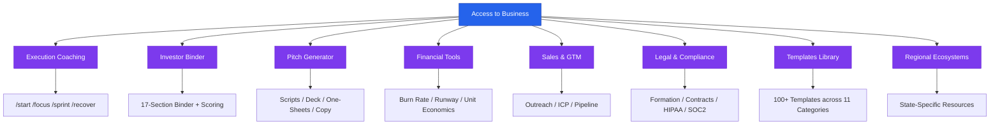
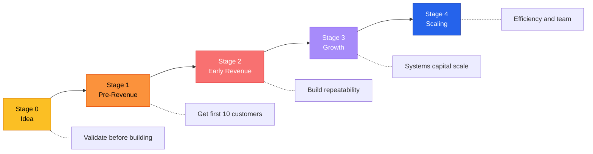
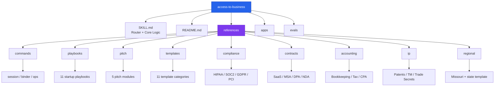

# Access to Business

**AI-powered startup coach, execution engine, pitch generator, and investor binder builder.**

Part of the [Access To](https://github.com/dougdevitre) open-source civic tech initiative.

> [Getting Started Guide](GETTING_STARTED.md) | [Architecture](docs/architecture.md) | [Contributing](CONTRIBUTING.md) | [Changelog](CHANGELOG.md)

---

## What It Does

Access to Business is a Claude AI skill that acts as a hands-on startup coach. It doesn't just advise — it builds with you. Every session ends with something shipped: a draft, a template, a pitch, a metric, a decision.

**For founders at any stage:**
- **Stage 0 (Idea):** Validate before building
- **Stage 1 (Pre-Revenue):** Get your first 10 customers
- **Stage 2 (Early Revenue):** Build repeatability
- **Stage 3 (Growth):** Systems, capital, and scale
- **Stage 4 (Scaling):** Efficiency and team

## Architecture

## Startup Stage Progression

## Repository Structure

## Key Capabilities

| Area | What You Get |
|------|-------------|
| **Execution Coaching** | Slash commands (`/start`, `/focus`, `/sprint`, `/recover`) that keep you moving |
| **Investor Binder** | Full 17-section binder build system with scoring and templates |
| **Pitch Generator** | Verbal pitch scripts, deck design system, one-sheets, marketing copy |
| **Financial Tools** | Burn rate, runway, unit economics, financial model scaffolding |
| **Sales & GTM** | Cold outreach, ICP builder, objection handling, pipeline management |
| **Legal & Compliance** | Entity formation guides, contract templates, HIPAA/SOC2/GDPR frameworks |
| **Templates** | 100+ copy-paste-ready templates across 11 categories |
| **Regional Ecosystems** | State-specific accelerators, grants, legal resources, formation guides |

## Install

### Claude.ai (Recommended)
1. Download the latest `.skill` file from [Releases](https://github.com/dougdevitre/access-to-business/releases)
2. Go to **Claude.ai → Settings → Skills**
3. Upload the `.skill` file

### Manual
1. Clone this repo into your Claude skill directory
2. The `SKILL.md` file will be automatically detected

## Quick Start

Just type one of these to get started:
- `/start` — Full onboarding
- `/help` — See all commands
- `/focus [topic]` — Lock into one task
- `/sprint [topic]` — 60-min deep work session
- `/binder` — Start building your investor binder
- `/pitch` — Draft your pitch

## The Access To Family

| Pillar | Repo | Focus |
|--------|------|-------|
| 1 | [access-to-justice](https://github.com/dougdevitre/access-to-justice) | Legal aid navigation |
| 2 | [access-to-education](https://github.com/dougdevitre/access-to-education) | K-12 standards & educator tools |
| 3 | [access-to-housing](https://github.com/dougdevitre/access-to-housing) | Real estate intelligence |
| 4 | [access-to-services](https://github.com/dougdevitre/access-to-services) | Social services navigation |
| 5 | [access-to-peace](https://github.com/dougdevitre/access-to-peace) | Conflict resolution |
| 6 | [access-to-safety](https://github.com/dougdevitre/access-to-safety) | Domestic violence resources |
| **7** | **access-to-business** | **Startup coaching & execution** |

## State Deployment

This skill is designed for state-level deployment. Missouri is the reference implementation.

To deploy for your state:
1. Copy `references/regional/missouri.md`
2. Replace with your state's ecosystem data
3. Submit a PR

See `references/regional/README.md` for the full guide.

## Contributing

See [CONTRIBUTING.md](CONTRIBUTING.md) for guidelines.

## License

MIT — see [LICENSE](LICENSE) for details.

---

**Built by [Doug DeVitre](https://github.com/dougdevitre) | Part of the Access To Initiative**
