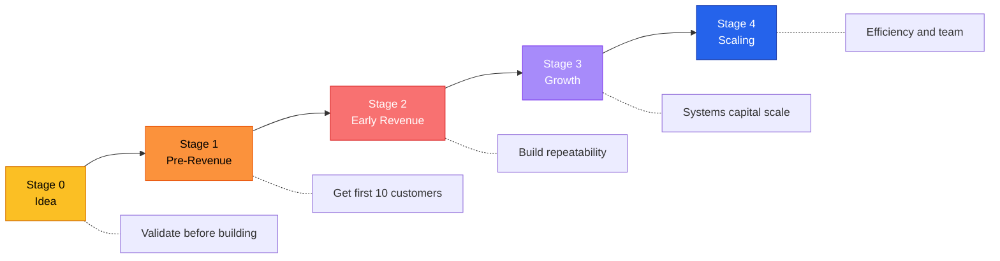

# Access to Business

[](LICENSE)
[](CHANGELOG.md)
[](.github/workflows/validate.yml)
[](https://github.com/dougdevitre)

**AI-powered startup coach, execution engine, pitch generator, and investor binder builder.**

Part of the [Access To](https://github.com/dougdevitre) open-source civic tech initiative.

> [Getting Started](GETTING_STARTED.md) · [Architecture](docs/architecture.md) · [Contributing](CONTRIBUTING.md) · [Changelog](CHANGELOG.md) · [Code of Conduct](CODE_OF_CONDUCT.md)

---

## Contents

- [What It Does](#what-it-does)
- [What's Inside](#whats-inside)
- [Architecture](#architecture)
- [Startup Stage Progression](#startup-stage-progression)
- [Repository Structure](#repository-structure)
- [Key Capabilities](#key-capabilities)
- [Quick Start](#quick-start)
- [Install](#install)
- [Key Commands](#key-commands)
- [The Access To Family](#the-access-to-family)
- [State Deployment](#state-deployment)
- [FAQ](#faq)
- [Contributing](#contributing)
- [Getting Help](#getting-help)
- [License](#license)

---

## What It Does

Access to Business is a Claude AI skill that acts as a hands-on startup coach. It doesn't just advise — it builds with you. Every session ends with something shipped: a draft, a template, a pitch, a metric, a decision.

**For founders at any stage:**
- **Stage 0 (Idea):** Validate before building
- **Stage 1 (Pre-Revenue):** Get your first 10 customers
- **Stage 2 (Early Revenue):** Build repeatability
- **Stage 3 (Growth):** Systems, capital, and scale
- **Stage 4 (Scaling):** Efficiency and team

## What's Inside

- **21 playbooks** — 11 core + 10 specialized, with 8 advanced companions (progressive disclosure)
- **100+ copy-paste templates** across 11 categories
- **36 slash commands** across 3 groups (session / binder / ops)
- **4 interactive browser apps** — intake assessment, pitch timer, runway calculator, unit economics
- **80 eval test cases** covering skill routing and triggering
- **12 reference directories** loaded on demand, not all at once — including playbooks, templates, pitch, compliance, contracts, accounting, IP, advisor toolkit, decision flowcharts, integrations, regional deployments, and commands
- **3 state deployments shipped** — Missouri, California, Texas (and a deployment guide for yours)

## Architecture

```mermaid
graph TD
    A[Access to Business] --> B[Execution Coaching]
    A --> C[Investor Binder]
    A --> D[Pitch Generator]
    A --> E[Financial Tools]
    A --> F[Sales & GTM]
    A --> G[Legal & Compliance]
    A --> H[Templates Library]
    A --> I[Regional Ecosystems]
    A --> J[Interactive Apps]

    B --> B1["/start /focus /sprint /recover"]
    C --> C1[17-Section Binder + Scoring]
    D --> D1[Scripts / Deck / One-Sheets / Copy]
    E --> E1[Burn Rate / Runway / Unit Economics]
    F --> F1[Outreach / ICP / Pipeline]
    G --> G1[Formation / Contracts / HIPAA / SOC2]
    H --> H1[100+ Templates across 11 Categories]
    I --> I1[State-Specific Resources]
    J --> J1[Intake / Pitch Timer / Runway / Unit Econ]

    style A fill:#2563eb,stroke:#1e40af,color:#fff
    style B fill:#7c3aed,stroke:#6d28d9,color:#fff
    style C fill:#7c3aed,stroke:#6d28d9,color:#fff
    style D fill:#7c3aed,stroke:#6d28d9,color:#fff
    style E fill:#7c3aed,stroke:#6d28d9,color:#fff
    style F fill:#7c3aed,stroke:#6d28d9,color:#fff
    style G fill:#7c3aed,stroke:#6d28d9,color:#fff
    style H fill:#7c3aed,stroke:#6d28d9,color:#fff
    style I fill:#7c3aed,stroke:#6d28d9,color:#fff
    style J fill:#7c3aed,stroke:#6d28d9,color:#fff
```



## Startup Stage Progression



## Repository Structure

```mermaid
graph TD
    ROOT[access-to-business] --> SKILL[SKILL.md\nRouter + Core Logic]
    ROOT --> README_F[README.md]
    ROOT --> REF[references]
    ROOT --> APPS[apps]
    ROOT --> EVALS[evals]
    ROOT --> DOCS[docs]

    REF --> CMD[commands]
    REF --> PB[playbooks]
    REF --> PT[pitch]
    REF --> TMP[templates]
    REF --> CMP[compliance]
    REF --> CTR[contracts]
    REF --> ACC[accounting]
    REF --> IP_D[ip]
    REF --> ADV[advisor]
    REF --> DEC[decisions]
    REF --> INT[integrations]
    REF --> RGN[regional]

    CMD --> CMD1[session / binder / ops]
    PB --> PB1[21 startup playbooks]
    PT --> PT1[5 pitch modules]
    TMP --> TMP1[11 template categories]
    CMP --> CMP1[HIPAA / SOC2 / GDPR / PCI]
    CTR --> CTR1[SaaS / MSA / DPA / NDA]
    ACC --> ACC1[Bookkeeping / Tax / CPA]
    IP_D --> IP1[Patents / TM / Trade Secrets]
    ADV --> ADV1[Diagnostics / Portfolio / Session Prep]
    DEC --> DEC1[Raise / Entity / Build vs Buy / Hire]
    INT --> INT1[Stripe / Airtable]
    RGN --> RGN1[Missouri / California / Texas]
    APPS --> APPS1[4 HTML tools]
    EVALS --> EVALS1[80 test cases]

    style ROOT fill:#2563eb,stroke:#1e40af,color:#fff
    style REF fill:#7c3aed,stroke:#6d28d9,color:#fff
```



## Key Capabilities

| Area | What You Get |
|------|-------------|
| **Execution Coaching** | Slash commands (`/start`, `/focus`, `/sprint`, `/recover`) that keep you moving |
| **Investor Binder** | Full 17-section binder build system with scoring and templates |
| **Pitch Generator** | Verbal pitch scripts, deck design system, one-sheets, marketing copy |
| **Financial Tools** | Burn rate, runway, unit economics, financial model scaffolding |
| **Sales & GTM** | Cold outreach, ICP builder, objection handling, pipeline management |
| **Legal & Compliance** | Entity formation guides, contract templates, HIPAA/SOC2/GDPR frameworks |
| **Templates** | 100+ copy-paste-ready templates across 11 categories |
| **Interactive Tools** | 4 self-contained browser apps: [intake](apps/intake-app.html), [pitch timer](apps/pitch-timer.html), [runway calculator](apps/runway-calculator.html), [unit economics](apps/unit-economics-calculator.html) |
| **Regional Ecosystems** | State-specific accelerators, grants, legal resources, formation guides |

## Quick Start

Type `/start` to begin. The skill asks three questions, then routes you into a working mode:

```
You:    /start
Skill:  1. What's your startup or business idea?
        2. Customers or funding — which matters more right now?
        3. How much time do you have?

You:    [answer]
Skill:  → Detects your stage (0–4)
        → Routes to the right playbook + mode
        → Ships one concrete output before you leave
```

See [GETTING_STARTED.md](GETTING_STARTED.md) for a full walkthrough.

## Install

### Option 1: Claude Code (CLI)
1. Clone this repo into your Claude Code skills directory
2. `SKILL.md` is auto-detected as the entrypoint
3. Start a session and type `/start`

### Option 2: Claude.ai (browser)
1. Clone this repo to your machine
2. In **Claude.ai → Settings → Skills**, upload the folder as a custom skill (or zip it and upload)
3. Start a new conversation and type `/start`

_A one-click `.skill` bundle is tracked as a follow-up — see [issue tracker](https://github.com/dougdevitre/access-to-business/issues) for status._

### Option 3: Fork for local development
1. Fork the repo and clone your fork
2. Point your Claude skill directory at the local path
3. Edit freely — CI validates references, counts, and eval IDs on every push

## Key Commands

| Command | What It Does |
|---------|-------------|
| `/start` | Full onboarding — identifies your stage and priorities |
| `/help` | See all available commands |
| `/focus [topic]` | Lock into one task until it's done |
| `/sprint [topic]` | 60-minute deep work session with micro-tasks |
| `/binder` | Build your 17-section investor binder |
| `/pitch` | Draft your verbal pitch, deck, or one-sheet |

Full command reference lives in [`references/commands/`](references/commands/) and is browsable inside the skill with `/help`.

## The Access To Family

| Pillar | Repo | Focus |
|--------|------|-------|
| 1 | [access-to-justice](https://github.com/dougdevitre/access-to-justice) | Legal aid navigation |
| 2 | [access-to-education](https://github.com/dougdevitre/access-to-education) | K-12 standards & educator tools |
| 3 | [access-to-housing](https://github.com/dougdevitre/access-to-housing) | Real estate intelligence |
| 4 | [access-to-services](https://github.com/dougdevitre/access-to-services) | Social services navigation |
| 5 | [access-to-peace](https://github.com/dougdevitre/access-to-peace) | Conflict resolution |
| 6 | [access-to-safety](https://github.com/dougdevitre/access-to-safety) | Domestic violence resources |
| **7** | **access-to-business** | **Startup coaching & execution** |

## State Deployment

This skill is designed for state-level deployment. **Missouri, California, and Texas** ship as reference implementations.

To deploy for your state:
1. Copy [`references/regional/missouri.md`](references/regional/missouri.md) to `references/regional/[your-state].md`
2. Replace with your state's accelerators, grants, legal resources, formation guide, and talent hubs
3. Add your state to the routing table in `SKILL.md`
4. Open a PR titled `Add regional deployment: [State Name]`

Full guide: [`references/regional/README.md`](references/regional/README.md).

## FAQ

**Who is this for?**
Founders at any stage, startup advisors, and ecosystem builders (accelerators, incubators, state programs). Advisor-specific tooling lives in [`references/advisor/`](references/advisor/).

**Do I need a startup yet?**
No. Stage 0 covers idea validation — the skill helps you find out whether the idea is worth building before you start.

**How is this different from prompting Claude directly?**
Structured routing (stage detection → playbook → mode), 100+ ready-to-use templates, decision frameworks, and 80 eval test cases that verify the skill triggers correctly. You get a working system, not a blank prompt.

**Can I deploy it for my state, accelerator, or portfolio?**
Yes. The regional architecture is built for that — see [State Deployment](#state-deployment). Advisors and accelerator operators can layer portfolio-level tooling on top via [`references/advisor/`](references/advisor/).

**Is the legal/compliance/tax content actual advice?**
No — all legal, financial, and compliance content carries an educational-information disclaimer. It's scaffolding, not a substitute for professional counsel.

## Contributing

Contributions welcome — especially state deployments, new templates, eval cases, and glossary terms. See [CONTRIBUTING.md](CONTRIBUTING.md) for the full guide, including "good first issues" for new contributors.

All contributors are expected to follow the [Code of Conduct](CODE_OF_CONDUCT.md).

## Getting Help

- [Open a GitHub Issue](https://github.com/dougdevitre/access-to-business/issues) for bugs or feature requests
- [GitHub Discussions](https://github.com/dougdevitre/access-to-business/discussions) for questions and ideas
- Inside the skill, type `/help` for the full command reference

## License

MIT — see [LICENSE](LICENSE) for details.

---

**Built by [Doug DeVitre](https://github.com/dougdevitre) · Part of the Access To Initiative**
