# Access to Business

**AI-powered startup coach, execution engine, pitch generator, and investor binder builder.**

Part of the [Access To](https://github.com/cotrackpro) open-source civic tech initiative by [CoTrackPro](https://cotrackpro.com).

---

## Overview

Access to Business is a Claude AI skill that acts as a hands-on startup coach. It doesn't just advise — it builds with you. Every session ends with something shipped: a draft, a template, a pitch, a metric, a decision.

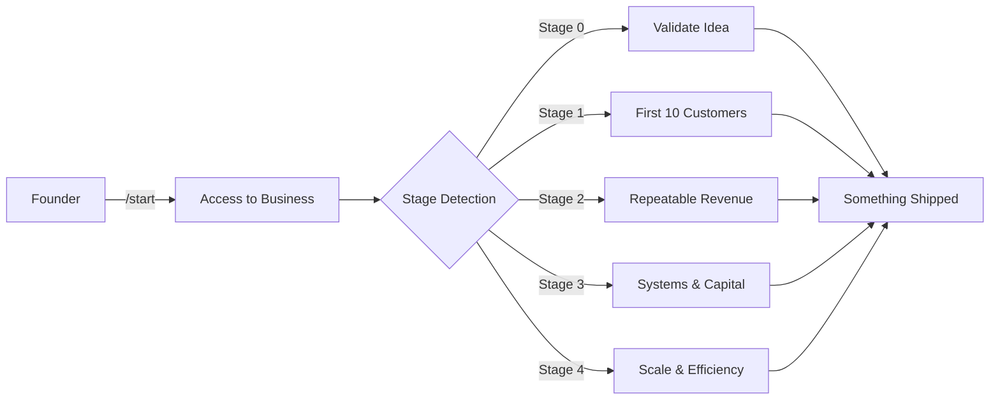

---

## Founder Stage Journey

The skill adapts coaching based on where you are. It detects your stage automatically and routes you to the right playbooks, templates, and commands.

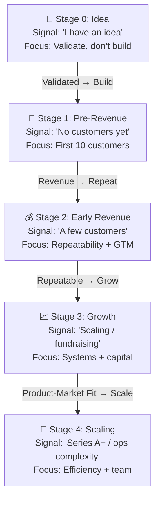

---

## Key Capabilities

| Area | What You Get |
|------|-------------|
| **Execution Coaching** | Slash commands (`/start`, `/focus`, `/sprint`, `/recover`) that keep you moving |
| **Investor Binder** | Full 17-section binder build system with scoring and templates |
| **Pitch Generator** | Verbal pitch scripts, deck design system, one-sheets, marketing copy |
| **Financial Tools** | Burn rate, runway, unit economics, financial model scaffolding |
| **Sales & GTM** | Cold outreach, ICP builder, objection handling, pipeline management |
| **Legal & Compliance** | Entity formation guides, contract templates, HIPAA/SOC2/GDPR frameworks |
| **Templates** | 100+ copy-paste-ready templates across 11 categories |
| **Regional Ecosystems** | State-specific accelerators, grants, legal resources, formation guides |

---

## Operating Modes

The skill routes you into the right working mode based on your energy, context, and available time.

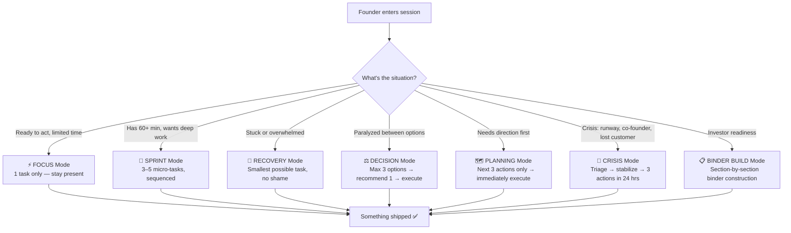

---

## Command System

35+ slash commands organized into three groups:

```mermaid
graph TD
    CMD["/ Commands"] --> SESSION["Session & Flow"]
    CMD --> BINDER["Binder & Fundraising"]
    CMD --> OPS["Ops, Sales & Coaching"]

    SESSION --> S1["/start — Full onboarding"]
    SESSION --> S2["/focus — Lock into one task"]
    SESSION --> S3["/sprint — 60-min deep work"]
    SESSION --> S4["/recover — Restart after being stuck"]
    SESSION --> S5["/decide — Break analysis paralysis"]
    SESSION --> S6["/energy — Route by energy level"]
    SESSION --> S7["/help — See all commands"]

    BINDER --> B1["/binder — Build investor binder"]
    BINDER --> B2["/score — Score binder readiness"]
    BINDER --> B3["/pitch — Draft your pitch"]
    BINDER --> B4["/deck — Pitch deck system"]
    BINDER --> B5["/exec — Executive summary"]
    BINDER --> B6["/simulate — Investor Q&A sim"]

    OPS --> O1["/metrics — Key metrics check"]
    OPS --> O2["/runway — Runway calculator"]
    OPS --> O3["/outreach — Sales outreach"]
    OPS --> O4["/icp — Ideal customer profile"]
    OPS --> O5["/validate — Assumption testing"]
    OPS --> O6["/hire — First hire planning"]
```

---

## Architecture

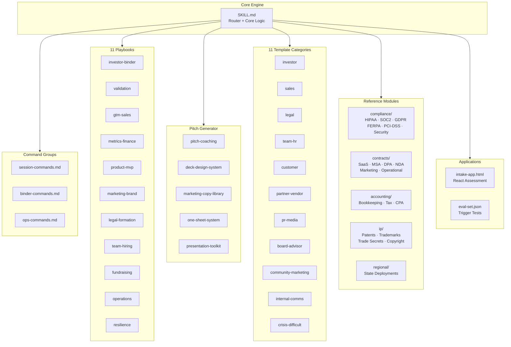

---

## File Structure

```
access-to-business/
├── SKILL.md                          ← Router + core logic (always loaded)
├── README.md                         ← This file
├── LICENSE                           ← MIT License
├── CONTRIBUTING.md                   ← Contributor guide
├── CHANGELOG.md                      ← Version history
├── references/
│   ├── commands/                     ← Slash command definitions
│   │   ├── session-commands.md       ← /start /focus /sprint /recover /decide /energy /help
│   │   ├── binder-commands.md        ← /binder /score /pitch /deck /exec /ask /dataroom /update /simulate
│   │   └── ops-commands.md           ← /metrics /runway /burn /outreach /icp /validate /hire +more
│   ├── playbooks/                    ← Deep-dive execution guides
│   │   ├── investor-binder.md        ← Full 17-section binder build system
│   │   ├── validation.md             ← Customer discovery, PMF signals
│   │   ├── gtm-sales.md              ← Outreach, pipeline, pricing, closing
│   │   ├── metrics-finance.md        ← Burn, runway, unit economics
│   │   ├── product-mvp.md            ← Roadmap, prioritization, shipping
│   │   ├── marketing-brand.md        ← Positioning, content, SEO, launch
│   │   ├── legal-formation.md        ← Entity, equity, vesting, QSBS, 409A
│   │   ├── team-hiring.md            ← First hire, co-founder, equity
│   │   ├── fundraising.md            ← Round planning, strategy
│   │   ├── operations.md             ← SOPs, automation, tool stack
│   │   └── resilience.md             ← Founder psychology, burnout, pivots
│   ├── pitch/                        ← Pitch & marketing asset generator
│   │   ├── pitch-coaching.md         ← Verbal scripts, timing, delivery, Q&A
│   │   ├── deck-design-system.md     ← Slide specs, typography, color, layout
│   │   ├── marketing-copy-library.md ← Taglines, bios, social, ads, email
│   │   ├── one-sheet-system.md       ← Investor / product / speaker one-sheets
│   │   └── presentation-toolkit.md   ← Speaker notes, demo script, follow-up
│   ├── templates/                    ← 100+ copy-paste-ready templates
│   ├── compliance/                   ← HIPAA, SOC2, GDPR/CCPA, FERPA, PCI-DSS
│   ├── contracts/                    ← SaaS, MSA, DPA, NDA, marketing, operational
│   ├── accounting/                   ← Bookkeeping, tax calendar, CPA guide
│   ├── ip/                           ← Patents, trademarks, trade secrets, copyright
│   └── regional/                     ← State-level ecosystem deployments
├── apps/
│   └── intake-app.html               ← React intake assessment (self-contained)
└── evals/
    └── eval-set.json                 ← Skill triggering test cases
```

---

## How It Works

Every interaction follows a consistent execution loop:

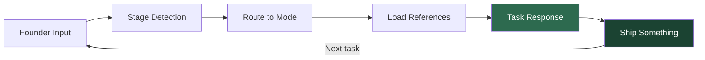

**Task Response Format** — every executable task follows this structure:

```
🎯 Task:    [Single, specific, completable action]
⏱ Time:    5 min | 15 min | 60 min
🪜 Steps:   1. ... 2. ... 3. ...
📦 Output:  [Copy-paste ready draft or template]
⚡ Stuck?   [One-step fallback, even smaller]
👉 Your Move: [Exact next action — no ambiguity]
```

---

## Investor Binder System

The binder builder walks founders through a complete 17-section investor-ready package:

```mermaid
graph TD
    BINDER["📋 Investor Binder"] --> CORE["Core Narrative"]
    BINDER --> MARKET["Market & Traction"]
    BINDER --> BUSINESS["Business Model"]
    BINDER --> TEAM["Team & Operations"]
    BINDER --> LEGAL["Legal & Data Room"]

    CORE --> C1["1. Executive Summary"]
    CORE --> C2["2. Problem Statement"]
    CORE --> C3["3. Solution"]
    CORE --> C4["4. Vision & Mission"]

    MARKET --> M1["5. Market Size (TAM/SAM/SOM)"]
    MARKET --> M2["6. Traction & Metrics"]
    MARKET --> M3["7. Competitive Landscape"]

    BUSINESS --> B1["8. Business Model"]
    BUSINESS --> B2["9. Unit Economics"]
    BUSINESS --> B3["10. Go-to-Market Strategy"]
    BUSINESS --> B4["11. Financial Projections"]

    TEAM --> T1["12. Team"]
    TEAM --> T2["13. Use of Funds"]
    TEAM --> T3["14. Roadmap & Milestones"]

    LEGAL --> L1["15. Cap Table"]
    LEGAL --> L2["16. Legal Structure"]
    LEGAL --> L3["17. Appendix / Data Room"]
```

Use `/binder` to start building and `/score` to assess readiness.

---

## Pitch Generator System

A complete system for crafting and delivering your startup story:

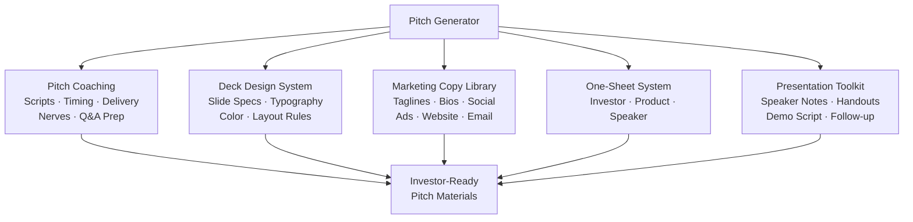

---

## Compliance & Legal Coverage

```mermaid
graph LR
    subgraph Compliance
        direction TB
        GDPR["GDPR / CCPA
        Privacy Policy · DPA"]
        HIPAA["HIPAA
        PHI · BAA · Health Data"]
        SOC2["SOC 2
        Security Audits"]
        IND["Industry
        FERPA · PCI-DSS · FINRA"]
        SEC["Security Basics
        OWASP · Incident Response"]
    end

    subgraph Contracts
        direction TB
        SAAS["SaaS Subscription"]
        MSA["Master Services Agreement"]
        DPA["DPA / NDA / Term Sheet"]
        MKT["Marketing Contracts"]
        OPS["Operational Contracts"]
        NEG["Contract Negotiation"]
    end

    subgraph IP
        direction TB
        PAT["Patents"]
        TM["Trademarks"]
        TS["Trade Secrets"]
        CR["Copyright"]
    end

    Compliance --- Contracts --- IP
```

---

## Template Library

100+ copy-paste-ready templates across 11 categories:

| Category | Examples |
|----------|----------|
| **Investor** | Exec summary, cold outreach, monthly update, LOI, data room |
| **Sales** | Cold email, discovery script, proposal, follow-up, objections |
| **Legal** | Co-founder agreement, NDA, vesting schedule, advisor agreement |
| **Team & HR** | Offer letters, onboarding, feedback, PIP, termination |
| **Customer** | Onboarding, churn recovery, NPS, price increase, upsell |
| **Partner & Vendor** | Partnership intro, SOW, vendor negotiation, reseller |
| **PR & Media** | Press release, journalist pitch, launch posts, speaker bio |
| **Board & Advisor** | Board updates, board deck, advisor asks, written consent |
| **Community & Marketing** | Waitlist, newsletter, case study, launch sequence |
| **Internal Comms** | Decision memo, standup, OKRs, sprint planning, post-mortem |
| **Crisis & Difficult** | Layoffs, co-founder separation, runway crisis, pivot |

---

## Install

### Claude.ai (Recommended)
1. Download the latest `.skill` file from [Releases](https://github.com/cotrackpro/access-to-business/releases)
2. Go to **Claude.ai → Settings → Skills**
3. Upload the `.skill` file

### Manual
1. Clone this repo into your Claude skill directory
2. The `SKILL.md` file will be automatically detected

---

## Quick Start

```
/start          Full onboarding — stage detection + first task
/help           See all 35+ commands
/focus [topic]  Lock into one task
/sprint [topic] 60-min deep work session
/binder         Start building your investor binder
/pitch          Draft your pitch
/metrics        Check your key numbers
/runway         Calculate your runway
```

---

## Core Principles

1. **Done beats perfect.** Ship the 80%.
2. **Momentum is the product.** Action → Completion → Confidence → More Action.
3. **Small tasks done > big plans written.** If it feels big, we made it too big.
4. **Rejection is data.** Collect it fast.
5. **Revenue solves most problems.** When in doubt, go sell something.
6. **Talk to customers before building.**
7. **Investors fund momentum, not potential.**
8. **Your binder is your story in writing.** Make it easy to say yes.
9. **Focus is a competitive advantage.** One thing at a time.
10. **Every session ends with something built** — not just planned.

---

## State Deployment

This skill is designed for **state-level deployment**. Missouri is the reference implementation.

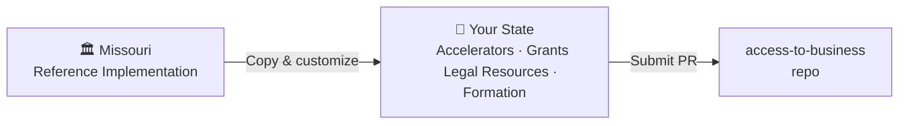

To deploy for your state:
1. Copy `references/regional/missouri.md`
2. Replace with your state's ecosystem data (accelerators, grants, legal resources, formation guides)
3. Submit a PR with the title: `Add regional deployment: [State Name]`

See `references/regional/README.md` for the full guide.

---

## The Access To Family

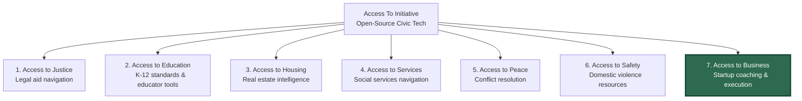

All pillars share: open-source MIT license, state-deployable architecture, and progressive disclosure skill structure.

---

## Contributing

See [CONTRIBUTING.md](CONTRIBUTING.md) for guidelines. Key areas where help is needed:

- **State deployments** — Add your state's startup ecosystem
- **Templates** — Expand the 100+ template library
- **Playbooks** — Improve execution guides with real-world patterns

## License

MIT — see [LICENSE](LICENSE) for details.

---

**Built by [CoTrackPro](https://cotrackpro.com) | Part of the Access To Initiative**
