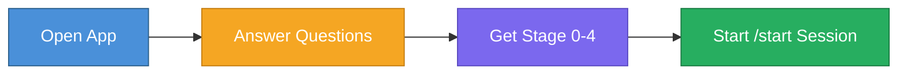

# Apps

## intake-app.html

A self-contained React intake assessment app that helps founders identify their startup stage and priorities.

Built as a single HTML file with no external dependencies -- open it in any browser to use.

### How It Works

1. Open `intake-app.html` in a browser
2. Answer the assessment questions
3. Get your startup stage (0-4) and recommended focus areas
4. Use the results to guide your first `/start` session

### Technical Details

- Self-contained: React is bundled inline, no CDN or npm required
- Single file: Everything (HTML, CSS, JS) in one `.html` file
- Offline-capable: Works without an internet connection
