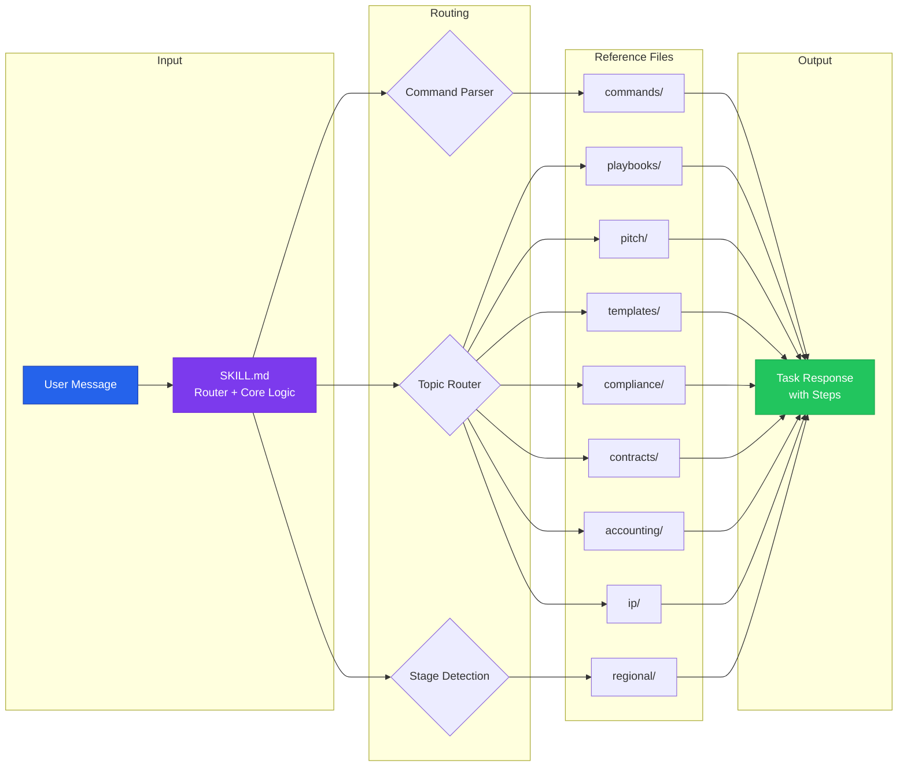
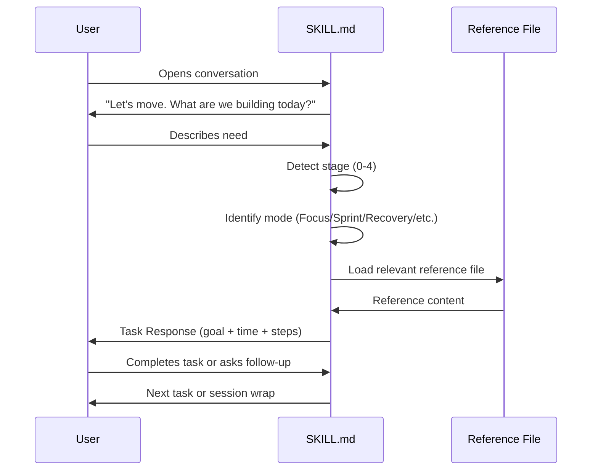
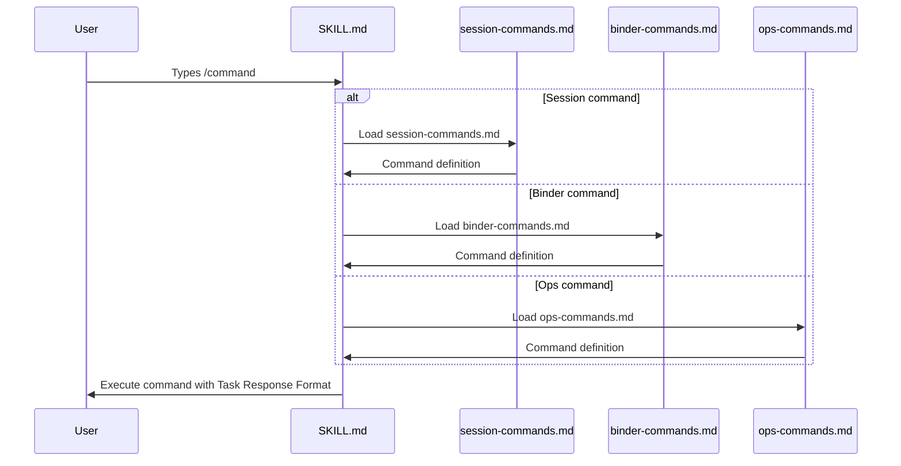
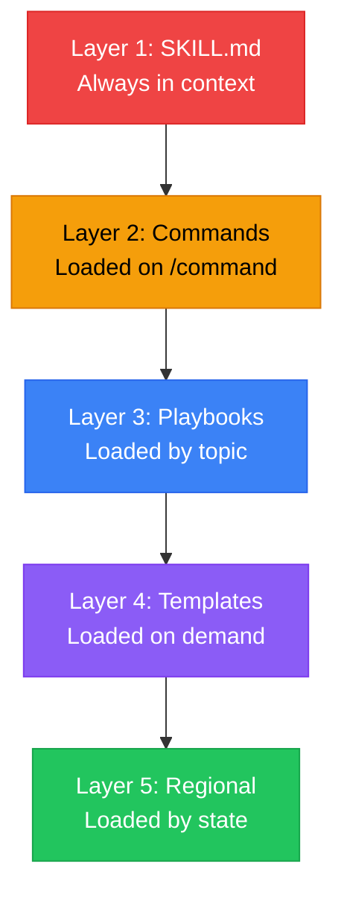

# Architecture

## System Overview



## Session Flow



## Command Routing Flow



## Investor Binder Build Flow

```mermaid
graph TD
    START[/binder command] --> ASSESS{Current Stage?}

    ASSESS -->|Stage 0-1| SKELETON[Build Binder Skeleton\nSections 1-5 only]
    ASSESS -->|Stage 2| FULL[Full 17-Section Build]
    ASSESS -->|Stage 3-4| UPGRADE[Upgrade for Larger Rounds]

    FULL --> S1[1. Cover Page]
    FULL --> S2[2. Executive Summary]
    FULL --> S3[3. Problem]
    FULL --> S4[4. Solution]
    FULL --> S5[5. Market Size]
    FULL --> S6[6-17. Remaining Sections]

    S6 --> SCORE[/score - Rate Binder]
    SCORE --> GAPS[Identify Gaps]
    GAPS --> ITERATE[Iterate Until Ready]

    style START fill:#2563eb,stroke:#1e40af,color:#fff
    style ASSESS fill:#f59e0b,stroke:#d97706,color:#000
    style SCORE fill:#7c3aed,stroke:#6d28d9,color:#fff
    style ITERATE fill:#22c55e,stroke:#16a34a,color:#fff
```

## Progressive Disclosure

The skill uses progressive disclosure to manage complexity:



**Rule:** Never load all reference files at once. Load only what the current task requires.
