# References Directory

The `references/` directory contains all on-demand reference content for the Access to Business skill. Files are loaded only when a relevant command or topic is triggered -- never all at once.

## Directory Map

```mermaid
graph TD
    REF[references/] --> CMD[commands/\n35+ slash commands]
    REF --> PB[playbooks/\n11 startup lifecycle guides]
    REF --> PT[pitch/\n5-module pitch system]
    REF --> TMP[templates/\n100+ copy-paste templates]
    REF --> CMP[compliance/\nHIPAA SOC2 GDPR PCI]
    REF --> CTR[contracts/\nSaaS MSA DPA NDA]
    REF --> ACC[accounting/\nBookkeeping Tax CPA]
    REF --> IP_D[ip/\nPatents TM Trade Secrets]
    REF --> RGN[regional/\nState deployments]

    CMD --> CMD_F[3 files]
    PB --> PB_F[11 files]
    PT --> PT_F[6 files]
    TMP --> TMP_F[11 files]
    CMP --> CMP_F[6 files]
    CTR --> CTR_F[7 files]
    ACC --> ACC_F[3 files]
    IP_D --> IP_F[3 files]
    RGN --> RGN_F[2 files]

    style REF fill:#2563eb,stroke:#1e40af,color:#fff
    style CMD fill:#22c55e,stroke:#16a34a,color:#fff
    style PB fill:#22c55e,stroke:#16a34a,color:#fff
    style PT fill:#7c3aed,stroke:#6d28d9,color:#fff
    style TMP fill:#7c3aed,stroke:#6d28d9,color:#fff
    style CMP fill:#f59e0b,stroke:#d97706,color:#000
    style CTR fill:#f59e0b,stroke:#d97706,color:#000
    style ACC fill:#3b82f6,stroke:#2563eb,color:#fff
    style IP_D fill:#3b82f6,stroke:#2563eb,color:#fff
    style RGN fill:#ef4444,stroke:#dc2626,color:#fff
```

## Subdirectories

| Directory | Files | Purpose |
|-----------|-------|---------|
| [commands/](commands/) | 3 | Slash command definitions for session flow, binder building, and ops |
| [playbooks/](playbooks/) | 11 | Step-by-step guides covering the full startup lifecycle |
| [pitch/](pitch/) | 6 | Complete pitch preparation and materials system |
| [templates/](templates/) | 11 | Copy-paste-ready templates across 11 business categories |
| [compliance/](compliance/) | 6 | HIPAA, SOC2, GDPR/CCPA, PCI-DSS, and security posture |
| [contracts/](contracts/) | 7 | Customer, marketing, and operational contract scaffolds |
| [accounting/](accounting/) | 3 | Bookkeeping setup, tax calendar, CPA selection guide |
| [ip/](ip/) | 3 | Patent strategy, trademarks, trade secrets, copyright |
| [regional/](regional/) | 2 | State-specific startup ecosystem deployments |

## Total: 52 reference files across 9 directories
