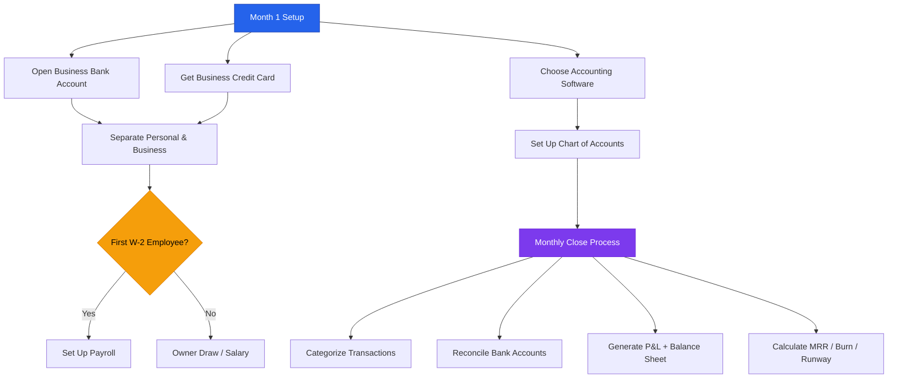
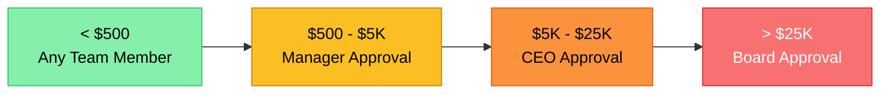

# Accounting & Tax for Missouri Startups

**Disclaimer:** Tax law is complex and changes frequently. This is educational context. Work with a CPA who specializes in startups for your specific situation.

---

## Accounting Setup Flow



## Financial Controls by Threshold



## Files in This Directory

| File | Contents |
|------|----------|
| `README.md` (this file) | Accounting setup, bookkeeping, financial controls |
| `tax-calendar.md` | Missouri and federal tax deadlines, startup-specific obligations |
| `startup-cpa-guide.md` | How to find and work with a startup-specialized CPA |

---

## Accounting Setup — Do This in Your First Month

### Step 1: Open a Dedicated Business Bank Account
- Never comingle personal and business funds — this is the #1 accounting mistake
- **Mercury** (mercury.com) — free, startup-friendly, fast setup, virtual cards
- **Relay** (relayfi.com) — good for multiple expense categories
- Local option: Midwest BankCentre, Enterprise Bank (relationship banking matters later)

### Step 2: Get a Business Credit Card
- Keeps expenses organized; builds business credit
- **Brex** — startup-focused; no personal guarantee required for funded startups
- **Ramp** — excellent expense management; free
- **American Express Business** — good rewards; requires personal guarantee early on

### Step 3: Choose Accounting Software
| Software | Best For | Cost |
|----------|---------|------|
| **QuickBooks Online** | Most common; easiest for CPAs to access | $30–$90/mo |
| **Wave** | Free; adequate for very early stage | Free |
| **Xero** | Good alternative to QBO; clean UI | $13–$70/mo |
| **Bench** | Fully managed bookkeeping service | $299–$499/mo |

**Recommendation:** Wave until first hire or first investor; QuickBooks Online after.

### Step 4: Set Up Payroll (When You Have Your First W-2 Employee)
- **Gusto** — most popular for startups; handles federal and Missouri payroll taxes
- **Rippling** — good if you also want HR software
- **ADP** — enterprise; overkill early-stage
- **Important:** Payroll tax deposits are due on specific schedules — late deposits have penalties

### Step 5: Separate Personal and Business Clearly
- All business income deposited to business account
- All business expenses on business card or reimbursed from personal with receipts
- **Pay yourself a salary or owner's draw** — don't just pull money randomly

---

## Chart of Accounts — Startup Starter Set

Set these up in your accounting software:

**Revenue**
- Software / Subscription Revenue
- Professional Services Revenue
- Grants and Other Income

**Cost of Goods Sold (COGS)**
- Hosting and Infrastructure
- Third-Party API Costs
- Contractor Costs (direct delivery)
- Customer Support

**Operating Expenses**
- Salaries and Wages
- Contractor / Freelancer Fees
- Marketing and Advertising
- Software and Subscriptions (tools)
- Legal and Professional Fees
- Accounting and Bookkeeping
- Travel and Entertainment
- Office and Co-working
- Insurance
- Depreciation
- Miscellaneous

**Assets**
- Cash and Bank Accounts
- Accounts Receivable
- Prepaid Expenses
- Fixed Assets (equipment)

**Liabilities**
- Accounts Payable
- Accrued Expenses
- Deferred Revenue (prepaid subscriptions)
- SAFE Notes / Convertible Notes
- Long-Term Debt

**Equity**
- Common Stock
- Additional Paid-in Capital
- Retained Earnings / Accumulated Deficit

---

## Bookkeeping Basics

### Monthly Close Checklist
```
By the 10th of each month, close the prior month:

[ ] Download and categorize all bank and credit card transactions
[ ] Match receipts to transactions (use Hubdoc, Dext, or manual upload)
[ ] Reconcile all bank accounts to bank statements
[ ] Record any accruals (expenses incurred but not yet paid)
[ ] Update accounts receivable (what customers owe you)
[ ] Update deferred revenue (prepaid subscriptions you haven't earned yet)
[ ] Generate P&L, balance sheet, and cash flow statement
[ ] Compare actuals to budget — note variances > 10%
[ ] Calculate MRR, burn, and runway
[ ] File with accountant if using managed bookkeeping service
```

### Receipts and Documentation
- Keep all receipts — IRS standard is 3 years; 7 years for fraud/significant underreporting
- Use Hubdoc, Dext, or Expensify to capture receipts digitally
- Every expense over $75 requires a receipt for tax purposes
- Document business purpose for meals and entertainment

### Accrual vs. Cash Accounting
- **Cash basis:** Record revenue when you receive payment; expenses when paid. Simpler.
- **Accrual basis:** Record revenue when earned; expenses when incurred. More accurate.
- **Which to use:** Cash for very early stage; switch to accrual before your first audit or Series A raise. Investors want to see accrual financials.
- **GAAP compliance:** Required for any audited financials (needed for Series B+)

---

## Deferred Revenue — Critical for SaaS

If customers pay annually upfront, you have **deferred revenue** — money received but not yet earned.

Example: Customer pays $12,000 on January 1 for annual subscription.
- **January:** Revenue = $1,000; Deferred Revenue = $11,000
- **February:** Revenue = $1,000; Deferred Revenue = $10,000
- ... and so on through December

**Why it matters:**
- Investors look at this — inflating revenue by recognizing upfront payments immediately is a red flag
- For SaaS companies, GAAP requires subscription revenue to be recognized ratably (monthly)

---

## Financial Controls for Early-Stage Startups

### Expense Authorization
```
< $500: Any team member (on company card, within policy)
$500–$5,000: Manager or department head approval
$5,000–$25,000: Founder/CEO approval
> $25,000: Board approval (or both founders)
```

### Vendor Payment Controls
- Two-factor verification for new vendor bank details (call to verify — wire fraud is common)
- No single person should be able to both initiate and approve a payment
- Review all vendor payments monthly

### Payroll Controls
- Payroll changes (new hires, raises, terminations) require written authorization
- Payroll processed by payroll software (Gusto) — not by manual check whenever possible
- Payroll account is separate from operating account

### Expense Policy
Create a one-page expense policy covering:
- Approved expense categories and limits
- Receipt requirements
- Reimbursement process and timing
- What requires pre-approval
- What is never reimbursable (personal expenses, fines, etc.)

---

## Common Accounting Mistakes at Startups

| Mistake | Consequence | Fix |
|---------|-------------|-----|
| Comingling personal and business funds | Pierces corporate veil; audit nightmare | Open business account immediately |
| Not tracking COGS separately | Can't calculate gross margin | Set up COGS accounts from day one |
| Recording annual subscriptions as revenue at receipt | Overstates revenue | Use deferred revenue |
| Not reconciling accounts monthly | Errors compound; catch them late | Monthly close discipline |
| Classifying contractor as employee (or vice versa) | Massive penalties | Know the IRS 20-factor test |
| Ignoring Missouri payroll registration | Penalties, interest | Register before first paycheck |
| Not documenting business purpose of expenses | Expenses disallowed in audit | Note business purpose at time of expense |
| Founder loans to company not documented | Can be treated as income | Document all intercompany loans |
