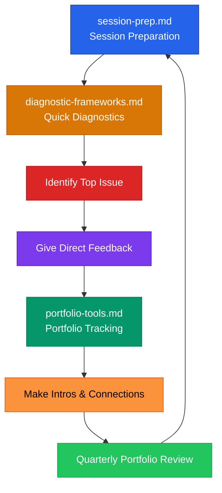

# Advisor Toolkit Directory

## Files in This Directory

| File | Focus | Use When |
|------|-------|----------|
| `session-prep.md` | Pre-session diagnostics, agenda templates, feedback methods | Preparing for any founder meeting |
| `diagnostic-frameworks.md` | 5 Vital Signs, bottleneck ID, stage mismatch detection | Running a quick health check on a startup |
| `portfolio-tools.md` | Portfolio tracker, intro templates, quarterly review | Managing multiple founders or making connections |

## Loading Rule

Load only the advisor tool relevant to the current task. Never load all advisor files at once.
