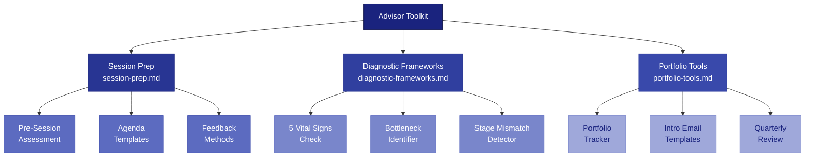

# Advisor Toolkit

Tools, frameworks, and templates for startup advisors and mentors working with early-stage founders.

## Files in This Directory

| File | Purpose |
|------|---------|
| `session-prep.md` | Pre-session assessment, agenda templates, bottleneck questions, feedback methods |
| `diagnostic-frameworks.md` | 15-minute diagnostic frameworks: vital signs, bottleneck ID, stage mismatch detection |
| `portfolio-tools.md` | Portfolio tracker, intro email templates, quarterly review template |

## When to Load

Load these files when:
- An advisor or mentor asks how to run effective founder sessions
- Someone needs diagnostic frameworks for evaluating startups quickly
- An advisor is managing multiple founders and needs tracking tools
- A founder asks how to get the most out of their advisor relationship
