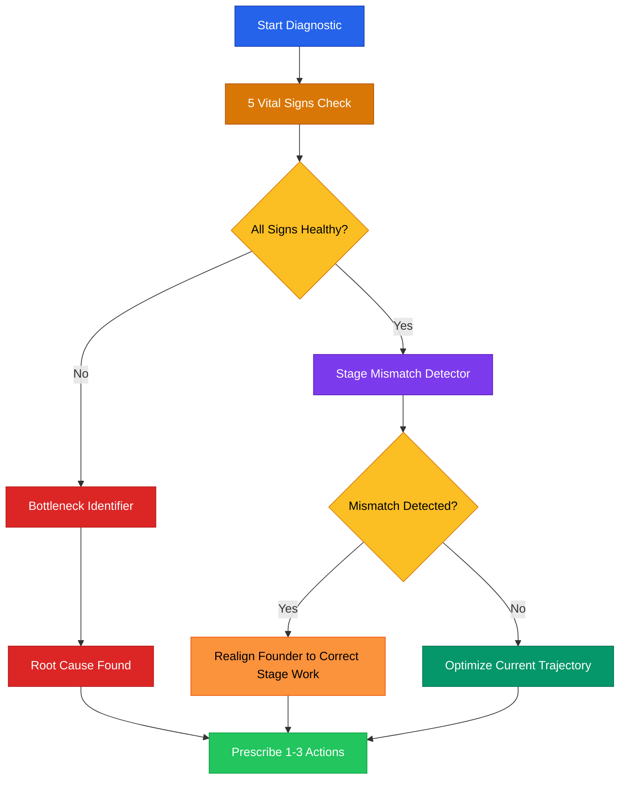

# Quick Diagnostic Frameworks

Run any of these in 15 minutes or less. Designed for advisors who need to assess a startup's health fast and pinpoint where to focus.



---

## Framework 1: The 5 Vital Signs Check

Like a doctor checking pulse, temperature, and blood pressure, these five metrics tell you whether a startup is healthy, struggling, or in crisis.

### How to Run It

Ask the founder for each vital sign. Score each one Green / Yellow / Red. Two or more Reds = crisis mode. Two or more Yellows = course correction needed.

| # | Vital Sign | Green | Yellow | Red |
|---|-----------|-------|--------|-----|
| 1 | **Revenue Trend** | Growing MoM (even slowly) | Flat for 2+ months | Declining or zero after 6+ months in market |
| 2 | **Burn Rate** | 12+ months runway | 6-12 months runway | Under 6 months runway |
| 3 | **Pipeline** | Active conversations, demos, or trials | Some inbound but nothing closing | No pipeline. Waiting for leads to appear. |
| 4 | **Team Health** | Aligned, shipping, low conflict | One key role missing or one simmering conflict | Co-founder dispute, key departure, or founder doing everything alone |
| 5 | **Founder Energy** | Motivated, clear-headed, sleeping | Tired but functional, some doubt | Burnt out, dreading work, unable to make decisions |

### Vital Signs Scorecard Template

```
Company: [COMPANY NAME]
Date: [DATE]
Advisor: [YOUR NAME]

Revenue Trend:   [ ] Green  [ ] Yellow  [ ] Red
  Notes: _______________________________________________

Burn Rate:       [ ] Green  [ ] Yellow  [ ] Red
  Notes: _______________________________________________

Pipeline:        [ ] Green  [ ] Yellow  [ ] Red
  Notes: _______________________________________________

Team Health:     [ ] Green  [ ] Yellow  [ ] Red
  Notes: _______________________________________________

Founder Energy:  [ ] Green  [ ] Yellow  [ ] Red
  Notes: _______________________________________________

Overall Assessment: ____________________________________
Top Priority: _________________________________________
```

---

## Framework 2: Bottleneck Identifier

Every startup has one primary constraint at any given time. Find it, and everything else gets easier. This framework sorts the bottleneck into one of five categories.

### The 5-Question Sort

Ask these questions in order. The first "yes" reveals the bottleneck category.

| # | Question | If Yes, the Bottleneck Is... |
|---|----------|------------------------------|
| 1 | "Are people using your product and then leaving?" | **Product** — You have a retention problem. Fix the product before anything else. |
| 2 | "Do you have a good product but can't find enough customers?" | **Market** — You have a distribution problem. Fix positioning, channel, or ICP. |
| 3 | "Do you know what to do but can't execute fast enough?" | **Team** — You have a capacity problem. Hire, delegate, or cut scope. |
| 4 | "Do you have traction but can't afford to grow?" | **Capital** — You have a funding problem. Raise, cut burn, or find non-dilutive money. |
| 5 | "Do you feel stuck, overwhelmed, or unable to make decisions?" | **Founder** — You have an energy problem. Address this before any business tactic. |

### Bottleneck Response Playbook

| Bottleneck | First Action | Second Action | Do NOT Do |
|-----------|-------------|---------------|-----------|
| **Product** | Talk to 5 churned users this week | Identify the one feature gap causing churn | Build more features without user input |
| **Market** | Narrow your ICP to one specific persona | Test 3 new outreach messages this week | "Rebrand" or redesign your website |
| **Team** | Write a job description for the one hire that unblocks you | Post it in 3 places by Friday | Hire a generalist when you need a specialist |
| **Capital** | Calculate exact runway in weeks, not months | Decide: raise or cut? No middle ground. | Spend time on anything except extending runway |
| **Founder** | Take 48 hours off completely | Talk to a founder peer or coach | Push through with willpower alone |

---

## Framework 3: Stage Mismatch Detector

The most common advisor finding: the founder is doing work from the wrong stage. Building a sales team at Stage 0 (validation). Obsessing over brand at Stage 1 (product). Raising a Series A with no revenue.

### Startup Stage Map

| Stage | Name | Core Job | You're Done When... |
|-------|------|----------|---------------------|
| 0 | **Idea** | Validate the problem exists | 10+ people describe the same pain unprompted |
| 1 | **Validation** | Find product-market fit | Users retain, pay, or refer without being asked |
| 2 | **Traction** | Build repeatable acquisition | You can predict revenue 30 days out |
| 3 | **Growth** | Scale what works | Unit economics are positive at 3x current volume |
| 4 | **Scale** | Build the organization | Company runs without founder in every meeting |

### Mismatch Detection Questions

| Question | If They Say... | Mismatch Signal |
|----------|---------------|-----------------|
| "What are you spending most of your time on?" | "Hiring a VP of Sales" | Mismatch if Stage 0-1. You sell first. |
| "What are you spending most of your time on?" | "Redesigning the logo and website" | Mismatch if Stage 0-1. Nobody cares about your logo yet. |
| "What are you spending most of your time on?" | "Building features" | Mismatch if they have zero users. Ship and talk to people. |
| "What are you spending most of your time on?" | "Fundraising" | Mismatch if no revenue and no clear use of funds. |
| "What are you spending most of your time on?" | "Everything" | Mismatch at any stage. Founders must ruthlessly prioritize. |

### How to Redirect

When you spot a mismatch, use this script:

> "I notice you're spending a lot of time on [ACTIVITY]. That's typically Stage [X] work. Based on what you've told me, you're at Stage [Y]. The single most important thing at Stage [Y] is [CORE JOB]. Can we talk about how to refocus your time on that?"

This is not a criticism. It's a recalibration. Most founders feel relief when someone gives them permission to stop doing the wrong work.

---

## Running All Three Together (15 Minutes)

| Time | Framework | Goal |
|------|-----------|------|
| 0-5 min | 5 Vital Signs | Understand overall health |
| 5-10 min | Bottleneck Identifier | Find the primary constraint |
| 10-15 min | Stage Mismatch Detector | Verify they're doing the right work for their stage |

After 15 minutes, you should be able to complete this sentence:

> "This company is at Stage [X]. Their primary bottleneck is [CATEGORY]. The one thing that would move the needle most is [ACTION]."

If you can say that, you've done your job as a diagnostician. Now switch to advisor mode and help them execute.

---

> **Disclaimer:** These diagnostic frameworks are educational tools designed to structure advisory conversations. They do not replace professional business, legal, or financial advice from qualified practitioners.
