# Quick Diagnostic Frameworks

Run any of these in 15 minutes or less. Designed for advisors who need to assess a startup fast.

```mermaid
flowchart TD
    DIAG["15-Minute\nDiagnostics"] --> VS["5 Vital Signs\nCheck"]
    DIAG --> BN["Bottleneck\nIdentifier"]
    DIAG --> SM["Stage Mismatch\nDetector"]

    VS --> REV["Revenue\nTrend"]
    VS --> BURN["Burn\nRate"]
    VS --> PIPE["Pipeline\nHealth"]
    VS --> TEAM["Team\nHealth"]
    VS --> ENERGY["Founder\nEnergy"]

    BN --> PROD["Product"]
    BN --> MKT["Market"]
    BN --> PPL["Team"]
    BN --> CAP["Capital"]
    BN --> FDR["Founder"]

    SM --> S1["Stage 1\nProblem-Solution"]
    SM --> S2["Stage 2\nProduct-Market Fit"]
    SM --> S3["Stage 3\nScale"]

    VS --> SCORE["Score:\nHealthy / Warning / Critical"]
    BN --> ROOT["Root Cause\nIdentified"]
    SM --> FIX["Realign Work\nto Actual Stage"]

    style DIAG fill:#1a237e,stroke:#0d1147,color:#ffffff
    style VS fill:#22c55e,stroke:#16a34a,color:#ffffff
    style BN fill:#f59e0b,stroke:#d97706,color:#ffffff
    style SM fill:#8b5cf6,stroke:#7c3aed,color:#ffffff
    style SCORE fill:#22c55e,stroke:#16a34a,color:#ffffff
    style ROOT fill:#f59e0b,stroke:#d97706,color:#ffffff
    style FIX fill:#8b5cf6,stroke:#7c3aed,color:#ffffff
    style REV fill:#86efac,stroke:#22c55e,color:#1a237e
    style BURN fill:#86efac,stroke:#22c55e,color:#1a237e
    style PIPE fill:#86efac,stroke:#22c55e,color:#1a237e
    style TEAM fill:#86efac,stroke:#22c55e,color:#1a237e
    style ENERGY fill:#86efac,stroke:#22c55e,color:#1a237e
    style PROD fill:#fcd34d,stroke:#f59e0b,color:#1a237e
    style MKT fill:#fcd34d,stroke:#f59e0b,color:#1a237e
    style PPL fill:#fcd34d,stroke:#f59e0b,color:#1a237e
    style CAP fill:#fcd34d,stroke:#f59e0b,color:#1a237e
    style FDR fill:#fcd34d,stroke:#f59e0b,color:#1a237e
    style S1 fill:#c4b5fd,stroke:#8b5cf6,color:#1a237e
    style S2 fill:#c4b5fd,stroke:#8b5cf6,color:#1a237e
    style S3 fill:#c4b5fd,stroke:#8b5cf6,color:#1a237e
```



---

## Framework 1: The 5 Vital Signs Check

Like a doctor checking pulse, temperature, and blood pressure, these five metrics give you a fast read on startup health.

### How to Run It

Ask the founder for each vital sign. Score each as Healthy, Warning, or Critical.

```
5 VITAL SIGNS — QUICK CHECK

Company: [COMPANY]
Date: [DATE]
Advisor: [NAME]

━━━━━━━━━━━━━━━━━━━━━━━━━━━━━━━━━━━━━━━━━━━━━━━━━━━━━━
VITAL SIGN 1: REVENUE TREND
━━━━━━━━━━━━━━━━━━━━━━━━━━━━━━━━━━━━━━━━━━━━━━━━━━━━━━

Current MRR/Revenue:  $[AMOUNT]
3-month trend:        [UP / FLAT / DOWN]  [X%]
Target:               $[AMOUNT]

Scoring:
  Healthy  — Growing 10%+ MoM (early stage) or on plan
  Warning  — Flat for 2+ months or 20%+ below plan
  Critical — Declining for 2+ months

Score: [ HEALTHY / WARNING / CRITICAL ]

━━━━━━━━━━━━━━━━━━━━━━━━━━━━━━━━━━━━━━━━━━━━━━━━━━━━━━
VITAL SIGN 2: BURN RATE
━━━━━━━━━━━━━━━━━━━━━━━━━━━━━━━━━━━━━━━━━━━━━━━━━━━━━━

Monthly burn:    $[AMOUNT]
Cash in bank:    $[AMOUNT]
Runway:          [X] months

Scoring:
  Healthy  — 12+ months runway
  Warning  — 6-12 months runway
  Critical — Under 6 months and not actively raising

Score: [ HEALTHY / WARNING / CRITICAL ]

━━━━━━━━━━━━━━━━━━━━━━━━━━━━━━━━━━━━━━━━━━━━━━━━━━━━━━
VITAL SIGN 3: PIPELINE HEALTH
━━━━━━━━━━━━━━━━━━━━━━━━━━━━━━━━━━━━━━━━━━━━━━━━━━━━━━

Active leads/opportunities:  [NUMBER]
Conversion rate:             [X%]
Average deal cycle:          [X] days/weeks
Pipeline coverage:           [X]x of target

Scoring:
  Healthy  — 3x+ pipeline coverage, stable conversion
  Warning  — Under 2x coverage or conversion dropping
  Critical — No pipeline, relying on 1-2 deals, or no outbound activity

Score: [ HEALTHY / WARNING / CRITICAL ]

━━━━━━━━━━━━━━━━━━━━━━━━━━━━━━━━━━━━━━━━━━━━━━━━━━━━━━
VITAL SIGN 4: TEAM HEALTH
━━━━━━━━━━━━━━━━━━━━━━━━━━━━━━━━━━━━━━━━━━━━━━━━━━━━━━

Team size:           [NUMBER]
Recent departures:   [NUMBER] in last 90 days
Open critical roles: [NUMBER]
Co-founder alignment: [STRONG / STRAINED / BROKEN]

Scoring:
  Healthy  — Team stable, co-founders aligned, key roles filled
  Warning  — 1 key departure or open critical role, or co-founder tension
  Critical — Multiple departures, co-founder conflict, or cannot hire

Score: [ HEALTHY / WARNING / CRITICAL ]

━━━━━━━━━━━━━━━━━━━━━━━━━━━━━━━━━━━━━━━━━━━━━━━━━━━━━━
VITAL SIGN 5: FOUNDER ENERGY
━━━━━━━━━━━━━━━━━━━━━━━━━━━━━━━━━━━━━━━━━━━━━━━━━━━━━━

Self-reported energy (1-10):  [SCORE]
Hours working per week:       [NUMBER]
Last full day off:            [DATE]
Sleep quality:                [GOOD / OK / POOR]

Scoring:
  Healthy  — Energy 7+, sustainable pace, regular recovery
  Warning  — Energy 4-6, working 70+ hrs, no recent break
  Critical — Energy 1-3, signs of burnout, health issues

Score: [ HEALTHY / WARNING / CRITICAL ]

━━━━━━━━━━━━━━━━━━━━━━━━━━━━━━━━━━━━━━━━━━━━━━━━━━━━━━
OVERALL ASSESSMENT
━━━━━━━━━━━━━━━━━━━━━━━━━━━━━━━━━━━━━━━━━━━━━━━━━━━━━━

Healthy count:  [X] / 5
Warning count:  [X] / 5
Critical count: [X] / 5

Interpretation:
  5 Healthy          — Maintain cadence. Focus on growth strategy.
  3-4 Healthy        — Address warnings before they become critical.
  Any 1 Critical     — This session's entire focus should be the critical item.
  2+ Critical        — Survival mode. Triage. Focus on the one that buys time.
```

---

## Framework 2: Bottleneck Identifier

Every startup has one root bottleneck at any given time. This framework identifies which of five categories it falls into.

### The Five Bottleneck Categories

| Category | Symptoms | Key Question |
|----------|----------|--------------|
| **Product** | Low engagement, high churn, weak NPS, users not coming back | "Do customers love the product?" |
| **Market** | Low awareness, hard to find customers, small TAM, no pull | "Can you find and reach customers who want this?" |
| **Team** | Execution gaps, missed deadlines, key roles empty, conflict | "Do you have the right people doing the right work?" |
| **Capital** | Running out of money, cannot hire, cannot invest in growth | "Do you have enough money to reach the next milestone?" |
| **Founder** | Decision paralysis, burnout, skill gaps, avoiding hard conversations | "Is the founder the bottleneck?" |

### How to Run It

```
BOTTLENECK IDENTIFIER

Step 1: Ask these five questions. The founder rates each 1-5.
        (1 = severe problem, 5 = no problem)

        Product fit and quality:       [1-5]
        Market access and demand:      [1-5]
        Team capability and stability: [1-5]
        Capital and runway:            [1-5]
        Founder effectiveness:         [1-5]

Step 2: The lowest score is your primary bottleneck.
        If two are tied, ask: "Which one, if solved, would fix the other?"

Step 3: Confirm with evidence.
        "You scored [CATEGORY] lowest. Tell me more about that.
         What specific evidence do you see?"

Step 4: Check for root cause.
        Often the visible bottleneck is not the root cause.
        - Product problem might be caused by Team (wrong engineers)
        - Market problem might be caused by Product (wrong features for wrong segment)
        - Capital problem might be caused by Founder (avoiding fundraising)

        Ask: "WHY is [CATEGORY] the bottleneck? What is causing it?"

Step 5: Define the unblock.
        "What is the single smallest action that would start to unblock this?"
```

### Common Bottleneck Patterns by Stage

| Stage | Most Common Bottleneck | Second Most Common |
|-------|----------------------|-------------------|
| Pre-revenue | Product or Market | Founder |
| First customers ($0-$10K MRR) | Market | Product |
| Growth ($10K-$100K MRR) | Team | Capital |
| Scale ($100K+ MRR) | Team | Founder |

---

## Framework 3: Stage Mismatch Detector

The most common mistake founders make is doing work that belongs to a different stage. This framework identifies mismatches fast.

### The Three Stages

**Stage 1: Problem-Solution Fit**
- Goal: Prove the problem exists and someone will pay for a solution
- Right work: Customer interviews, MVPs, manual delivery, first 5 paying customers
- Wrong work: Building a sales team, perfecting the brand, optimizing pricing tiers

**Stage 2: Product-Market Fit**
- Goal: Find repeatable acquisition and prove unit economics work
- Right work: Iterating on product, finding scalable channels, proving retention
- Wrong work: International expansion, conference speaking, complex partnerships

**Stage 3: Scale**
- Goal: Grow fast with proven unit economics
- Right work: Hiring, process, systems, expanding channels, raising growth capital
- Wrong work: Pivoting the product, questioning the market, doing everything yourself

### How to Run It

```
STAGE MISMATCH DETECTOR

Step 1: Determine actual stage.
        Revenue:     $[AMOUNT] MRR
        Customers:   [NUMBER] paying
        Retention:   [X]% monthly
        Acquisition: [REPEATABLE / EXPERIMENTAL / UNKNOWN]

        Based on these numbers, the company is at Stage: [1 / 2 / 3]

Step 2: List the founder's top 5 activities this week.
        1. [ACTIVITY]
        2. [ACTIVITY]
        3. [ACTIVITY]
        4. [ACTIVITY]
        5. [ACTIVITY]

Step 3: Score each activity.
        For each activity, mark which stage it belongs to.

        Activity 1: Stage [1 / 2 / 3]
        Activity 2: Stage [1 / 2 / 3]
        Activity 3: Stage [1 / 2 / 3]
        Activity 4: Stage [1 / 2 / 3]
        Activity 5: Stage [1 / 2 / 3]

Step 4: Count mismatches.
        Activities matching current stage:    [X] / 5
        Activities from an earlier stage:     [X] / 5  (holding on)
        Activities from a later stage:        [X] / 5  (jumping ahead)

Step 5: Interpret.
        4-5 match:   Good stage alignment. Focus on execution.
        2-3 match:   Moderate mismatch. Redirect 1-2 activities.
        0-1 match:   Severe mismatch. The founder is working on
                     the wrong things. This is the session's focus.
```

### Common Mismatches and Fixes

| Mismatch | What It Looks Like | What to Say |
|----------|--------------------|-------------|
| Stage 1 founder doing Stage 3 work | Building a sales team with 2 customers | "You do not have a repeatable sales process to hand off yet. Sell the next 10 yourself." |
| Stage 2 founder doing Stage 1 work | Still interviewing customers at $50K MRR | "You have product-market fit evidence. Stop validating and start scaling what works." |
| Stage 3 founder doing Stage 1 work | CEO personally closing every deal at $200K MRR | "You are the bottleneck. Hire a sales leader and give them 90 days to own it." |
| Stage 1 founder doing Stage 2 work | Optimizing ad spend with 3 customers | "You do not know your ICP yet. Talk to 20 more prospects before spending on ads." |

---

## Using These Frameworks Together

**Recommended sequence for a first diagnostic session:**

1. Run the **5 Vital Signs** first (5 minutes) to get the overall picture
2. Run the **Bottleneck Identifier** (5 minutes) to find the root constraint
3. Run the **Stage Mismatch Detector** (5 minutes) to check if the founder is working on the right things

If the bottleneck and the stage mismatch point to the same issue, you have high confidence in your diagnosis. If they point to different things, dig deeper -- one is likely the cause of the other.
