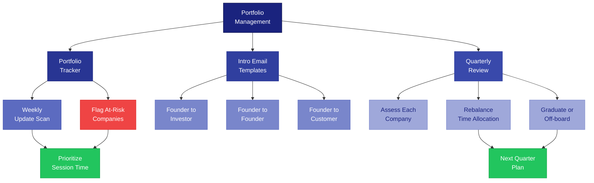

# Portfolio Management Tools

Templates and trackers for advisors managing multiple founders simultaneously.



---

## Portfolio Tracker Template

Copy and maintain this tracker. Update it after every session.

```
ADVISOR PORTFOLIO TRACKER
Updated: [DATE]
Advisor: [NAME]

┌──────────────┬───────────┬──────────────┬─────────────────┬──────────────────┬──────────┐
│ Company      │ Stage     │ Last         │ Top Issue        │ Next Action      │ Status   │
│              │           │ Check-In     │                  │                  │          │
├──────────────┼───────────┼──────────────┼─────────────────┼──────────────────┼──────────┤
│ [COMPANY 1]  │ [1/2/3]   │ [DATE]       │ [ISSUE]          │ [ACTION + DATE]  │ [G/Y/R]  │
├──────────────┼───────────┼──────────────┼─────────────────┼──────────────────┼──────────┤
│ [COMPANY 2]  │ [1/2/3]   │ [DATE]       │ [ISSUE]          │ [ACTION + DATE]  │ [G/Y/R]  │
├──────────────┼───────────┼──────────────┼─────────────────┼──────────────────┼──────────┤
│ [COMPANY 3]  │ [1/2/3]   │ [DATE]       │ [ISSUE]          │ [ACTION + DATE]  │ [G/Y/R]  │
├──────────────┼───────────┼──────────────┼─────────────────┼──────────────────┼──────────┤
│ [COMPANY 4]  │ [1/2/3]   │ [DATE]       │ [ISSUE]          │ [ACTION + DATE]  │ [G/Y/R]  │
├──────────────┼───────────┼──────────────┼─────────────────┼──────────────────┼──────────┤
│ [COMPANY 5]  │ [1/2/3]   │ [DATE]       │ [ISSUE]          │ [ACTION + DATE]  │ [G/Y/R]  │
└──────────────┴───────────┴──────────────┴─────────────────┴──────────────────┴──────────┘

Status Key:
  G (Green)  — On track. No urgent issues.
  Y (Yellow) — Needs attention. One or more warning signs.
  R (Red)    — At risk. Requires immediate advisor engagement.

NOTES:
- Flag any company where Last Check-In is more than 30 days ago
- Flag any company where Top Issue has not changed in 2+ sessions
- If 3+ companies are Red, you are overextended. Consider off-boarding or delegating.
```

### How to Use the Tracker

1. **After every session:** Update the Top Issue, Next Action, and Status columns
2. **Weekly (5 minutes):** Scan the tracker. Who is overdue? Who is Red?
3. **Monthly:** Review whether Top Issues are changing. Stale issues mean the founder is stuck or you are not being effective
4. **Quarterly:** Full portfolio review (see template below)

---

## Intro Email Templates

The most valuable thing an advisor does is make introductions. These templates make them easy to send well.

### Founder-to-Investor Introduction

```
Subject: Intro: [FOUNDER NAME] / [COMPANY] <> [INVESTOR NAME]

Hi [INVESTOR FIRST NAME],

I wanted to introduce you to [FOUNDER NAME], founder of [COMPANY].
[He/She/They] [ONE SENTENCE about what the company does].

Why I think this is worth your time:
- [TRACTION POINT: e.g., "$X MRR, growing X% MoM"]
- [DIFFERENTIATION: e.g., "Only solution that does X for Y market"]
- [FIT: e.g., "Right in your sweet spot of B2B SaaS at seed stage"]

I have been advising [FOUNDER NAME] for [X months] and
[ONE SENTENCE about why you believe in this founder personally].

[FOUNDER NAME], meet [INVESTOR NAME] — [ONE SENTENCE about the
investor's focus and why they are relevant].

I will let you two take it from here.

Best,
[YOUR NAME]
```

**Rules for investor intros:**
- Only introduce when you genuinely believe it is a fit. Your reputation is the currency.
- Always ask the investor FIRST if they want the intro (double opt-in).
- Include specific traction numbers. Vague intros get ignored.
- Keep it under 150 words.

### Founder-to-Founder Introduction

```
Subject: Intro: [FOUNDER 1] <> [FOUNDER 2] — [REASON]

Hi [FOUNDER 1] and [FOUNDER 2],

I wanted to connect you two.

[FOUNDER 1] — [FOUNDER 2] is building [COMPANY 2], which [WHAT THEY DO].
[SPECIFIC REASON this is relevant: e.g., "They just solved the exact
payment integration problem you mentioned last week."]

[FOUNDER 2] — [FOUNDER 1] is building [COMPANY 1], which [WHAT THEY DO].
[SPECIFIC REASON this is relevant: e.g., "They are selling to the same
buyer persona and might have channel insights to share."]

I think a 20-minute call would be valuable for both of you.
No obligation, but I think you will find the overlap interesting.

Best,
[YOUR NAME]
```

**Rules for founder intros:**
- Be specific about WHY they should talk. "You are both founders" is not a reason.
- Suggest a concrete format (20-min call, coffee, async Slack).
- Do not overdo it. One useful intro per month is better than five noisy ones.

### Founder-to-Customer Introduction

```
Subject: Intro: [FOUNDER NAME] / [COMPANY] <> [CONTACT NAME] / [THEIR COMPANY]

Hi [CONTACT NAME],

I wanted to introduce you to [FOUNDER NAME], who is building [COMPANY].

[ONE SENTENCE about what the product does and why it is relevant
to the contact's company or role.]

I thought of you because [SPECIFIC REASON: e.g., "you mentioned last
quarter that [THEIR COMPANY] was looking for a better way to handle X.
[COMPANY] does exactly that."]

[FOUNDER NAME] — [CONTACT NAME] is [ROLE] at [THEIR COMPANY].
[ONE SENTENCE about the contact's context.]

No pressure on either side. If it is a fit, great. If not, no worries.

Best,
[YOUR NAME]
```

**Rules for customer intros:**
- Only introduce when you believe the product is genuinely relevant. Do not waste your contact's time.
- Frame it as "this might help you" not "please buy from my portfolio company."
- Let the founder know what to expect: decision-maker vs. influencer, timeline, budget context.

---

## Quarterly Portfolio Review Template

Run this every quarter. Block 60 minutes. Be honest with yourself.

```
QUARTERLY PORTFOLIO REVIEW

Advisor: [NAME]
Quarter: [Q1/Q2/Q3/Q4 YEAR]
Date: [DATE]

━━━━━━━━━━━━━━━━━━━━━━━━━━━━━━━━━━━━━━━━━━━━━━━━━━━━━━
PORTFOLIO OVERVIEW
━━━━━━━━━━━━━━━━━━━━━━━━━━━━━━━━━━━━━━━━━━━━━━━━━━━━━━

Total companies advised:  [NUMBER]
Hours spent this quarter: [NUMBER]
Average hours per company per month: [NUMBER]

━━━━━━━━━━━━━━━━━━━━━━━━━━━━━━━━━━━━━━━━━━━━━━━━━━━━━━
COMPANY-BY-COMPANY REVIEW
━━━━━━━━━━━━━━━━━━━━━━━━━━━━━━━━━━━━━━━━━━━━━━━━━━━━━━

For each company, answer:

[COMPANY 1]:
  Progress this quarter:     [SUMMARY]
  Key metric start of Q:     [VALUE]
  Key metric end of Q:       [VALUE]
  Advice I gave:             [SUMMARY]
  Did my advice help?        [YES / PARTIALLY / NO / TOO EARLY TO TELL]
  Intros I made:             [NUMBER] — outcomes: [SUMMARY]
  Time spent:                [X] hours
  Continue advising?         [YES / WIND DOWN / OFF-BOARD]
  Reason:                    [WHY]

[COMPANY 2]:
  [SAME FIELDS]

[COMPANY 3]:
  [SAME FIELDS]

━━━━━━━━━━━━━━━━━━━━━━━━━━━━━━━━━━━━━━━━━━━━━━━━━━━━━━
SELF-ASSESSMENT
━━━━━━━━━━━━━━━━━━━━━━━━━━━━━━━━━━━━━━━━━━━━━━━━━━━━━━

Where did I add the most value this quarter?
[ANSWER]

Where did I fail to add value?
[ANSWER]

Am I overextended? (More than 5-6 active companies = likely yes)
[YES / NO]

What type of founder/company am I best at advising?
[ANSWER]

What type should I stop taking on?
[ANSWER]

━━━━━━━━━━━━━━━━━━━━━━━━━━━━━━━━━━━━━━━━━━━━━━━━━━━━━━
NEXT QUARTER PLAN
━━━━━━━━━━━━━━━━━━━━━━━━━━━━━━━━━━━━━━━━━━━━━━━━━━━━━━

Companies to off-board:     [LIST]
Companies to increase time: [LIST]
Companies to decrease time: [LIST]
Open slots for new companies: [NUMBER]
Type of company I want to add: [DESCRIPTION]

Actions:
1. [ACTION + DATE]
2. [ACTION + DATE]
3. [ACTION + DATE]
```

### Off-Boarding Gracefully

When it is time to stop advising a company, use this script:

```
OFF-BOARDING CONVERSATION

"[FOUNDER NAME], I have been thinking about how to be most useful to
you going forward. Honestly, I think we have reached the point where
[REASON]:

- [You need expertise I do not have (e.g., enterprise sales, hardware)]
- [The company is in great shape and does not need regular advising]
- [I am overextended and cannot give you the attention you deserve]

I want to make sure you are set up well:
- Here are 2-3 people who would be better advisors for your current stage:
  [NAME 1] — [WHY]
  [NAME 2] — [WHY]
- I am happy to make those intros.
- I am always available for a one-off call if something urgent comes up.

This is not about you doing anything wrong. It is about me being
honest about where I can and cannot add value."
```

---

## Capacity Guidelines

| Number of Companies | Recommended Cadence | Hours per Month |
|--------------------|--------------------|-----------------|
| 1-3 | Bi-weekly sessions | 4-6 hrs/company |
| 4-6 | Monthly sessions | 2-3 hrs/company |
| 7-10 | Monthly or as-needed | 1-2 hrs/company |
| 10+ | You are overextended. Off-board or move to group format. | -- |

**Rule of thumb:** If you cannot remember a company's top issue without checking your notes, you have too many companies.
