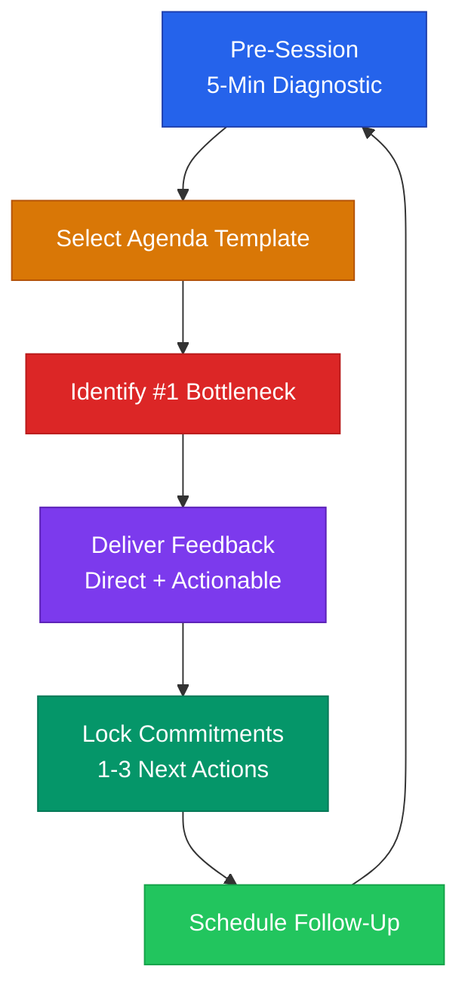

# Advisor Session Preparation Guide

---

## Pre-Session Founder Assessment (5-Minute Diagnostic)

Run this before every session. Have the founder answer these five questions in advance (via email or form), or spend the first five minutes walking through them live.

### Quick-Fire Questionnaire

| # | Question | What You're Listening For |
|---|----------|--------------------------|
| 1 | What's the single biggest thing blocking you right now? | Clarity vs. confusion. Are they focused or scattered? |
| 2 | What did you ship or close since we last spoke? | Execution velocity. Are promises turning into results? |
| 3 | How many months of runway do you have at current burn? | Financial urgency. Under 3 months = crisis mode. |
| 4 | What's your pipeline look like? (Leads, trials, conversations) | Revenue momentum. Zero pipeline = alarm bell. |
| 5 | On a scale of 1-10, how are you doing personally? | Founder energy. Below 5 = burnout risk, address first. |

**Scoring shortcut:** If answers 1-4 are vague, the founder needs clarity before strategy. If answer 5 is low, start with founder health before business tactics.

---

## Session Agenda Templates

### First Meeting (60 minutes)

| Time | Activity | Notes |
|------|----------|-------|
| 0-10 min | Founder story and motivation | Why this? Why now? Why you? |
| 10-20 min | Current state of the business | Revenue, team, product, traction |
| 20-30 min | Run the 5-minute diagnostic | Use the questionnaire above |
| 30-45 min | Identify the #1 bottleneck | See bottleneck section below |
| 45-55 min | Set 3 concrete next actions | Specific, measurable, time-bounded |
| 55-60 min | Agree on cadence and communication | Monthly? Bi-weekly? Slack or email? |

### Monthly Check-In (30 minutes)

| Time | Activity | Notes |
|------|----------|-------|
| 0-5 min | Review last session's commitments | Did they do what they said? |
| 5-10 min | Run the 5-minute diagnostic | Compare to last month |
| 10-20 min | Deep-dive on the top blocker | One topic, go deep |
| 20-27 min | Set 1-3 next actions | Fewer is better |
| 27-30 min | Confirm next meeting date | Never end without scheduling |

### Crisis Session (45 minutes)

Use when: founder is running out of cash, lost a co-founder, major customer churned, or facing legal/regulatory trouble.

| Time | Activity | Notes |
|------|----------|-------|
| 0-5 min | Let them vent | Listen. Do not problem-solve yet. |
| 5-15 min | Clarify the facts | Separate emotions from data. What actually happened? |
| 15-25 min | Triage: what must happen in the next 7 days? | Survival moves only |
| 25-35 min | Build a 30-day action plan | 3-5 actions max, prioritized |
| 35-42 min | Identify who else can help | Intros, experts, legal counsel |
| 42-45 min | Schedule check-in for 48-72 hours | Crisis = shorter feedback loops |

### Pivot Discussion (45 minutes)

Use when: founder is considering a major change in product, market, or business model.

| Time | Activity | Notes |
|------|----------|-------|
| 0-10 min | Why pivot? What data supports the change? | Distinguish signal from frustration |
| 10-20 min | What's working that you'd lose? | Protect existing assets and relationships |
| 20-30 min | Define the new hypothesis clearly | One sentence: "We believe [X] for [Y] because [Z]" |
| 30-40 min | What's the cheapest way to test this in 2 weeks? | No full rebuilds. Minimum viable test. |
| 40-45 min | Set decision criteria | "If we see [result] by [date], we commit. If not, we return." |

---

## Questions to Identify the #1 Bottleneck Fast

Use these in sequence. Stop as soon as you find the real blocker.

### The Drill-Down Sequence

1. **"What would change the most if you solved it this month?"** — Forces prioritization.
2. **"What have you already tried?"** — Reveals whether the problem is effort or strategy.
3. **"Who else has solved this problem?"** — Tests whether they're looking for patterns or reinventing.
4. **"What happens if you do nothing about this for 90 days?"** — Tests urgency. If the answer is "not much," it's not the real bottleneck.
5. **"Is there something you're avoiding that might be the actual problem?"** — The real bottleneck is often the conversation the founder doesn't want to have.

### Common Bottleneck Categories

| Category | Symptoms | Typical Fix |
|----------|----------|-------------|
| **Product** | No one uses it, high churn, feature bloat | Talk to users. Ship less, learn more. |
| **Market** | Low demand, wrong audience, crowded space | Redefine ICP. Test a niche. |
| **Team** | Founder doing everything, bad hire, co-founder conflict | Hire one key person, or have the hard conversation. |
| **Capital** | Running out of cash, can't invest in growth | Cut burn or raise. No middle ground. |
| **Founder** | Burnout, indecision, fear of failure | Address energy first. Tactics don't work on empty tanks. |

---

## How to Give Effective Feedback to Founders

### The Three Rules

1. **Be direct.** Founders get enough vague encouragement from friends and family. Your job is to tell the truth, kindly but clearly. "This isn't working" is more useful than "Have you considered other approaches?"

2. **Be actionable.** Every piece of feedback should end with a specific next step. Bad: "You need to improve your sales process." Good: "This week, call five past prospects who said no and ask what would have changed their mind."

3. **Be time-bounded.** Attach a deadline to every recommendation. Startups move in weeks, not quarters. "By our next session on [DATE], I'd like to see [SPECIFIC OUTCOME]."

### Feedback Framework: SBI + A

| Step | Meaning | Example |
|------|---------|---------|
| **S** — Situation | When and where | "In your investor pitch last Tuesday..." |
| **B** — Behavior | What you observed | "...you spent 12 minutes on the product and 30 seconds on traction." |
| **I** — Impact | Why it matters | "Investors decide based on traction. They tuned out." |
| **A** — Action | What to do next | "Flip the ratio. Lead with your 3x MoM growth. Practice by Thursday." |

### Things to Avoid

- **Don't solve their problems for them.** Ask questions that lead them to the answer.
- **Don't pile on.** One or two pieces of feedback per session. More than that overwhelms.
- **Don't be vague about timelines.** "Soon" and "eventually" are not deadlines.
- **Don't skip the positive.** If something is working, say so. Founders need fuel, not just correction.

---

> **Disclaimer:** This guide provides general advisory frameworks for educational purposes. Specific business, legal, or financial advice should come from qualified professionals in those domains.
