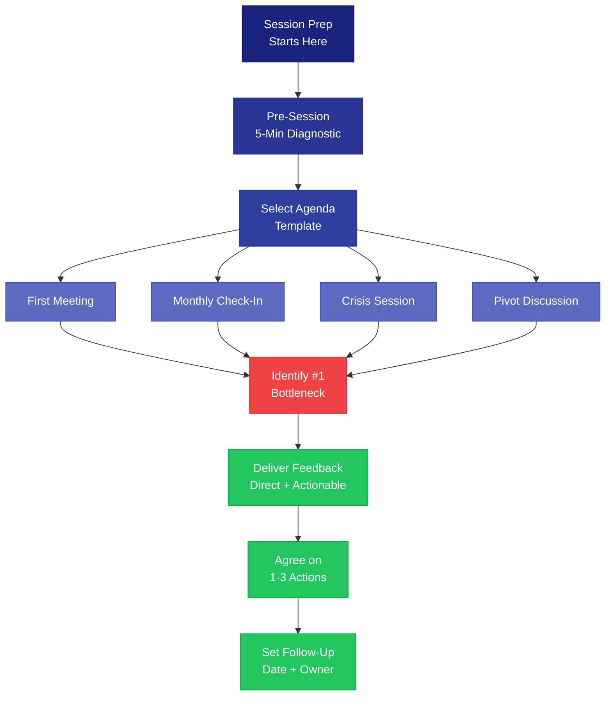

# Advisor Session Preparation Guide



---

## Pre-Session Founder Assessment (5-Minute Diagnostic)

Send this to the founder 24 hours before the session, or run it in the first 5 minutes.

```
PRE-SESSION CHECK-IN

Founder: [NAME]
Company: [COMPANY]
Date: [DATE]

Answer each question in 1-2 sentences.

1. WINS: What is the single best thing that happened since we last spoke?
   [ANSWER]

2. STUCK: What is the one thing you are most stuck on right now?
   [ANSWER]

3. NUMBERS: Share your current key metric (MRR, users, pipeline, etc.) and its trend.
   Metric: [METRIC]   Current: [VALUE]   Trend: [UP/DOWN/FLAT]

4. ENERGY: On a scale of 1-10, how are you feeling about the business right now?
   [1-10]   Why: [BRIEF REASON]

5. ASK: What is the one thing you want to walk away from this session with?
   [ANSWER]
```

**How to read the answers:**
- If WINS is blank or vague, the founder may be in a tough spot and not saying it
- If STUCK and ASK are the same topic, that is the session focus
- If ENERGY is below 5, start the session by addressing founder well-being before strategy
- If NUMBERS trend is down, prepare to discuss whether it is a blip or a pattern

---

## Session Agenda Templates

### First Meeting Agenda (60 minutes)

```
FIRST ADVISOR SESSION — AGENDA

Founder: [NAME]
Company: [COMPANY]
Date: [DATE]

0:00 - 0:05  Intros and ground rules
             - How do you prefer to receive feedback? (direct/gentle/written)
             - What does a successful advisor relationship look like to you?

0:05 - 0:20  Founder story and current state
             - What does the company do? Who is the customer?
             - Where are you right now? (stage, revenue, team, runway)
             - What got you here?

0:20 - 0:35  Top 3 challenges
             - What are the three biggest problems you are facing?
             - Which one, if solved, would unlock the other two?

0:35 - 0:50  Advisor value-add mapping
             - Where I can help: [LIST YOUR STRENGTHS]
             - Where I cannot help: [BE HONEST]
             - People I can introduce you to: [SPECIFIC NAMES/ROLES]

0:50 - 0:55  Working agreement
             - Meeting cadence: [MONTHLY / BI-WEEKLY]
             - Communication channel: [EMAIL / SLACK / TEXT]
             - Response time expectation: [24-48 HRS]

0:55 - 1:00  Action items
             - Founder commits to: [1-2 ACTIONS]
             - Advisor commits to: [1-2 ACTIONS]
             - Next meeting: [DATE]
```

### Monthly Check-In Agenda (30 minutes)

```
MONTHLY CHECK-IN — AGENDA

Founder: [NAME]
Company: [COMPANY]
Date: [DATE]

0:00 - 0:05  Quick pulse check
             - Review pre-session diagnostic answers
             - Energy level and any personal factors

0:05 - 0:15  Metrics and progress review
             - Key metrics vs. last month vs. target
             - Status of last session's action items (done / not done / pivoted)
             - Biggest win and biggest miss

0:15 - 0:25  Deep dive on #1 bottleneck
             - What is blocking progress right now?
             - What have you already tried?
             - Advisor input: [OPTIONS / CONNECTIONS / REFRAMES]

0:25 - 0:30  Action items and next steps
             - 1-3 specific actions with owners and deadlines
             - Any intros advisor will make
             - Next meeting date confirmed
```

### Crisis Session Agenda (45 minutes)

```
CRISIS SESSION — AGENDA

Founder: [NAME]
Company: [COMPANY]
Date: [DATE]
Crisis type: [RUNWAY / KEY PERSON LEFT / LOST MAJOR CUSTOMER / LEGAL / OTHER]

0:00 - 0:05  Stabilize
             - Acknowledge the situation. Do not minimize.
             - "What happened? Give me the facts, not the feelings, for now."

0:05 - 0:15  Assess the damage
             - What is the actual impact? (financial, operational, reputational)
             - What is the timeline before this becomes irreversible?
             - Who else knows? Who needs to know?

0:15 - 0:30  Triage and options
             - Option A: [DESCRIBE]  — likelihood of success, cost, timeline
             - Option B: [DESCRIBE]  — likelihood of success, cost, timeline
             - Option C: Do nothing  — what happens?
             - Which option does the founder lean toward? Why?

0:30 - 0:40  Execution plan
             - First 24 hours: [SPECIFIC ACTIONS]
             - First 7 days: [SPECIFIC ACTIONS]
             - Communication plan: who gets told what, when

0:40 - 0:45  Support check
             - Does the founder have personal support? (co-founder, partner, therapist)
             - Schedule follow-up in 48-72 hours, not next month
             - "You are going to get through this. Here is why I believe that: [SPECIFIC REASON]."
```

### Pivot Discussion Agenda (60 minutes)

```
PIVOT DISCUSSION — AGENDA

Founder: [NAME]
Company: [COMPANY]
Date: [DATE]

0:00 - 0:10  Why are we having this conversation?
             - What evidence suggests the current path is not working?
             - How long have you been thinking about this?
             - Is this data-driven or gut-driven? (Both are valid. Name it.)

0:10 - 0:25  What we know
             - What IS working that we want to keep?
             - What customers/segments show the most traction?
             - What have customers asked for that we are not doing?
             - What would we build if we started today with what we know now?

0:25 - 0:40  Pivot options
             - Option 1: [CUSTOMER PIVOT — same product, different market]
             - Option 2: [PRODUCT PIVOT — same market, different product]
             - Option 3: [BUSINESS MODEL PIVOT — same product, different pricing/delivery]
             - Option 4: [STAY THE COURSE — what would need to be true?]
             - For each: resources required, timeline to signal, risk level

0:40 - 0:50  Decision framework
             - What would make this decision obvious in 30 days?
             - Can we run a 2-week test before committing?
             - What do we tell the team? Investors? Customers?

0:50 - 1:00  Commit or test
             - Decision: [PIVOT / TEST / STAY]
             - If test: what metric, what threshold, what timeline
             - Action items with owners and deadlines
```

---

## Questions to Identify the #1 Bottleneck Fast

Use these questions in the first 5 minutes of any session to cut through noise.

**The Opening Three:**
1. "If you could only fix ONE thing in the next 30 days, what would it be?"
2. "What are you avoiding that you know you should be doing?"
3. "What would your co-founder / best employee say is the biggest problem?"

**Follow-Up Probes:**
- "Is this a people problem, a money problem, or a market problem?"
- "How long has this been the top issue? What have you tried?"
- "If I solved this for you tonight, what would be the NEXT bottleneck?"
- "Are you spending your time on this problem, or on other things?"

**Red Flag Questions (when the founder seems off):**
- "When was the last time you took a full day off?"
- "Are you sleeping?"
- "Is there something you are not telling your co-founder / board?"

---

## How to Give Effective Feedback to Founders

### The 3 Rules

1. **Be direct.** Founders are drowning in polite noise. Say the hard thing clearly.
2. **Be actionable.** Every piece of feedback should end with "here is what to do about it."
3. **Be time-bounded.** "Do X by [DATE]" is useful. "You should think about X" is not.

### Feedback Framework: STATE

```
S — SITUATION:  "Here is what I am seeing..."
T — TENSION:    "The risk is..."
A — ACTION:     "I would recommend..."
T — TIMELINE:   "Do this by [DATE]..."
E — EVIDENCE:   "You will know it is working when..."
```

### Examples

**Weak feedback:**
"You might want to think about your pricing."

**Strong feedback using STATE:**
"Your churn is 8% monthly, which means you are replacing your entire customer base every year. (SITUATION) If this continues, you will not be able to raise a Series A. (TENSION) I would run a pricing experiment: raise prices 30% for new customers starting next Monday. (ACTION) Run it for 6 weeks. (TIMELINE) If conversion stays within 10% of current rates, keep the new price. (EVIDENCE)"

### What to Avoid

- **The compliment sandwich.** Founders see through it. Just say the thing.
- **"What do you think?"** as a way to avoid giving your opinion. Give your opinion first, then ask for theirs.
- **Advice based on your company, not theirs.** "When I was at [Big Company]..." is rarely useful. Translate the lesson to their context.
- **Too many things at once.** One session, one main action item. Two at most. Three means nothing gets done.
