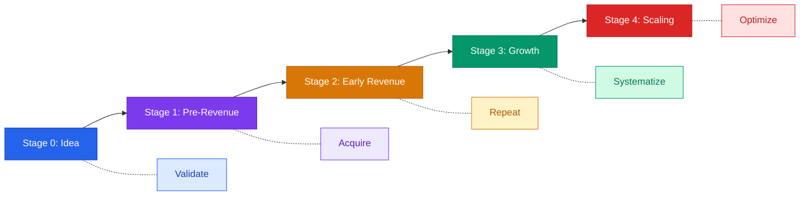

# Weekly Founder Checklists by Stage

> Copy-paste the checklist for your current stage. Use it every week to stay focused on what matters most right now.

---

## Stage 0: Idea

**Focus: Validation -- Is this problem real, and will anyone pay to solve it?**

### Weekly Checklist

- [ ] Conduct at least 3 customer discovery conversations this week
- [ ] Document key quotes and pain points from each conversation
- [ ] Update your assumption tracker with what you confirmed or disproved
- [ ] Research one competitor or alternative solution and note their strengths/weaknesses
- [ ] Refine your one-sentence problem statement based on what you learned
- [ ] Sketch or update a rough solution concept (napkin-level is fine)
- [ ] Identify and reach out to 5 new potential interviewees for next week
- [ ] Write a weekly learning summary: what changed in your thinking
- [ ] Check if your target customer segment is narrowing or shifting
- [ ] Share your progress with one advisor, mentor, or peer for honest feedback

### Monthly Checklist

- [ ] Review all interview notes and identify the top 3 recurring pain points
- [ ] Decide whether to continue, pivot, or kill the idea based on evidence
- [ ] Update your Ideal Customer Profile with demographic and behavioral details
- [ ] Create or update a simple landing page to test messaging and collect interest
- [ ] Estimate your total addressable market size with real data sources
- [ ] Map the competitive landscape: who exists, what they charge, where they fall short
- [ ] Draft a rough value proposition: what you do, for whom, and why it matters
- [ ] Set specific validation goals for next month (number of interviews, sign-ups, etc.)

---

## Stage 1: Pre-Revenue

**Focus: Customer Acquisition -- Get your first 10 paying customers.**

### Weekly Checklist

- [ ] Ship at least one improvement or fix to your MVP based on user feedback
- [ ] Personally onboard or demo the product for at least 2 prospective customers
- [ ] Follow up with every active trial user or beta tester for feedback
- [ ] Track your sign-up-to-active-user conversion rate and note any changes
- [ ] Identify and test one new customer acquisition channel (content, outreach, community)
- [ ] Review all customer support messages or complaints and categorize them
- [ ] Update your product roadmap based on this week's feedback patterns
- [ ] Send a personal thank-you or check-in to your most engaged users
- [ ] Review your cash position and weeks of runway remaining
- [ ] Document one thing you learned about what makes someone convert from free to paid

### Monthly Checklist

- [ ] Analyze which acquisition channel is producing the best results and double down
- [ ] Review your pricing: are customers hesitating, or are you undercharging?
- [ ] Conduct 5+ in-depth conversations with users who did NOT convert and learn why
- [ ] Update your financial model with actual numbers (sign-ups, conversions, costs)
- [ ] Review and tighten your onboarding flow to reduce drop-off
- [ ] Set a clear revenue target for next month and write down the plan to hit it
- [ ] Evaluate whether your MVP scope needs to grow or if you should cut features
- [ ] Update your pitch deck or investor materials with real traction data

---

## Stage 2: Early Revenue

**Focus: Repeatability -- Can you reliably acquire and retain customers?**

### Weekly Checklist

- [ ] Review MRR and compare to last week; identify what drove any change
- [ ] Check churn: did anyone cancel? Reach out to learn why
- [ ] Review your sales pipeline and follow up on every open opportunity
- [ ] Analyze which customer segment is converting fastest and most profitably
- [ ] Ship product updates on a consistent schedule (weekly or biweekly)
- [ ] Monitor CAC by channel and pause anything that is not working
- [ ] Document your sales process: what steps consistently lead to a close
- [ ] Collect and publish one new customer testimonial or case study
- [ ] Review support ticket volume and response time
- [ ] Hold a weekly team standup or co-founder sync to align priorities

### Monthly Checklist

- [ ] Calculate and track LTV:CAC ratio; target 3:1 or better
- [ ] Review net revenue retention: are existing customers spending more or less over time
- [ ] Audit your expenses and cut anything that is not directly contributing to growth
- [ ] Conduct a cohort analysis: are newer customers retaining as well as earlier ones
- [ ] Formalize your sales playbook so someone other than the founder could sell
- [ ] Review hiring needs: what role would have the biggest impact if filled next month
- [ ] Update your financial projections with actual revenue and cost trends
- [ ] Assess whether your current pricing tiers match how customers actually use the product

---

## Stage 3: Growth

**Focus: Systems and Metrics -- Build the machine that runs without you.**

### Weekly Checklist

- [ ] Review the company dashboard: MRR, churn, CAC, LTV, runway
- [ ] Hold a leadership team meeting with clear agenda and action items
- [ ] Check pipeline health: is next month's revenue target on track?
- [ ] Review hiring pipeline and interview at least one candidate if roles are open
- [ ] Monitor product uptime and performance; address any reliability issues immediately
- [ ] Review marketing spend vs. results and reallocate budget where needed
- [ ] Ensure every team has clear weekly goals tied to company-level OKRs
- [ ] Read customer feedback from the past week and share key themes with the team
- [ ] Check cash flow forecast for the next 90 days
- [ ] Dedicate time to one strategic initiative (new market, partnership, product line)

### Monthly Checklist

- [ ] Run a full financial review: burn rate, runway, revenue growth, margins
- [ ] Conduct a team health check: are people aligned, engaged, and unblocked?
- [ ] Review and update OKRs or quarterly goals based on actual progress
- [ ] Analyze your funnel conversion rates at every stage and identify the biggest drop-off
- [ ] Evaluate whether current systems (CRM, support, billing) are scaling with you
- [ ] Meet with at least 3 customers for in-depth feedback on where the product should go next
- [ ] Review your competitive position: has anything changed in the market?
- [ ] Plan next quarter's budget, headcount, and key milestones

---

## Stage 4: Scaling

**Focus: Efficiency and Team -- Grow without breaking.**

### Weekly Checklist

- [ ] Review company-wide KPIs and flag anything off-track to the leadership team
- [ ] Ensure each department lead has a clear plan for the week tied to quarterly goals
- [ ] Monitor unit economics: is each new customer still profitable at current scale?
- [ ] Review cross-functional dependencies and unblock any teams that are stuck
- [ ] Check in on new hires: are they ramping effectively with proper onboarding?
- [ ] Review customer expansion revenue: are upsell and cross-sell motions working?
- [ ] Monitor infrastructure costs and flag any unexpected increases
- [ ] Dedicate time to culture: recognize wins, reinforce values, address issues early
- [ ] Review the product roadmap with engineering and product leads for alignment
- [ ] Assess one area for process improvement or automation

### Monthly Checklist

- [ ] Run a detailed P&L review with finance: revenue, COGS, operating expenses, margins
- [ ] Conduct a retention analysis by segment: which customers stay longest and spend most
- [ ] Review organizational structure: are reporting lines clear and spans of control reasonable?
- [ ] Assess management team capacity: does anyone need support, coaching, or a new hire under them?
- [ ] Evaluate operational risks: single points of failure in people, technology, or vendors
- [ ] Review compliance and security posture: are certifications current, policies followed?
- [ ] Benchmark your metrics against industry peers using public data or investor input
- [ ] Plan for the next 6-12 months: what needs to be true for the company to reach the next milestone?

### Quarterly Checklist (Post-Series A)

- [ ] Prepare and send board update: financials, KPIs, wins, challenges, asks
- [ ] Review cap table: any upcoming option expirations, refresh grants needed, or 409A due?
- [ ] Conduct quarterly business review (QBR) with each department lead
- [ ] Review burn multiple and magic number: is growth spend efficient?
- [ ] Assess whether current pricing supports scale or needs revision
- [ ] Evaluate investor relations: any follow-up asks, warm intro requests, or strategic help needed?
- [ ] Run an equity refresh analysis: are key employees approaching full vest? Plan retention grants.
- [ ] Review vendor contracts: any renewals coming up that should be renegotiated at scale?
- [ ] Audit data governance: are customer data practices ready for enterprise scrutiny?
- [ ] Plan hiring for next quarter against budget and revenue targets

---

## How to Use These Checklists

1. **Identify your stage.** Be honest -- most founders think they are further along than they are.
2. **Copy the relevant checklist** into your task manager, notebook, or project board.
3. **Review it every Monday** to plan your week and every Friday to assess progress.
4. **Move to the next stage** when you consistently complete the current checklist without finding new issues.
5. **Do not skip stages.** The habits from earlier stages are the foundation for later ones.

---

*These checklists are practical guidelines, not rigid rules. Adapt them to your specific business, industry, and team size.*
