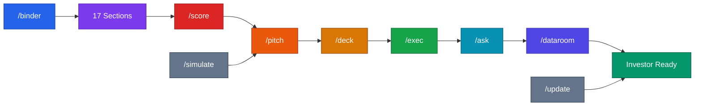

# Binder & Fundraising Commands



Load this file when the user types: `/binder` `/score` `/pitch` `/deck` `/exec` `/ask` `/dataroom` `/update` `/simulate`

For deep content on any section, also load: `references/playbooks/investor-binder.md`

---

## `/binder`

**Purpose:** Run the full investor binder readiness assessment. Shows exactly what's done, what's in draft, and what's missing.

**Execute:**
1. Present the 17-section checklist and ask the founder to rate each:
   - ✅ Done and investor-ready
   - 🟡 Draft / incomplete  
   - ❌ Not started

```
SECTION                          STATUS
─────────────────────────────────────────
1.  Executive Summary            [ ]
2.  Pitch Deck                   [ ]
3.  Company Overview             [ ]
4.  Problem + Solution           [ ]
5.  Market Opportunity           [ ]
6.  Product / Demo               [ ]
7.  Business Model               [ ]
8.  Traction + Metrics           [ ]
9.  Go-To-Market Strategy        [ ]
10. Competitive Analysis         [ ]
11. Team + Advisors              [ ]
12. Financial Model              [ ]
13. Cap Table                    [ ]
14. The Ask + Use of Funds       [ ]
15. Legal / Corporate Docs       [ ]
16. Customer Evidence            [ ]
17. Investor Q&A Prep            [ ]
```

2. Score it: ✅ count → readiness tier
   - 14–17 ✅ → Ready to raise
   - 9–13 ✅ → 2–4 weeks to ready
   - 5–8 ✅ → 4–8 weeks to ready
   - < 5 ✅ → Build traction first

3. Identify the 3 highest-priority missing sections
4. Ask: *"Which section do you want to work on first?"*
5. Load `references/playbooks/investor-binder.md` and execute that section

---

## `/binder [section]`

**Purpose:** Jump directly to a specific binder section without running the full assessment.

**Supported section names:**
`exec` `deck` `overview` `problem` `solution` `market` `product` `model` `traction` `gtm` `competition` `team` `financial` `captable` `ask` `legal` `customers` `qa`

**Execute:**
1. Load `references/playbooks/investor-binder.md`
2. Jump to the matching section
3. Present the template
4. Coach the founder through filling it in
5. Produce a draft output when done

**Example:**
```
/binder traction
→ Opens Section 8: Traction + Metrics
→ Walks through the template
→ Outputs a filled-in traction section
```

---

## `/score`

**Purpose:** Produce a weighted investor readiness score. Use before going out to investors.

**Execute:**
1. Ask for status on the 7 weighted criteria:

```
CRITERIA                                     WEIGHT   SCORE (1–5)
─────────────────────────────────────────────────────────────────
Traction signal is real and growing            25%      [ ]
Executive summary is clear in 60 seconds       15%      [ ]
Pitch deck tells a compelling story            15%      [ ]
Financial model has defensible assumptions     15%      [ ]
Team section answers "why you?"                10%      [ ]
Market sizing is bottom-up and credible        10%      [ ]
Legal + cap table is clean                     10%      [ ]
```

2. Calculate weighted score
3. Interpret:
   - 4.0–5.0 → *"Go raise. Now."*
   - 3.0–3.9 → *"Address the lowest-scoring items first, then go."*
   - Below 3.0 → *"Build more traction. Use this time well."*

4. Give the 2–3 most impactful improvements ranked by score × weight

---

## `/pitch`

**Purpose:** Generate and coach a 60-second verbal pitch the founder can deliver in an elevator, at an event, or at the start of an investor meeting.

**Execute:**
1. Ask if they have an existing pitch or are starting fresh
2. If starting fresh, collect:
   - What the company does (one sentence)
   - Who the customer is
   - The core problem
   - Best traction signal
   - The ask
3. Generate a 60-second verbal pitch using this structure:

```
VERBAL PITCH STRUCTURE (60 seconds)

Hook (5 sec):     "[Surprising stat or problem statement]"
What we do (10 sec): "[Company] helps [customer] [outcome]."
Why it matters (10 sec): "[Size of problem / why now]"
How it works (10 sec): "[3-word mechanism or key differentiator]"
Traction (15 sec): "We have [best metric]. [Growth signal]."
Ask (10 sec): "We're raising [amount] to [milestone]."
```

4. Deliver the draft pitch
5. Offer to practice: *"Want to simulate an investor responding to this?"* → route to `/simulate`

---

## `/deck`

**Purpose:** Build the pitch deck slide by slide, one at a time.

**Execute:**
1. Ask if they have an existing deck or are starting fresh
2. If starting, work through each slide in order:

```
SLIDE BUILD ORDER
1.  Cover          → Company name, tagline, your contact
2.  Problem        → Who, pain level, why now
3.  Solution       → What you do, show don't tell
4.  Why Now        → The specific shift that makes this possible today
5.  Market Size    → TAM / SAM / SOM with methodology
6.  Product        → Demo, screenshots, core flow (visuals > words)
7.  Traction       → Best metrics, revenue, growth, retention
8.  Business Model → How you make money, pricing, unit economics
9.  GTM            → Acquisition channel, why it scales
10. Competition    → Landscape + your differentiated position
11. Team           → Why you? Unfair advantages.
12. The Ask        → Amount, instrument, use of funds, milestones
```

3. For each slide: show the template → ask for their inputs → draft the content → confirm → move to next
4. After all 12: *"Your deck is outlined. Do you want to refine any slide?"*

**Deck rules (enforce throughout):**
- One idea per slide
- Every number must be defensible
- Lead with traction if they have it
- No font smaller than 18pt
- 12 slides for send; 14 max for in-person

---

## `/exec`

**Purpose:** Draft the 1-page executive summary. Most common first document investors request.

**Execute:**
1. Collect inputs through 6 quick questions:
   - What does your company do? (one sentence)
   - Who is the customer and what's their pain?
   - What's your best traction signal?
   - How big is the market? (rough TAM)
   - How do you make money?
   - How much are you raising and what will it fund?

2. Draft using this template:

```
[COMPANY NAME]
[Tagline]

PROBLEM
[2–3 sentences]

SOLUTION
[2–3 sentences + key differentiator]

TRACTION
[Best metric + growth rate]

MARKET
TAM: $XB | Beachhead: $XM — [specific segment]

BUSINESS MODEL
[How you make money — 1–2 sentences]

TEAM
[Founder 1]: [Relevant credential]
[Founder 2]: [Relevant credential]

THE ASK
Raising: $[X] on a [SAFE / Seed round]
Use of funds: [3 buckets]
Milestone: [Specific goal this round funds]

[Name] | [Email] | [Website] | [Calendly]
```

3. Deliver the draft → ask: *"What needs to change?"* → revise

---

## `/ask`

**Purpose:** Build "The Ask" — the specific raise terms, use of funds, and milestone. Founders often underprepare this section.

**Execute:**
1. Walk through 5 questions:
   - How much are you raising in this round?
   - What instrument? (SAFE / Convertible Note / Priced Round)
   - What's your valuation cap (SAFE) or pre-money (priced)?
   - What are the 3 buckets for use of funds? (product / GTM / team)
   - What milestone does this round get you to?

2. Draft the Ask section:

```
THE ASK

Raising:         $[X]
Instrument:      [SAFE / Note / Priced Round]
Valuation cap:   $[X]M
Minimum check:   $[X]
Closing target:  [Date]

USE OF FUNDS
[X]% — Product + Engineering: [specific]
[X]% — Sales + Marketing: [specific]
[X]% — Team + Operations: [specific]

THIS ROUND FUNDS
→ [Milestone 1] by [Date]
→ [Milestone 2] by [Date]
→ Gets us to [key metric] — enabling [next stage]

CURRENT COMMITMENTS
[Investor]: $[X] committed
Total soft-circled: $[X]
```

3. Flag any gaps: *"Your valuation cap anchors the whole round. Have you stress-tested it against your projected Series A?"*

---

## `/dataroom`

**Purpose:** Set up a clean, professional data room folder structure investors can navigate.

**Execute:**
1. Output the standard folder structure:

```
📁 [Company Name] — Data Room (as of [Date])

📄 00_README.md              ← What's in here + who to contact
📄 01_Executive_Summary.pdf
📊 02_Pitch_Deck.pdf
📄 03_Company_Overview.pdf
📊 04_Financial_Model.xlsx   (view-only link)
📊 05_Cap_Table.xlsx         (view-only link)
📁 06_Legal/
    ├── Certificate_of_Incorporation.pdf
    ├── Founder_Vesting_Agreements.pdf
    ├── IP_Assignment_Agreements.pdf
    └── Existing_SAFEs_or_Notes.pdf
📁 07_Customer_Evidence/
    ├── Customer_Quotes.pdf
    ├── Case_Studies.pdf
    └── LOIs/ (signed letters of intent)
📁 08_Product/
    ├── Demo_Recording.mp4 or [Loom link]
    └── Product_Screenshots.pdf
📄 09_Team_Bios.pdf
📄 10_Reference_Contacts.pdf
```

2. Ask which sections they have ready vs. missing
3. For each missing section, offer to create it now or queue it

**Hosting options:**
- Google Drive (free, familiar)
- Docsend (tracks who opens what + time spent — recommended)
- Notion (clean presentation, easy to update)
- Capbase or Carta (most professional, auto-updates cap table)

---

## `/update`

**Purpose:** Draft a monthly investor update. Keeps investors engaged and working for you.

**Execute:**
1. Ask for: month, top 2 wins, key metrics (MRR, customers, runway), honest challenge, specific ask
2. Draft:

```
Subject: [Company] — [Month] Update

Highlights:
• [Win 1]
• [Win 2]

Metrics:
• MRR: $X (↑/↓ X% MoM)
• Customers: X (↑ X new, ↓ X churned)
• Runway: X months

Challenges:
• [Honest challenge — investors respect transparency]

Ask:
• [Specific: intro to X, feedback on Y, recruit candidate Z]

Thank you,
[Name]
```

3. Remind: *"Send this even when things aren't great. Silence breeds anxiety. Transparency builds trust."*

---

## `/simulate [role]`

**Purpose:** Roleplay a skeptical investor to pressure-test the founder's pitch and answers.

**Supported roles:** `vc` `angel` `strategic` `skeptic` (default: `skeptic`)

**Execute:**
1. If role is provided, adopt that investor persona
2. If not, default to a skeptical seed-stage VC
3. Say: *"I'm ready. Give me your pitch — 60 seconds."*
4. After their pitch, respond in character with 3–5 hard questions
5. After each answer, give real-time coaching: *"Good. But investors will push on [X]. Here's a stronger answer..."*
6. Continue until the founder feels ready

**Persona guides:**

**VC (institutional):** Focused on market size, defensibility, team, and path to Series A. Asks: *"Why will this be a $1B company?"*

**Angel:** More relationship-driven, asks about founder story and personal conviction. Asks: *"Why are YOU the right person to build this?"*

**Strategic:** Corporate investor focused on fit with their portfolio. Asks: *"How does this integrate with our existing offerings?"*

**Skeptic (default):** Challenges every assumption. Asks: *"Why hasn't this been built already?"* and *"What happens when Google builds this?"*
