# Ops, Sales & Coaching Commands

```mermaid
graph TD
    ops["Ops Commands"] --> metrics["Metrics & Finance"]
    ops --> sales["Sales & GTM"]
    ops --> coaching["Coaching & Accountability"]
    ops --> team["Team Building"]

    metrics --> m1["/metrics"]
    metrics --> m2["/runway"]
    metrics --> m3["/burn"]
    metrics --> m4["/uniteconomics"]
    metrics --> m5["/model"]

    sales --> s1["/outreach"]
    sales --> s2["/followup"]
    sales --> s3["/objection"]
    sales --> s4["/icp"]
    sales --> s5["/position"]
    sales --> s6["/proposal"]

    coaching --> c1["/status"]
    coaching --> c2["/blockers"]
    coaching --> c3["/wins"]
    coaching --> c4["/next"]
    coaching --> c5["/pivot"]
    coaching --> c6["/validate"]

    team --> t1["/hire"]
    team --> t2["/cofounder"]

    style ops fill:#2563eb,stroke:#1e40af,color:#fff
    style metrics fill:#dc2626,stroke:#991b1b,color:#fff
    style sales fill:#16a34a,stroke:#166534,color:#fff
    style coaching fill:#9333ea,stroke:#6b21a8,color:#fff
    style team fill:#ea580c,stroke:#9a3412,color:#fff
    style m1 fill:#fca5a5,stroke:#991b1b,color:#000
    style m2 fill:#fca5a5,stroke:#991b1b,color:#000
    style m3 fill:#fca5a5,stroke:#991b1b,color:#000
    style m4 fill:#fca5a5,stroke:#991b1b,color:#000
    style m5 fill:#fca5a5,stroke:#991b1b,color:#000
    style s1 fill:#86efac,stroke:#166534,color:#000
    style s2 fill:#86efac,stroke:#166534,color:#000
    style s3 fill:#86efac,stroke:#166534,color:#000
    style s4 fill:#86efac,stroke:#166534,color:#000
    style s5 fill:#86efac,stroke:#166534,color:#000
    style s6 fill:#86efac,stroke:#166534,color:#000
    style c1 fill:#c4b5fd,stroke:#6b21a8,color:#000
    style c2 fill:#c4b5fd,stroke:#6b21a8,color:#000
    style c3 fill:#c4b5fd,stroke:#6b21a8,color:#000
    style c4 fill:#c4b5fd,stroke:#6b21a8,color:#000
    style c5 fill:#c4b5fd,stroke:#6b21a8,color:#000
    style c6 fill:#c4b5fd,stroke:#6b21a8,color:#000
    style t1 fill:#fdba74,stroke:#9a3412,color:#000
    style t2 fill:#fdba74,stroke:#9a3412,color:#000
```



Load this file when the user types any of: `/metrics` `/runway` `/burn` `/uniteconomics` `/model`
`/outreach` `/followup` `/objection` `/icp` `/position` `/proposal`
`/status` `/blockers` `/wins` `/next` `/pivot` `/validate` `/hire` `/cofounder`

For deeper content, load the matching playbook from `references/playbooks/`.

---

## METRICS & FINANCE COMMANDS

---

### `/metrics`

**Purpose:** Force the founder to know their numbers. Produces a clean investor-ready dashboard.

**Execute:**
1. Ask for these 8 numbers (use "don't know" as a valid answer — flag it):

```
Revenue:
  MRR: $___
  MoM growth: ___%
  ARR: $___

Customers:
  Total paying: ___
  Monthly churn: ___%
  Net Revenue Retention: ___%

Unit Economics:
  CAC: $___
  LTV: $___

Cash:
  Bank balance: $___
  Monthly burn: $___
  Runway: ___ months
```

2. Calculate any missing numbers if enough inputs exist
3. Flag any red flags:
   - Churn > 5% monthly → serious problem
   - LTV:CAC < 1x → broken unit economics
   - Runway < 6 months → crisis territory
   - MoM growth < 5% → GTM issue
4. Output a clean metrics summary formatted for investor communication
5. Offer interactive tools: *"Want to model your runway? Open `apps/runway-calculator.html`. For unit economics, try `apps/unit-economics-calculator.html`."*
6. Ask: *"Which number concerns you most right now?"* → route to fix

---

### `/runway`

**Purpose:** Calculate runway and flag urgency level. Fast triage.

**Execute:**
1. Ask for: bank balance, monthly gross burn, monthly revenue
2. Calculate: `Runway = Cash ÷ Net Burn` (Net Burn = Gross Burn − Revenue)
3. Interpret:
   - 18+ months → *"Comfortable. Focus on growth."*
   - 12–18 months → *"Healthy. Start fundraising conversations now if raising."*
   - 6–12 months → *"Start raising immediately. This window closes fast."*
   - < 6 months → *"Crisis mode. See /pivot or cut burn today."*
4. Give 3 specific actions based on their runway situation
5. Offer: *"Want to model scenarios? Open `apps/runway-calculator.html` for an interactive calculator."*

---

### `/burn`

**Purpose:** Quick burn rate check and commentary. Good weekly habit.

**Execute:**
1. Ask for: this month's total expenses (or last month if current isn't closed)
2. Break down by category if they can: payroll / contractors / tools / marketing / other
3. Compare to last month if they know it
4. Flag the biggest line item: *"Your largest expense is [X]. Is it generating revenue?"*
5. Identify 1 cut that could extend runway by 30+ days

---

### `/uniteconomics`

**Purpose:** Walk through CAC, LTV, and payback period. Surfaces pricing and GTM health.

**Execute:**
1. Collect inputs:
   - Monthly sales + marketing spend: $___
   - New customers acquired this month: ___
   - Average monthly revenue per customer: $___
   - Gross margin: ___%
   - Monthly churn rate: ___%

2. Calculate:
```
CAC = Sales & Marketing Spend ÷ New Customers
LTV = ARPU × Gross Margin % ÷ Monthly Churn Rate
LTV:CAC = LTV ÷ CAC
CAC Payback = CAC ÷ (ARPU × Gross Margin %)
```

3. Interpret:
   - LTV:CAC > 3x → healthy
   - LTV:CAC 1–3x → marginal, improve before scaling
   - LTV:CAC < 1x → broken, fix pricing or churn before spending on acquisition
   - Payback > 18 months → too long for most SaaS

4. Give 1–2 specific levers to improve the weakest metric
5. Offer: *"Want to play with the numbers? Open `apps/unit-economics-calculator.html` for interactive modeling."*

---

### `/model`

**Purpose:** Scaffold a 5-tab financial model structure. Removes the blank-page problem.

**Execute:**
1. Ask: spreadsheet (Google Sheets / Excel) or just the structure?
2. Output the 5-tab structure with row-by-row scaffolding:

```
TAB 1 — ASSUMPTIONS (fill these first)
  Starting MRR: $___
  New customer growth rate (MoM): ___%
  Average deal size: $___
  Monthly churn rate: ___%
  Headcount plan (month-by-month)
  Key cost assumptions (hosting, tools, marketing)

TAB 2 — P&L (Monthly, 12–24 months)
  Rows: Revenue | COGS | Gross Profit | Gross Margin %
        Payroll | Marketing | G&A | Total OpEx
        EBITDA | Net Income/(Loss)

TAB 3 — CASH FLOW
  Rows: Starting Cash | Net Burn | Ending Cash
        Runway (months remaining)

TAB 4 — UNIT ECONOMICS
  Rows: CAC | LTV | LTV:CAC | Payback Period (months)
        Burn Multiple | NRR

TAB 5 — SCENARIOS
  Columns: Conservative | Base | Aggressive
  Key assumption: What changes in each scenario?
```

3. Flag: *"Investors look for: Is burn justified by growth? Is the path to profitability visible? Are your assumptions defensible?"*

---

## SALES & GTM COMMANDS

---

### `/outreach [target]`

**Purpose:** Write a cold email or DM for a specific target. Founder knows who — needs the words.

**Execute:**
1. If `[target]` is provided (e.g., "family law attorneys", "angel investors", "HR directors"), use it
2. If not, ask: *"Who are you reaching out to and what do you want them to do?"*
3. Ask: channel? (email / LinkedIn DM / Slack / Twitter)
4. Draft the message using channel-appropriate format:

**Email:**
```
Subject: [Specific result] for [their role/company type]

Hi [Name],

[1 sentence — personal relevance or why them specifically.]

[Company] helps [their type] [specific outcome] — [one proof point].

Worth a quick call to see if it's a fit?

[Your name]
```

**LinkedIn DM (shorter):**
```
Hi [Name] — saw [specific thing about them].
Quick question: [problem-focused question, not a pitch].
Happy to share what we've learned if useful.
```

5. Ask: *"Do you want a 3-email follow-up sequence too?"*

---

### `/followup`

**Purpose:** Write a follow-up for a stalled lead. Most deals die from no follow-up.

**Execute:**
1. Ask: who is it, what was the last interaction, how long ago?
2. Select the right follow-up type:

**Gentle nudge (3–5 days after last contact):**
```
Subject: Re: [original subject]

Hi [Name], just wanted to make sure this didn't get buried.
[Optional: relevant new development or resource]
Still happy to connect when timing works.
[Name]
```

**Value-add (1 week):**
```
Subject: Re: [original subject]

Wanted to share [relevant insight / case study / stat] — useful regardless of timing.
Still open to a quick call if the moment's right.
```

**Final close (2 weeks):**
```
Subject: Re: [original subject]

Last note — didn't want to keep bothering you.
If the timing ever works, here's my calendar: [link].
Rooting for you either way.
```

---

### `/objection [objection]`

**Purpose:** Coach through a specific sales or investor objection in real time.

**Execute:**
1. If `[objection]` is provided, go directly to coaching
2. If not, ask: *"What objection did you hear?"*
3. Identify the objection type and give a coached response:

| Objection | Reframe + Response |
|-----------|-------------------|
| "Too expensive" | *"Compared to what?"* or *"What would make it worth it?"* — anchor on value, not cost |
| "We already have something" | *"What does it not do that you wish it did?"* — find the gap |
| "Not right now" | *"When would be right? Can we put a date on it?"* — create a specific future |
| "Send me more info" | *"What specifically would help you evaluate this?"* — replace passive with active |
| "I need to check with my team" | *"Who else should be on the next call?"* — advance, don't stall |
| "Market is too small" | *"We're starting with [beachhead]. Here's the expansion path..."* |
| "Why now?" | *"[Specific market shift] makes this possible/necessary today."* |
| "What's your moat?" | *"Our unfair advantage is [X] — here's why it compounds."* |

4. Roleplay the response if they want practice: *"Want to try it? I'll play the objector."*

---

### `/icp`

**Purpose:** Build or sharpen the Ideal Customer Profile. ICP drift kills GTM efficiency.

**Execute:**
1. Walk through 5 questions:
   - Who gets the most value from your product? (role, industry, company size)
   - What specific problem do they have right before they need you?
   - What trigger event makes them ready to buy NOW?
   - What do they currently do instead? (the workaround)
   - Who should you NOT sell to? (anti-ICP)

2. Draft the ICP statement:
```
ICP: [Title] at [company type / size]
     who [trigger event / situation]
     and struggles with [specific pain]
     currently solving it by [workaround]
     willing to pay [price range] to fix it

Anti-ICP: [Who to avoid and why]
```

3. Ask: *"Does this match your 3 best current customers?"* If not — revise.

---

### `/position`

**Purpose:** Draft a positioning statement. The foundation of all marketing and sales copy.

**Execute:**
1. Collect inputs:
   - Who is the target customer?
   - What category are you in?
   - What's the key benefit?
   - Who are the main alternatives?
   - What's the unique proof point?

2. Draft using the positioning formula:
```
For [target customer]
Who [have this problem / are in this situation]
[Company] is a [category]
That [key benefit]
Unlike [main alternative]
We [unique proof point]
```

3. Test it: *"Read this out loud. Does it sound like something you'd say to a real customer? If not, let's rewrite it."*

---

### `/proposal`

**Purpose:** Scaffold a one-page proposal. Remove blank-page friction on deals.

**Execute:**
1. Ask for: customer name, problem they have, your solution, price, timeline
2. Draft:

```
PROPOSAL FOR [CUSTOMER NAME]
Prepared by [Your Company] | [Date]

THE SITUATION
[2 sentences: what problem they have and why it matters now]

OUR APPROACH
[3 sentences: what you'll do, how it works, what's different]

WHAT YOU GET
• [Deliverable 1]
• [Deliverable 2]
• [Deliverable 3]

INVESTMENT
$[X] — [payment terms]
[Refund / guarantee policy if any]

TIMELINE
[Start date] → [Key milestone] → [Completion]

NEXT STEP
[Specific action: "Sign and return by [date] to lock in [start date]"]

Questions? [Name] | [Email] | [Phone]
```

---

## COACHING & ACCOUNTABILITY COMMANDS

---

### `/status`

**Purpose:** Quick progress report. Reflects back gaps the founder might not see.

**Execute:**
1. Ask: *"What have you shipped in the last 7 days?"*
2. Ask: *"What's still blocking you?"*
3. Ask: *"What's your #1 priority this week?"*
4. Reflect back:
   - What's on track
   - What's slipping
   - What the gap between stated priority and actual activity reveals
5. Give 1 specific reorientation task

---

### `/blockers`

**Purpose:** Surface what's actually blocking progress — gets past "I've been busy."

**Execute:**
1. Ask: *"What's the thing you keep not doing?"*
2. Diagnose the blocker type:

| Blocker Type | Signal | Response |
|-------------|--------|----------|
| Clarity | "I don't know how to start" | Break into the first 3 micro-steps |
| Fear | "I'm afraid it won't work" | *"Rejection is data. Send it and find out."* |
| Perfectionism | "It's not ready yet" | *"Done beats perfect. What's the 80% version?"* |
| Overwhelm | "There's too much to do" | *"Pick one thing. The rest disappears for now."* |
| Avoidance | "I know what to do, I just haven't" | Route to `/recover` |
| External | Waiting on someone else | Identify the dependency + workaround |

3. Remove or route around the blocker
4. Give the smallest possible next action

---

### `/wins`

**Purpose:** Log and reinforce recent wins. Momentum is built on recognition, not just pressure.

**Execute:**
1. Ask: *"What's gone well in the last week or two?"*
2. Reflect back each win with a concrete framing:
   - *"You closed your first paying customer. That's PMF signal."*
   - *"You shipped on time. Execution reliability compounds."*
   - *"You got a 'no' and followed up anyway. That's how deals close."*
3. Connect wins to the larger trajectory: *"Three months ago you had no customers. Now you have [X]. That's real."*
4. Ask: *"What would it take to repeat that win this week?"*

---

### `/next`

**Purpose:** Give the single most important next action when the founder has no idea where to start.

**Execute:**
1. Ask: *"What stage are you at and what's the current biggest constraint?"*
2. Apply the startup priority hierarchy:
   - Stage 0–1: Next action = always a customer conversation
   - Stage 2: Next action = whatever unblocks the next closed deal
   - Stage 3: Next action = whatever is blocking the fundraise or revenue target
3. Give 1 task. Not 3. Not a list. Just 1.
4. *"Do that. Come back when it's done."*

---

### `/pivot [situation]`

**Purpose:** Coach the pivot vs. persevere decision with structure, not panic.

**Execute:**
1. If `[situation]` is provided, frame it; if not ask: *"What's making you consider a pivot?"*
2. Run the 4-question diagnostic:

```
Q1: Is the problem still real?
    YES → continue | NO → pivot the problem

Q2: Is the solution actually solving it?
    YES → continue | NO → pivot the solution

Q3: Can you reach customers at viable cost?
    YES → continue | NO → pivot the channel

Q4: Will they pay what you need to be sustainable?
    YES → keep going | NO → pivot the model or pricing
```

3. Identify where the breakdown is
4. Give a specific pivot hypothesis to test
5. Remind: *"Pivot ≠ failure. Slack, Instagram, YouTube — all pivots. Panic pivot = failure. Pivot based on data."*

---

### `/validate [idea]`

**Purpose:** Run the assumption mapping and Mom Test framework before any new feature or direction.

**Execute:**
1. Ask: *"What's the idea or feature you're considering?"*
2. Surface the 5 riskiest assumptions:

```
1. Customer: Who specifically has this problem?
2. Problem: Is it painful enough that they'll pay to fix it?
3. Solution: Does our approach actually solve it?
4. Channel: Can we reach them at viable cost?
5. Revenue: Will they pay what we need?
```

3. Rank by risk (highest uncertainty × highest impact if wrong)
4. Give the fastest test for the top 2 assumptions
5. Rule: *"Don't build until assumptions 1 and 2 are validated."*

---

### `/hire [role]`

**Purpose:** Build a job description and equity framing for a specific role.

**Execute:**
1. If `[role]` is provided, use it; if not ask: *"What role are you hiring for?"*
2. Ask: full-time or contractor? Equity-only, cash+equity, or full cash?
3. Draft the job description:

```
TITLE: [Specific — "Head of Sales" not "Growth Person"]

WE'RE LOOKING FOR:
[2 sentences — what they'll do and why it matters]

YOU'LL BE GREAT IF YOU:
• [Required skill — specific + observable]
• [Required mindset]
• [Nice to have]

WHAT YOU'LL OWN IN 90 DAYS:
• [Deliverable 1]
• [Deliverable 2]
• [Deliverable 3]

COMPENSATION:
Salary: $X–$X | Equity: X% (4yr / 1yr cliff)

THIS IS NOT A FIT IF YOU:
• [Anti-pattern 1]
• [Anti-pattern 2]
```

4. Give equity range benchmarks for the role (Seed stage typical ranges):
   - First engineer: 0.5–2%
   - VP Sales: 0.5–1%
   - First salesperson: 0.1–0.5%
   - Advisor: 0.1–0.25%

---

### `/cofounder`

**Purpose:** Surface the co-founder agreement checklist and conversation guide before things go wrong.

**Execute:**
1. Present the checklist of things to agree on in writing:

```
CO-FOUNDER AGREEMENT CHECKLIST

Equity:
  [ ] Equity split (and written rationale)
  [ ] Vesting schedule for all founders (4yr / 1yr cliff standard)
  [ ] What happens if a founder leaves (buyback rights)

Roles:
  [ ] Decision-making authority (who decides what)
  [ ] Full-time commitment expectations
  [ ] Compensation expectations (now + future)

IP:
  [ ] All work done for the company belongs to the company
  [ ] IP assignment signed by every founder

Exit:
  [ ] Right of first refusal on share transfers
  [ ] Drag-along / tag-along rights
  [ ] Dissolution process if the company doesn't work

Other:
  [ ] Non-compete / non-solicit scope
  [ ] Confidentiality obligations
```

2. Ask: *"Which of these haven't you talked about yet?"*
3. For any unmarked item, give a conversation starter:
   - *"Here's how to open the equity conversation: 'I want to make sure we both feel great about this long-term. Can we talk through the split and vesting?'"*
4. Remind: *"A handshake agreement is not enough. More co-founder disputes come from undocumented expectations than bad intentions."*
