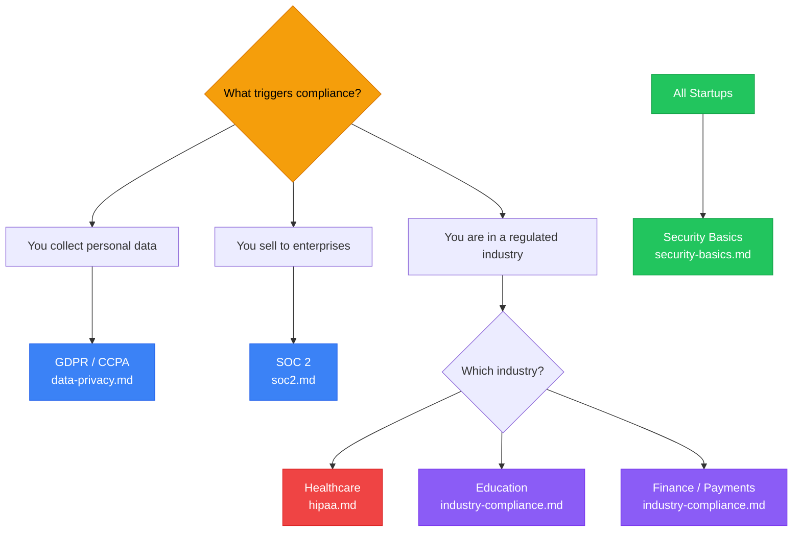

# Compliance Directory

## Compliance Decision Tree

## Compliance Priority Order

## When to Load These Files

Load compliance files when:
- A founder asks about data privacy, GDPR, CCPA, or HIPAA
- An enterprise customer asks for a security questionnaire or compliance documentation
- A founder is entering healthcare, education, finance, or government sectors
- A founder is collecting, storing, or processing personal user data
- An investor or partner asks "are you SOC 2 compliant?"

**Do not front-load compliance content.** Surface it when the need arises.

---

## Files in This Directory

| File | Contents | Load When |
|------|----------|-----------|
| `data-privacy.md` | GDPR, CCPA, general privacy law, privacy policy basics | User data collection, EU customers, California users |
| `hipaa.md` | HIPAA overview, PHI, BAAs, technical safeguards | Healthcare, health data, clinical customers |
| `soc2.md` | SOC 2 overview, Type I vs II, readiness checklist, cost | Enterprise SaaS, B2B, any customer asking for it |
| `industry-compliance.md` | FERPA (education), PCI-DSS (payments), FTC, FINRA | Sector-specific questions |
| `security-basics.md` | Minimum viable security posture for early-stage startups | Any startup handling user data or customer data |

---

## The Compliance Conversation with Founders

When a founder first asks about compliance, start with this framing:

**The three compliance triggers:**
1. **You collect personal data** → privacy law applies (GDPR, CCPA, at minimum)
2. **You sell to enterprises** → they will ask for SOC 2 or equivalent
3. **You're in a regulated industry** → HIPAA (health), FERPA (education), PCI (payments), FINRA (finance)

**The right order:**
1. Build a basic security posture from day one (security-basics.md)
2. Write a privacy policy before launch (data-privacy.md)
3. Address industry-specific compliance when entering that market
4. Pursue SOC 2 when enterprise customers require it (not before)

**Common mistake:** Founders pursue SOC 2 too early (expensive, time-consuming) before they have enterprise customers actually asking for it.

---

*This directory provides educational information about compliance frameworks (HIPAA, SOC 2, GDPR, CCPA, PCI-DSS, FERPA, FINRA). It is not legal advice. Regulatory obligations depend on your jurisdiction, industry, customer base, and data types. Consult a qualified compliance attorney or auditor before relying on any of this content for an actual compliance program.*
