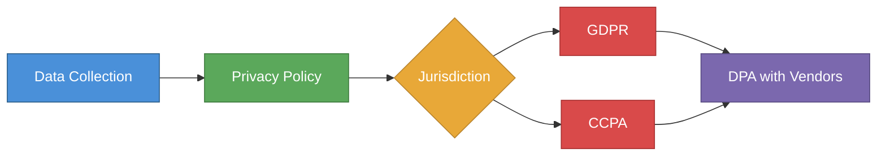

# Data Privacy Compliance



**Disclaimer:** Privacy law is jurisdiction-specific and evolves rapidly. This is educational context. Consult a privacy attorney for compliance decisions.

---

## Do You Have a Privacy Problem?

You are subject to privacy law if you:
- Collect names, emails, or any identifying information from users
- Use cookies or tracking pixels on your website
- Store user behavior data
- Have customers in California (CCPA) or the EU/UK (GDPR)
- Sell or share data with third parties

**Bottom line:** If you have a website with a signup form, you have privacy obligations.

---

## The Laws That Apply to Missouri Startups

### GDPR (EU General Data Protection Regulation)
- **Who it applies to:** Any company that processes personal data of EU/UK residents — regardless of where the company is located
- **If you have even one EU user:** GDPR applies
- **Key rights:** Access, erasure ("right to be forgotten"), portability, objection
- **Penalties:** Up to 4% of global annual revenue or €20M — whichever is higher
- **What you need:**
  - Privacy policy that covers GDPR requirements
  - Cookie consent banner for EU visitors
  - Data Processing Agreement (DPA) with any vendors handling EU data
  - Legal basis for processing (consent, legitimate interest, contract, etc.)
  - Data breach notification within 72 hours

### CCPA / CPRA (California Consumer Privacy Act / Rights Act)
- **Who it applies to:** Businesses that collect personal data of California residents AND meet one of:
  - Annual gross revenue > $25M
  - Buy/sell/receive personal data of 100,000+ consumers/households annually
  - Derive 50%+ of revenue from selling personal data
- **Most early-stage startups:** Not yet subject to CCPA thresholds, but best practice to comply anyway
- **Key rights:** Know what data is collected, delete data, opt out of sale, non-discrimination
- **What you need:**
  - "Do Not Sell My Personal Information" link (if you sell data)
  - Updated privacy policy
  - Process for handling consumer requests within 45 days

### Missouri Consumer Data Protection Act (State Level)
- Missouri has discussed consumer data protection legislation
- **Current status:** Monitor at mo.gov — no comprehensive state privacy law enacted as of 2024
- **Practical advice:** Comply with GDPR/CCPA standards regardless — they set the de facto baseline

### CAN-SPAM Act (Federal — Email Marketing)
- **Applies to:** All commercial email sent from the US
- **Requirements:**
  - No deceptive subject lines or headers
  - Physical mailing address in every email
  - Clear unsubscribe mechanism
  - Honor unsubscribe requests within 10 days
- **Penalty:** Up to $50,120 per email violation

### COPPA (Children's Online Privacy Protection Act)
- **Applies to:** Any online service directed at children under 13, or that knowingly collects data from children under 13
- **Requirement:** Verifiable parental consent before collecting data
- **Risk:** If your product could reach children, address this explicitly

---

## Minimum Viable Privacy Stack (For Early-Stage Startups)

### 1. Privacy Policy
**Required before you launch.** Must cover:
- What data you collect and why
- How you use it
- Who you share it with
- How long you keep it
- User rights (access, deletion, portability)
- How to contact you
- Cookie policy (if applicable)
- GDPR-specific section (if EU users)
- CCPA section (if California users, even informally)

**Free tools:**
- Iubenda — generates compliant policies; ~$27/year
- Termly — free tier available
- Shopify Privacy Policy Generator (if e-commerce)
- Attorney-drafted: $500–$2,000; recommended if you handle sensitive data

### 2. Terms of Service
**Required before users create accounts or transact.**
Must cover:
- What the service is and what it isn't
- User obligations and prohibited conduct
- IP ownership (you own your IP; users own their data)
- Limitation of liability
- Dispute resolution / arbitration clause
- Governing law (Missouri)

### 3. Cookie Consent Banner
**Required for EU users; best practice for all.**
- Tools: Cookiebot (free tier), CookieYes, Osano
- Must allow users to accept or reject non-essential cookies
- Analytics (Google Analytics) requires consent for EU users

### 4. Data Processing Agreement (DPA)
**Required if you process EU personal data as a processor for another controller.**
- If you're a SaaS tool that processes your customers' user data: you need a DPA
- Your key vendors (AWS, Google, Stripe, etc.) have DPAs — you must execute them
- Template: GDPR.eu has a standard DPA template

### 5. Sub-processor List
If you have a DPA with customers, you must disclose all sub-processors (AWS, SendGrid, Stripe, etc.)
Publish at a URL like: yourcompany.com/sub-processors

---

## Data Minimization Principles (Build These In From Day 1)

1. **Collect only what you need.** Don't ask for birthdate if you don't use it.
2. **Delete what you no longer use.** Define a data retention policy.
3. **Encrypt sensitive data** at rest and in transit.
4. **Limit access** — only employees who need data should have it.
5. **Log access** to sensitive data where possible.
6. **Have a breach response plan** — who gets notified, when, how.

---

## Data Breach Response Checklist

If you discover a data breach:

```
IMMEDIATE (within hours):
[ ] Contain the breach — isolate affected systems
[ ] Preserve evidence — don't delete logs
[ ] Notify your attorney and cyber insurance carrier

WITHIN 72 HOURS (if GDPR applies):
[ ] Notify relevant EU Data Protection Authority
[ ] Document: what data, how many people, what happened

WITHIN 30 DAYS (CCPA breach notification, if applicable):
[ ] Notify affected California residents
[ ] Notify California Attorney General if 500+ residents affected

WITHIN REASONABLE TIME (general US):
[ ] Notify affected users
[ ] State AG notification (varies by state)
[ ] Credit monitoring offer (if financial/SSN data exposed)
[ ] Post public notice if required

AFTER CONTAINMENT:
[ ] Root cause analysis
[ ] Security improvements
[ ] Update incident response plan
```

---

## Vendor Privacy Checklist

Before signing up any vendor that handles user data:
- [ ] Do they have a Privacy Policy?
- [ ] Do they offer a DPA? (Required for GDPR compliance)
- [ ] What data do they store and for how long?
- [ ] Are they SOC 2 certified or equivalent?
- [ ] Where is data stored? (EU data storage requirements apply)
- [ ] What is their breach notification process?

**Key vendors and their DPA locations:**
- AWS: aws.amazon.com/compliance/gdpr-center
- Google (Workspace): workspace.google.com/terms/dpa_terms.html
- Stripe: stripe.com/privacy
- Twilio/SendGrid: sendgrid.com/policies/privacy
- HubSpot: legal.hubspot.com/dpa
