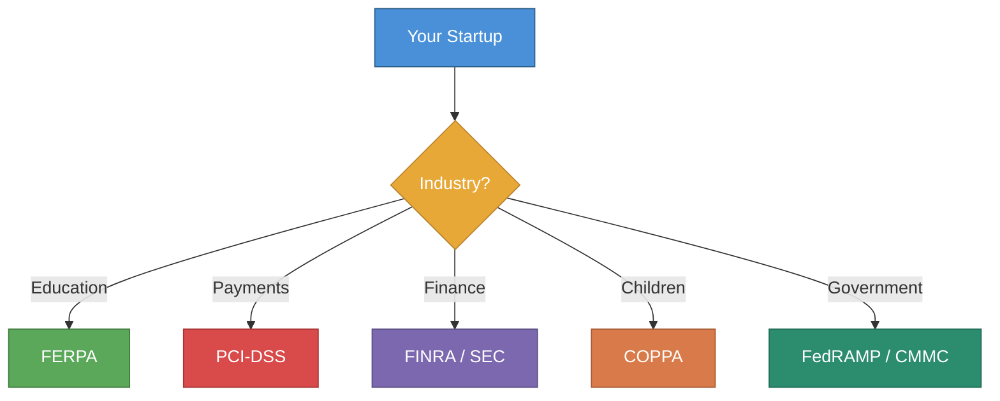

# Industry-Specific Compliance



**Disclaimer:** Industry regulations change and enforcement varies by context. Consult a compliance specialist or attorney for your specific situation.

---

## How to Use This File

Identify which regulations apply to your sector, then work through the relevant section. Most early-stage startups are affected by only one or two of these.

| Your Market | Likely Regulation |
|------------|------------------|
| K-12 or higher education | FERPA |
| Any payment processing | PCI-DSS |
| Financial services, investment | FINRA, SEC, GLBA |
| Consumer-facing products | FTC Act, UDAP |
| Children's products | COPPA (see data-privacy.md) |
| Defense / government contracting | ITAR, CMMC, FedRAMP |
| Cannabis (Missouri) | Missouri DHSS regulations |

---

## FERPA (Family Educational Rights and Privacy Act)

**Applies to:** Any company that handles student education records on behalf of a school, district, or university.

**What it protects:** Education records — grades, transcripts, disciplinary records, financial aid, personally identifiable information about students.

**Who must comply:** Schools are the covered entity. If you sell to schools and your product processes student records, you operate as a "school official" and must comply with FERPA's requirements.

### Key FERPA Requirements for EdTech Companies

**Legitimate Educational Interest:**
Your product must have a legitimate educational interest — you can only access student data to the extent necessary to provide your service.

**No Secondary Use:**
You cannot use student data for any purpose beyond providing the contracted service. No advertising, no selling data, no training models on student data without consent.

**Data Destruction:**
When the contract ends, return or destroy all student data as specified by the school.

**Breach Notification:**
Notify the school promptly if student data is breached.

### FERPA Compliance Checklist
```
[ ] Data Processing Agreement (DPA) with each school district
[ ] Contract specifies: legitimate educational interest, data use limitations
[ ] No student data used for advertising or non-educational purposes
[ ] No sale or disclosure of student data to third parties
[ ] Data destruction process documented and followed at contract end
[ ] Breach notification process established
[ ] Student data not retained beyond contract period
[ ] Employees with access to student data trained on FERPA
```

### Missouri-Specific: Student Data Privacy Act
Missouri has a Student Data Privacy Act that provides additional protections for K-12 student data. Requirements include:
- Operators must maintain reasonable security procedures
- Operators cannot sell or use student data for targeted advertising
- Students can request deletion of their data

**Website:** revisor.mo.gov (search: student data privacy)

---

## PCI-DSS (Payment Card Industry Data Security Standard)

**Applies to:** Any organization that accepts, processes, stores, or transmits credit or debit card data.

**Who enforces it:** The major card brands (Visa, Mastercard, Amex, Discover) — not a government agency.

**Consequence of non-compliance:** Card brand fines ($5,000–$100,000/month), increased transaction fees, loss of ability to accept cards, liability for fraudulent transactions.

### The Easiest Path: Don't Touch Card Data

Use a PCI-compliant payment processor (Stripe, Braintree, Square) and implement tokenization — they handle card data; you never see or store it. This reduces your PCI scope dramatically.

**Stripe's approach:**
- Stripe.js or Stripe Elements — card data goes directly to Stripe, never touches your servers
- Stripe is PCI DSS Level 1 certified
- Your scope: SAQ A (simplest) — fill out a self-assessment questionnaire

### PCI Compliance Levels

| Merchant Level | Transaction Volume | Requirement |
|---------------|-------------------|-------------|
| Level 1 | > 6M transactions/year | On-site audit by QSA |
| Level 2 | 1M–6M/year | SAQ + quarterly scan |
| Level 3 | 20K–1M/year | SAQ + quarterly scan |
| Level 4 | < 20K/year | SAQ + quarterly scan |

**Most early-stage startups:** Level 4 — self-assessment questionnaire (SAQ) only.

### SAQ Types (Self-Assessment Questionnaire)
- **SAQ A:** E-commerce using fully outsourced payment (Stripe Elements) — simplest, ~22 questions
- **SAQ A-EP:** E-commerce with some card data flowing through your servers
- **SAQ D:** Full cardholder data environment — most complex

### Minimum PCI Requirements (SAQ A)
```
[ ] Use Stripe, Braintree, or equivalent — no card data on your servers
[ ] HTTPS on all payment pages
[ ] No card data in logs, emails, or databases
[ ] Strong access controls on any systems with payment access
[ ] Annual SAQ completed and kept on file
[ ] Quarterly external vulnerability scan (ASV) — required for Level 4 merchants with internet-facing systems
```

---

## FINRA and SEC (Financial Services)

**Applies to:** Companies providing investment advice, brokerage services, securities trading, or financial planning tools.

**This is complex territory.** If you're in fintech touching securities or investment, engage a securities attorney before launch.

### Key Registrations

**Investment Adviser Registration:**
- If your product provides investment advice for compensation → likely need to register as an Investment Adviser
- < $100M AUM: Register with Missouri Secretary of State (sos.mo.gov)
- > $100M AUM: Register with SEC

**Broker-Dealer Registration:**
- If facilitating securities transactions → likely need broker-dealer registration
- Registered with FINRA and SEC
- Significant capital requirements and ongoing compliance

**Exemptions to Know:**
- **Robo-adviser exemption:** Automated investment tools may qualify for lighter regulation
- **Platform exemption:** Some fintech platforms qualify for specific exemptions
- **No-action letters:** SEC issues guidance on specific products

### Missouri Money Transmitter License
- Required if you transmit money on behalf of others
- Applies to: Payment processors, wallets, remittance services
- Apply at: **sos.mo.gov** → Financial Institutions
- Bond requirement: Varies; typically $100K–$500K
- Time: 3–6 months

---

## FTC Act and Consumer Protection (UDAP)

**Applies to:** All companies selling to consumers. Nearly universal applicability.

**What it prohibits:** Unfair or deceptive acts or practices (UDAP) in commerce.

### FTC Compliance Basics

**Advertising Claims:**
- Must be truthful and not misleading
- Must be substantiated — have evidence before making claims
- Material claims ("clinically proven," "100% secure") require adequate support

**Endorsements and Testimonials (FTC Endorsement Guides):**
- Paid endorsements must be disclosed
- "I made $10K in my first month" claims require disclosure if atypical
- Influencer partnerships must disclose the relationship
- Updated 2023 rules: disclosure must be clear and conspicuous

**Subscription Trap Rules (FTC ROSCA):**
- Must clearly disclose subscription terms before charging
- Must provide easy cancellation
- Cannot use dark patterns to prevent cancellation
- "Free trial" requires clear disclosure of what happens after

**Dark Patterns:**
- FTC actively enforces against UI/UX designed to trick users
- Examples: hidden unsubscribe, confusing opt-out language, pre-checked boxes
- Missouri AG also enforces under Missouri Merchandising Practices Act

**Data Privacy (FTC Act Section 5):**
- Companies must follow their own privacy policies
- Companies must implement reasonable security
- Deceptive data practices are FTC violations

---

## ITAR / EAR (Defense and Export Control)

**Applies to:** Companies with products that have military or dual-use applications; companies selling to defense contractors.

**ITAR (International Traffic in Arms Regulations):**
- Controls export of defense-related articles and services
- Managed by State Department
- Applies to: Military hardware, software with encryption for defense use, certain technical data

**EAR (Export Administration Regulations):**
- Controls export of dual-use items (commercial and military potential)
- Managed by Commerce Department (BIS)

**If relevant:** Engage an export controls attorney immediately. ITAR violations carry criminal penalties up to $1M per violation and 20 years imprisonment.

**Missouri relevance:** Strong defense corridor (Boeing, Northrop, Leidos) means many Missouri startups end up with defense-adjacent customers where ITAR/EAR applies.

---

## CMMC (Cybersecurity Maturity Model Certification)

**Applies to:** Defense contractors and subcontractors handling Controlled Unclassified Information (CUI).

**Who needs it:** Any company in the DoD supply chain handling CUI — including software vendors whose products are used on DoD systems.

**Levels:**
- **Level 1:** Basic cyber hygiene (17 practices) — self-assessment
- **Level 2:** Advanced (110 NIST SP 800-171 practices) — third-party assessment for most
- **Level 3:** Expert (DoD-led assessment)

**Timeline:** CMMC requirements being phased into contracts 2024–2026.

**Missouri relevance:** Critical for any startup pursuing DoD contracts or subcontracting with Boeing, Leidos, etc.

---

## Missouri Cannabis Compliance

Missouri legalized recreational cannabis (Amendment 3, effective December 2022).

**Regulated by:** Missouri Department of Health and Senior Services (DHSS)

**License types:** Dispensary, cultivation, manufacturing, testing laboratory, microbusiness

**For cannabis-adjacent tech startups:**
- Seed-to-sale tracking systems: Must integrate with Missouri's state system (METRC)
- Payment processing: Cannabis is federally illegal — most banks and payment processors don't serve cannabis directly; specialized processors exist
- Banking: Find a cannabis-friendly financial institution; options limited
- IP considerations: Federal trademark registration unavailable for cannabis products (illegal under federal law); state registration available

**Website:** health.mo.gov/safety/cannabis/
