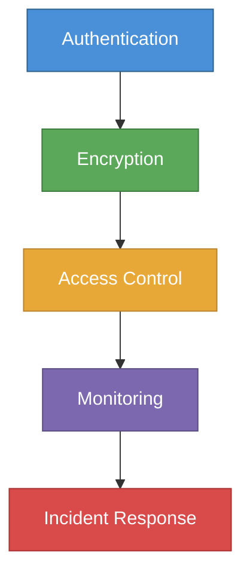

# Security Basics for Early-Stage Startups



**Build security in from day one. Retrofitting security is 10x more expensive than starting right.**

---

## Minimum Viable Security (Do This Before You Launch)

### Authentication
- [ ] Passwords hashed with bcrypt, Argon2, or scrypt (never MD5 or SHA-1)
- [ ] Multi-factor authentication (MFA) available to users; required for admins
- [ ] Password reset flow uses time-limited tokens, not passwords in email
- [ ] Account lockout after failed attempts (5–10 attempts, then temporary lockout)
- [ ] Use an identity provider (Auth0, Cognito, Clerk) rather than rolling your own

### Data Protection
- [ ] HTTPS everywhere — no HTTP in production; enforce HSTS
- [ ] Database encrypted at rest (enabled by default on RDS, MongoDB Atlas, etc.)
- [ ] Sensitive fields additionally encrypted at the application layer (passwords, SSNs, PHI)
- [ ] Backups encrypted and tested for restore
- [ ] PII not stored in logs

### Access Control
- [ ] Least privilege: employees only have access they need
- [ ] Production database not directly accessible from developer laptops
- [ ] Separate environments: dev / staging / production
- [ ] Environment variables for secrets — never hardcode credentials
- [ ] Secret management: AWS Secrets Manager, HashiCorp Vault, or 1Password Secrets Automation

### Infrastructure
- [ ] All traffic over HTTPS/TLS 1.2+
- [ ] Firewall rules restrict inbound traffic to only necessary ports
- [ ] No public SSH access — use bastion hosts or AWS Systems Manager Session Manager
- [ ] S3 buckets not public unless intentionally serving public assets
- [ ] CloudTrail or equivalent logging enabled in AWS/GCP/Azure

### Code Security
- [ ] Dependencies scanned for vulnerabilities (Dependabot, Snyk)
- [ ] No secrets in git history (use git-secrets or truffleHog to scan)
- [ ] Code review required for all production changes (no solo deploys)
- [ ] OWASP Top 10 addressed in application design

### Internal Security
- [ ] All employees use password manager (1Password, Bitwarden)
- [ ] MFA on all company accounts (email, AWS, GitHub, Slack)
- [ ] Full disk encryption on all company laptops (FileVault / BitLocker)
- [ ] Remote wipe capability on company devices
- [ ] Offboarding checklist: revoke all access within 24 hours

---

## OWASP Top 10 — What Every Developer Must Know

The most common web application vulnerabilities. Address these before launch.

| Vulnerability | What It Is | How to Prevent |
|---------------|-----------|----------------|
| **Injection (SQL, NoSQL, OS)** | Attacker injects malicious code into queries | Parameterized queries; ORMs; input validation |
| **Broken Authentication** | Weak auth allows account takeover | Use Auth0/Cognito; enforce MFA; rate limit logins |
| **Sensitive Data Exposure** | Unencrypted sensitive data | Encrypt at rest and in transit; minimize data collection |
| **XML External Entities (XXE)** | XML parsers process malicious input | Disable external entity processing |
| **Broken Access Control** | Users access data they shouldn't | Enforce authorization at every endpoint; test IDOR |
| **Security Misconfiguration** | Default configs, open ports, stack traces exposed | Harden configs; disable debug in prod; rotate defaults |
| **Cross-Site Scripting (XSS)** | Malicious scripts injected into pages | Sanitize inputs; use CSP headers; escape output |
| **Insecure Deserialization** | Malicious objects deserialized | Validate serialized data; avoid Java serialization |
| **Using Vulnerable Components** | Old dependencies with known CVEs | Dependabot; Snyk; update dependencies regularly |
| **Insufficient Logging** | No audit trail for incidents | Log all auth events; alert on anomalies |

---

## Common Security Mistakes at Early-Stage Startups

| Mistake | Fix |
|---------|-----|
| Hardcoding API keys in code | Use environment variables; scan git history with truffleHog |
| Public S3 buckets | Audit with AWS Trusted Advisor; default to private |
| No MFA on AWS root account | Enable immediately; never use root for day-to-day |
| Shared database credentials | Per-service credentials; rotate regularly |
| Logging PII | Mask or hash PII before logging |
| Admin panels accessible from internet | Restrict to VPN or specific IP ranges |
| No security headers | Add CSP, HSTS, X-Frame-Options, X-Content-Type-Options |
| Storing passwords in plaintext | bcrypt/Argon2 only; never reversible encryption |
| No incident response plan | Write a one-page plan before you need it |
| Skipping penetration testing | Budget $5K–$15K for annual pentest once you have customers |

---

## Incident Response — One-Page Plan

Write this before you have an incident:

```
INCIDENT RESPONSE PLAN — [Company Name]

SEVERITY LEVELS
P1 (Critical): Data breach, system compromise, payment fraud
P2 (High): Service outage, unauthorized access, data exposure
P3 (Medium): Attempted intrusion, policy violation
P4 (Low): Suspicious activity, potential vulnerability

FIRST RESPONSE (within 1 hour of P1/P2):
1. Identify: What system/data is affected?
2. Contain: Isolate affected systems (revoke credentials, block IPs, take offline)
3. Notify: [Founder/CTO name] + [Attorney name] + [Cyber insurance carrier]
4. Document: Log everything with timestamps

COMMUNICATION (P1 breach affecting user data):
- External legal counsel: [Name, phone]
- Cyber insurance: [Carrier, policy #, phone]
- Customers: Template in crisis-difficult-templates.md
- GDPR: DPA notification within 72 hours (if EU data)

ESCALATION CONTACTS
[Name] — [Role] — [Phone]
[Name] — [Role] — [Phone]

RECOVERY
- Restore from last known good backup
- Reset all credentials on affected systems
- Conduct post-mortem within 5 days
```

---

## Security Tools Stack (Startup Budget)

| Category | Free / Low Cost | Paid / Scale |
|----------|----------------|--------------|
| Auth | Clerk (free tier), Auth0 (free tier) | Auth0 production, Okta |
| Secrets | AWS Secrets Manager ($0.40/secret/mo) | HashiCorp Vault |
| Vulnerability scanning | Dependabot (free), Snyk (free tier) | Snyk Teams |
| SAST | Semgrep (free), CodeQL (free) | Checkmarx |
| Logging/SIEM | CloudTrail (free), CloudWatch | Datadog, Splunk |
| Pen testing | HackerOne (bug bounty) | Cobalt.io, NCC Group |
| Compliance automation | Vanta, Drata (see soc2.md) | Same |
| Password manager | Bitwarden Teams ($3/user/mo) | 1Password Business |
| Endpoint security | Malwarebytes (free) | CrowdStrike, SentinelOne |
