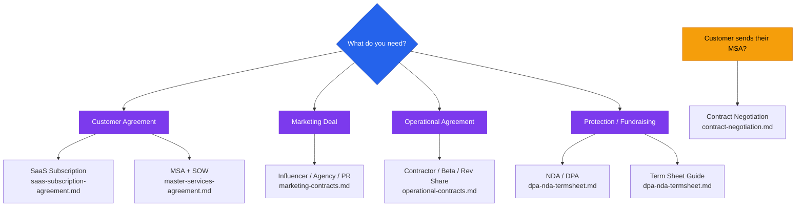
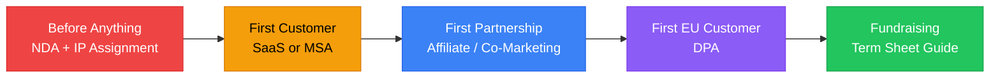

# Contracts Directory

**Disclaimer:** These are educational scaffolds — not final legal documents. All contracts should be reviewed by a licensed attorney before execution, especially for deals over $10K, involving enterprise customers, or equity instruments.

---

## Contract Selection Guide

## Contract Priority Timeline

## When to Load These Files

Load contract files when a founder needs to send, sign, or understand any business agreement — customer contracts, marketing deals, freelancer engagements, partnerships, equity instruments, or grants.

---

## Files in This Directory

### Customer & Revenue Contracts
| File | Contents |
|------|----------|
| `saas-subscription-agreement.md` | Full SaaS subscription agreement + order form template |
| `master-services-agreement.md` | MSA framework + SOW template for professional services |
| `dpa-nda-termsheet.md` | GDPR DPA, mutual/one-way NDAs, VC term sheet reading guide |

### Marketing Contracts
| File | Contents |
|------|----------|
| `marketing-contracts.md` | Influencer, marketing agency, PR retainer, co-marketing, sponsorship, affiliate/referral, brand ambassador, photography/videography, advertising insertion order, content licensing |

### Operational Contracts
| File | Contents |
|------|----------|
| `operational-contracts.md` | Independent contractor, beta/pilot, revenue share, LOI, speaking engagement, software license (outbound), grant acknowledgment |

### Negotiation Reference
| File | Contents |
|------|----------|
| `contract-negotiation.md` | Redline philosophy, standard positions, red lines, what to concede |

---

## Quick Reference — Which Contract for Which Situation

| Situation | Contract | File |
|-----------|---------|------|
| Paying a creator to post about your product | Influencer Agreement | marketing-contracts.md |
| Hiring a growth marketing agency | Marketing Agency Agreement | marketing-contracts.md |
| Hiring a PR firm | PR Agency Retainer | marketing-contracts.md |
| Joint campaign with a partner company | Co-Marketing Agreement | marketing-contracts.md |
| Sponsoring a podcast or newsletter | Sponsorship Agreement | marketing-contracts.md |
| Building a referral / affiliate program | Affiliate/Referral Agreement | marketing-contracts.md |
| Ongoing brand representation | Brand Ambassador Agreement | marketing-contracts.md |
| Commissioning a photo or video shoot | Photography/Videography Agreement | marketing-contracts.md |
| Buying ad placements in a publication | Advertising Insertion Order | marketing-contracts.md |
| Licensing content for your ads | Content Licensing Agreement | marketing-contracts.md |
| Hiring a freelance developer or designer | Independent Contractor Agreement | operational-contracts.md |
| Giving early users free access for feedback | Beta/Pilot Agreement | operational-contracts.md |
| Splitting revenue with a partner | Revenue Share Agreement | operational-contracts.md |
| Documenting a deal before full contracts | Letter of Intent (LOI) | operational-contracts.md |
| Getting paid to speak at a conference | Speaking Engagement Agreement | operational-contracts.md |
| Licensing your software to another company | Software License Agreement | operational-contracts.md |
| Accepting a grant | Grant Acknowledgment | operational-contracts.md |
| Selling SaaS to a business | SaaS Subscription Agreement | saas-subscription-agreement.md |
| Professional services or custom work | MSA + SOW | master-services-agreement.md |
| GDPR / EU customers | Data Processing Agreement | dpa-nda-termsheet.md |
| Protecting confidential information | Mutual or One-Way NDA | dpa-nda-termsheet.md |
| You receive a VC term sheet | Term Sheet Guide | dpa-nda-termsheet.md |
| Customer sends their MSA to sign | Contract Negotiation Guide | contract-negotiation.md |

---

## Contract Priority for Early-Stage Startups

**Before anything else:**
1. NDA — before sharing confidential info with anyone outside the company
2. IP assignment — before any employee or contractor starts work

**Before first paying customer:**
3. SaaS Subscription Agreement or MSA

**Before first marketing partnership:**
4. Affiliate Agreement or Co-Marketing Agreement

**Before commissioning content:**
5. Photographer/Videographer or Influencer Agreement

**Before hiring any agency:**
6. Marketing Agency Agreement or PR Retainer

**Before first EU customer:**
7. Data Processing Agreement

**Before any fundraising conversation:**
8. Review term sheet guide
