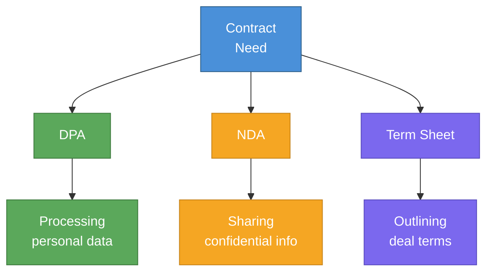

# Data Processing Agreement (DPA), NDA Library & Term Sheet Guide



---

# PART 1: DATA PROCESSING AGREEMENT (DPA)

## When You Need a DPA

Required when:
- You process personal data of EU/UK residents on behalf of a customer (GDPR Article 28)
- A customer operates in California and requests one (CCPA best practice)
- Enterprise customers require it as part of their vendor onboarding

**Who signs it:** You (as data processor) and your customer (as data controller).

---

## DPA — Key Sections

```
DATA PROCESSING AGREEMENT

This DPA is entered into between:
Controller: [Customer Company Name] ("Controller")
Processor: [Your Company Name] ("Processor")
Effective Date: [Date]
Incorporated into: [Master Agreement / SaaS Agreement] dated [Date]

1. DEFINITIONS
"Personal Data" means any information relating to an identified or identifiable
natural person as defined under applicable Data Protection Law.
"Data Protection Law" means GDPR, UK GDPR, CCPA, and other applicable privacy laws.
"Processing" has the meaning given under applicable Data Protection Law.
"Sub-processor" means any third party engaged by Processor to process Personal Data.

2. SCOPE AND PURPOSE
Processor processes Personal Data only: (a) to provide the services under the
Agreement; (b) on documented instructions from Controller; (c) as required by law.

3. PROCESSOR OBLIGATIONS
Processor shall:
(a) Process Personal Data only on Controller's instructions;
(b) Ensure persons authorized to process are bound by confidentiality;
(c) Implement appropriate technical and organizational security measures (Article 32);
(d) Not engage sub-processors without Controller's prior written consent;
(e) Assist Controller with data subject rights requests within 5 business days;
(f) Notify Controller of any personal data breach within 48 hours of becoming aware;
(g) Delete or return all Personal Data upon termination (at Controller's option);
(h) Provide all information necessary to demonstrate compliance.

4. SECURITY MEASURES
Processor implements measures including:
- Encryption of Personal Data at rest (AES-256) and in transit (TLS 1.2+)
- Access controls and authentication
- Audit logging
- Regular security testing
- Employee training
[Processor may reference its Security Policy at [URL] for full details]

5. SUB-PROCESSORS
Current sub-processors: [List at URL or in Exhibit A]
Processor will provide 30 days' notice of new sub-processors.
Controller may object within 14 days; if unresolved, Controller may terminate.

6. DATA SUBJECT RIGHTS
Processor will forward data subject requests to Controller within 5 business days
and assist Controller in responding as technically feasible.

7. BREACH NOTIFICATION
Processor will notify Controller within 48 hours of discovering a personal data breach,
including: nature of the breach; categories and approximate number of records affected;
likely consequences; measures taken or proposed.

8. INTERNATIONAL TRANSFERS
If Processor transfers Personal Data outside the EEA/UK, it will do so only:
(a) To countries with adequate protection decisions; or
(b) Using Standard Contractual Clauses (SCCs) or equivalent mechanism.

9. TERM AND TERMINATION
This DPA continues as long as Processor processes Personal Data under the Agreement.
Upon termination, Processor will delete or return all Personal Data within 30 days.

10. GOVERNING LAW
[Same as main Agreement]

Exhibit A — Sub-Processors
[Company Name] | [Purpose] | [Location]
AWS (Amazon Web Services) | Cloud infrastructure | USA + EU
Stripe | Payment processing | USA
[Other vendor] | [Purpose] | [Location]

Controller: _____________________ Date: _________
Processor: ______________________ Date: _________
```

---

# PART 2: NDA LIBRARY

## NDA Type Selection Guide

| Situation | NDA Type |
|-----------|---------|
| Exploring a partnership or deal — both sides sharing | Mutual NDA |
| You're sharing your confidential info only | One-Way (Disclosing Party favored) |
| Receiving confidential info only | One-Way (Receiving Party favored) |
| New employee | Employee NDA (embedded in employment agreement) |
| Advisor or board member | Advisor NDA + confidentiality |

---

## Mutual NDA (Standard)

```
MUTUAL NON-DISCLOSURE AGREEMENT

Parties:
Party A: [Company Name], [State] [Entity]
Party B: [Company Name], [State] [Entity]
Effective Date: [Date]
Purpose: [Evaluating a potential business relationship / partnership / investment]

1. CONFIDENTIAL INFORMATION
"Confidential Information" means non-public information disclosed by either party
in connection with the Purpose, whether oral, written, electronic, or other form.

2. OBLIGATIONS
Each party agrees to:
(a) Keep Confidential Information strictly confidential;
(b) Use it only for the Purpose;
(c) Disclose it only to employees or advisors with a need to know who are bound
    by similar obligations;
(d) Use at least the same degree of care as for its own confidential information
    (not less than reasonable care).

3. EXCLUSIONS
Obligations do not apply to information that:
(a) Is or becomes public without breach of this Agreement;
(b) Was known to the receiving party before disclosure;
(c) Is independently developed without use of Confidential Information;
(d) Is received from a third party without restriction;
(e) Is required to be disclosed by law (with prompt notice to the other party).

4. RETURN OR DESTRUCTION
Upon request, each party will promptly return or destroy the other's Confidential
Information and certify destruction in writing.

5. NO LICENSE
Nothing grants any rights to intellectual property except as expressly stated.

6. TERM
This Agreement is effective for 2 years. Confidentiality obligations survive for
3 years from the date of disclosure.

7. REMEDIES
Breach may cause irreparable harm; each party is entitled to seek injunctive relief
without posting a bond, in addition to other remedies.

8. GOVERNING LAW
Missouri law governs. Disputes resolved in [St. Louis / Kansas City], Missouri.

9. ENTIRE AGREEMENT
This Agreement supersedes all prior agreements on its subject matter.

Party A: _____________________ Date: _________
Party B: _____________________ Date: _________
```

---

## One-Way NDA (Disclosing Party Favored)

Use when only one party is sharing confidential information.

```
NON-DISCLOSURE AGREEMENT

Disclosing Party: [Your Company]
Receiving Party: [Other Party]
Effective Date: [Date]
Purpose: [Specific purpose]

1. CONFIDENTIAL INFORMATION
[Same as Mutual NDA above]

2. OBLIGATIONS OF RECEIVING PARTY
Receiving Party agrees to:
(a) Keep all Confidential Information strictly confidential;
(b) Use it only for the Purpose stated above;
(c) Not disclose it to any third party without Disclosing Party's prior written consent;
(d) Protect it with at least the same care as its own confidential information
    (not less than reasonable care);
(e) Promptly notify Disclosing Party of any unauthorized disclosure.

3. EXCLUSIONS [Same as Mutual]

4. RETURN OR DESTRUCTION
Upon Disclosing Party's request or termination, Receiving Party will promptly
return or destroy all Confidential Information and certify in writing.

5. TERM
2 years from Effective Date; confidentiality obligations survive for 5 years.

6. REMEDIES
Breach may cause irreparable harm; Disclosing Party is entitled to seek injunctive
relief without bond.

7. GOVERNING LAW
Missouri law governs.

Disclosing Party: ___________________ Date: _________
Receiving Party: ____________________ Date: _________
```

---

# PART 3: VC TERM SHEET GUIDE

## What a Term Sheet Is (and Isn't)

A term sheet is a non-binding letter of intent outlining the key terms of a proposed investment. It is:
- **Not a final agreement** — binding documents (stock purchase agreement, investor rights agreement, etc.) come later
- **The negotiating document** — most important terms to fight for are here
- **Usually non-binding** except for exclusivity and confidentiality clauses

**Timeline after term sheet:** 30–60 days to closing (legal docs, due diligence, closing).

---

## Key Term Sheet Sections — What They Mean

### Valuation and Investment

```
Pre-Money Valuation: $[X]M
Investment Amount: $[X]M
Post-Money Valuation: $[X]M (pre-money + investment)
Price per Share: $[X] (post-money valuation ÷ fully diluted shares)
```

**What to negotiate:** Higher pre-money valuation; lower option pool (see below).

### Option Pool

```
Pre-Financing Option Pool: [X]% of post-money fully diluted shares
```

**The option pool shuffle:** Investors often require you to create or increase the option pool BEFORE the financing — which dilutes existing shareholders, not the new investor.

**Example:**
- Company has 8M shares; pre-money = $8M; investor puts in $2M
- Investor requires 20% post-money option pool
- If option pool is created pre-financing: ~2.5M new shares created diluting founders; investor price is based on $10M post-money with pool already carved out
- If post-financing: Founders diluted less

**Your negotiation:** Push for a smaller option pool; push for post-money (rarely won but worth asking).

### Liquidation Preference

```
Liquidation Preference: 1x non-participating preferred
```

**What it means:**
- **1x non-participating:** Investors get their money back first, then share in the rest with common stockholders. Standard and acceptable.
- **1x participating:** Investors get their money back AND participate pro-rata with common. Unfavorable for founders.
- **2x or higher:** Investors get 2x their money before anyone else. Very founder-unfavorable.

**Your negotiation:** Fight hard for non-participating. 1x non-participating is the market standard for seed.

### Anti-Dilution Protection

```
Anti-Dilution: Broad-based weighted average
```

**What it means:** Protects investors if you raise a future round at a lower valuation ("down round").
- **Broad-based weighted average:** Most founder-friendly; only moderate adjustment
- **Narrow-based weighted average:** Less favorable
- **Full ratchet:** Most investor-friendly; very bad for founders in a down round

**Your negotiation:** Broad-based weighted average is market standard. Resist full ratchet.

### Board Composition

```
Board: 2 Common Directors (founders), 1 Preferred Director (lead investor), 
       2 Independent Directors (mutually agreed)
```

**What to watch:** Investors sometimes ask for board control (majority preferred seats) at seed. Resist this — you should control your board until Series A at minimum.

**Founder-friendly seed board:** 2 founders, 1 investor, no independents until Series A.

### Protective Provisions (Investor Veto Rights)

Investors get veto rights over certain actions:
```
Standard veto items (acceptable):
- Issuing new preferred stock
- Amending the certificate of incorporation
- Declaring dividends
- Selling or merging the company
- Increasing the option pool

Watch out for (negotiate to remove):
- Requiring investor approval for ordinary business decisions
- CEO hiring/firing veto
- Annual budget approval requirement
```

### Pro-Rata Rights

```
Pro-Rata: Investors have the right to participate in future rounds to maintain %
```

**Acceptable:** Standard; investors maintaining their ownership percentage.

**Watch for:** Major investors sometimes demand super pro-rata rights (right to invest MORE than their pro-rata). This can crowd out other investors in future rounds.

### Information Rights

```
Information Rights: Quarterly financials, annual audited statements, 
                    annual budget for approval, inspection rights
```

**Acceptable:** Quarterly financials and annual budget. Watch out for monthly reporting requirements — burdensome for early-stage.

---

## Term Sheet Red Flags

| Term | Why It's a Problem |
|------|--------------------|
| Participating preferred (especially > 1x) | Significantly reduces founder payout in exits |
| Full ratchet anti-dilution | Devastating in down rounds |
| Board control by investors at seed | Loss of company control too early |
| Drag-along requiring only preferred approval | Can force sale over founder objection |
| No-shop > 30 days | Locks you out of other conversations too long |
| Pay-to-play without adequate disclosure | Penalizes non-participating existing investors |
| Founder vesting reset to 0 | Loses credit for time already served |

---

## Term Sheet Negotiation Priorities

**Fight hardest for:**
1. Valuation (directly impacts dilution)
2. Non-participating liquidation preference
3. Board control (you must maintain majority at seed)
4. Option pool size (smaller = less dilution)
5. No full ratchet anti-dilution

**Acceptable to concede:**
- Pro-rata rights (market standard)
- Standard protective provisions
- Information rights (quarterly, not monthly)
- 30-day no-shop period

**Engage a startup attorney** before signing any term sheet. The negotiation cost is trivial compared to the long-term impact of bad terms.

---

*This document provides educational information about DPAs, NDAs, and term sheets, not legal advice. Data protection obligations (GDPR, CCPA, etc.) and term sheet mechanics have material financial and legal consequences. Consult a qualified startup attorney before signing any DPA, NDA, or term sheet.*
