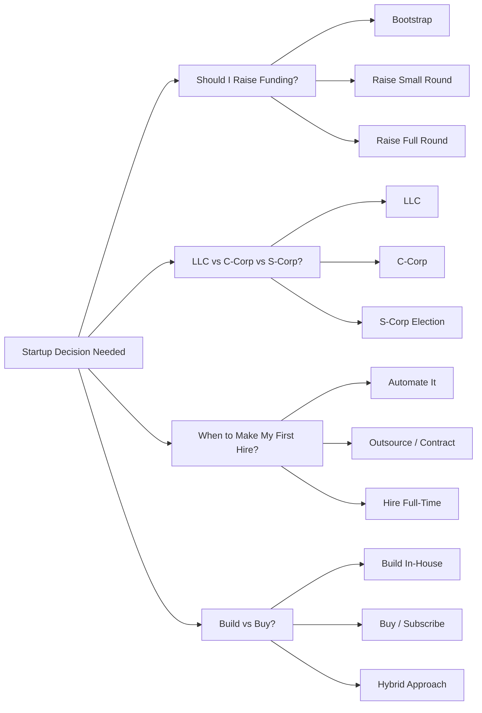

# Decision Flowcharts

Interactive decision guides for common startup choices. Each flowchart walks you through the key questions with clear end-state recommendations.

## Overview

## Index

| Decision | File | When to Use |
|---|---|---|
| [Should I Raise Funding?](should-i-raise.md) | `should-i-raise.md` | You are considering taking outside capital |
| [LLC vs C-Corp vs S-Corp](entity-type.md) | `entity-type.md` | You need to form a legal entity |
| [When to Make Your First Hire](when-to-hire.md) | `when-to-hire.md` | You are overwhelmed with work and considering help |
| [Build vs Buy](build-vs-buy.md) | `build-vs-buy.md` | You need a tool, system, or capability |

## How to Use These Guides

1. Start at the top of the flowchart.
2. Answer each question honestly based on your current situation, not where you hope to be.
3. Follow the arrows to your recommended outcome.
4. Read the prose explanation for the decision points that were hardest for you.

These flowcharts are educational tools, not legal or financial advice. Consult qualified professionals before making binding decisions.
