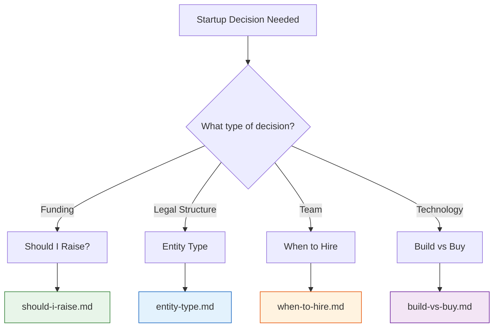

# Decision Flowcharts

Interactive decision guides for common startup choices. Each flowchart walks you through a structured set of questions to reach a clear recommendation.

## Overview

## Flowchart Index

| Decision | File | When to Use |
|---|---|---|
| Should I Raise Funding? | [should-i-raise.md](should-i-raise.md) | You are considering outside capital and want to evaluate whether bootstrapping, a small round, or a full raise is right for you. |
| LLC vs C-Corp vs S-Corp | [entity-type.md](entity-type.md) | You need to form a business entity and want to pick the right structure for your goals. |
| When to Make Your First Hire | [when-to-hire.md](when-to-hire.md) | You are overwhelmed with work and trying to decide whether to automate, outsource, or hire. |
| Build vs Buy | [build-vs-buy.md](build-vs-buy.md) | You need a capability and are deciding whether to build it in-house or purchase an existing solution. |

## How to Use These Guides

1. Start at the top of the relevant flowchart.
2. Answer each decision question honestly based on your current situation, not where you hope to be.
3. Follow the arrows to your recommended outcome.
4. Read the prose explanation for context on why that recommendation applies.

> **Note:** These flowcharts provide general guidance for educational purposes. Every business situation is unique. Consult qualified legal, financial, and business advisors before making major decisions.
