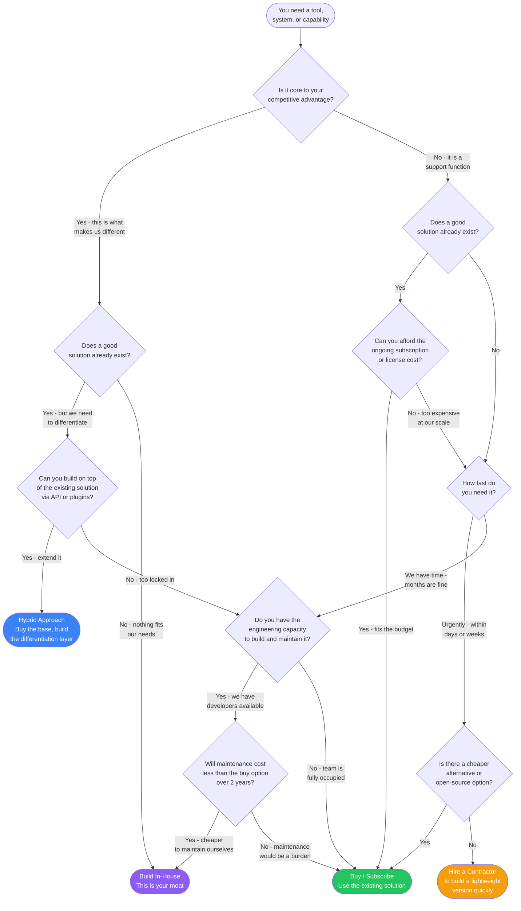

# Build vs Buy

Every startup faces this question repeatedly: should you build a capability in-house or buy an existing solution? This flowchart helps you decide.

## Decision Flowchart

## Decision Points Explained

### Is it core to your competitive advantage?

This is the most important question. Core capabilities are the things that make your product different from competitors. They are the reason customers choose you.

**Core examples:**
- A recommendation algorithm for a content platform.
- The booking and matching engine for a marketplace.
- A proprietary data pipeline for an analytics product.

**Not core examples:**
- Authentication and login (use Auth0, Clerk, or Firebase Auth).
- Payment processing (use Stripe).
- Email sending (use SendGrid, Postmark, or Amazon SES).
- Customer support ticketing (use Intercom, Zendesk, or Freshdesk).

If you are building something that is not core, you are spending engineering time that should go toward what makes you unique.

### Does a good solution already exist?

Research before you build. Check:

- **SaaS products:** Search G2, Capterra, or Product Hunt for existing tools.
- **Open-source projects:** Search GitHub. Many mature open-source projects cover common needs.
- **APIs and services:** Check RapidAPI, AWS Marketplace, or specialized API directories.

"Good" does not mean perfect. It means good enough to solve 80% of your problem without custom development.

### Can you build on top of an existing solution?

The hybrid approach is often the best of both worlds. You get the reliability and feature set of an existing product while adding your own differentiation on top.

**Hybrid examples:**
- Use Stripe for payments but build a custom billing dashboard.
- Use a headless CMS for content management but build a custom frontend.
- Use PostgreSQL for storage but build a custom query layer optimized for your use case.
- Use an off-the-shelf LLM via API but build custom prompts, fine-tuning, and application logic.

The key requirement: the existing solution must have good APIs or extension points. If it is a closed black box, the hybrid approach will not work.

### Can you afford the ongoing cost?

Calculate the total cost of ownership for the buy option over 2 years:

- Monthly or annual subscription fees.
- Per-seat or per-usage costs at your expected scale.
- Integration and migration costs.
- Training costs for your team.

Compare this to the build option:

- Engineering hours to build (developer salary * estimated hours).
- Ongoing maintenance (typically 20% of initial build cost per year).
- Infrastructure costs (hosting, monitoring, backups).
- Opportunity cost of engineering time not spent on your core product.

Many founders underestimate maintenance costs. A system you build today will need bug fixes, security patches, upgrades, and feature additions for as long as you use it.

### How fast do you need it?

Speed is a legitimate reason to buy. If you need something working this week, building it from scratch is almost never the right answer.

| Timeline | Recommended Approach |
|---|---|
| Days | Buy an existing SaaS product |
| Weeks | Buy, or hire a contractor for a lightweight build |
| Months | Evaluate build vs buy based on other factors |
| No rush | Take time to find the best long-term solution |

### Do you have the engineering capacity?

Be honest about your team's bandwidth. Building in-house means:

- Pulling engineers away from your core product.
- Taking on ongoing maintenance responsibility.
- Needing domain expertise (e.g., building your own email deliverability system requires specialized knowledge).

If your team is already stretched thin, buying is the pragmatic choice even for things you could theoretically build.

### Will maintenance cost less than buying over 2 years?

The 2-year total cost comparison is the reality check. Many things that seem cheaper to build become more expensive once you factor in:

- **Bug fixes:** Every system has bugs. Yours will too.
- **Security updates:** Vulnerabilities need to be patched promptly.
- **Scaling:** What works for 100 users may break at 10,000.
- **Feature requests:** Users will want more capabilities over time.
- **Documentation:** Without it, only the original developer can maintain the system.

## Framework with Examples

| Scenario | Build, Buy, or Hybrid? | Reasoning |
|---|---|---|
| **Authentication system** | Buy (Auth0, Clerk) | Not core. Security-critical. Hard to get right. |
| **Landing page** | Buy (Webflow, Framer) | Not core. Faster iteration. Easy to switch later. |
| **Payment processing** | Buy (Stripe) | Not core. Heavily regulated. Not worth the liability. |
| **Recommendation engine** | Build | Core differentiator for a content platform. |
| **Internal admin dashboard** | Hybrid (Retool + custom) | Not core, but needs custom workflows. |
| **Data pipeline** | Depends | Core if data is your product. Buy if it is a support function. |
| **CRM** | Buy (HubSpot, Salesforce) | Not core for most companies. Mature solutions exist. |
| **Mobile app** | Build | Core for a mobile-first company. Buy/no-code for internal tools. |
| **Search functionality** | Hybrid (Algolia + custom UI) | Buy the search engine, build the experience. |
| **Email marketing** | Buy (Mailchimp, ConvertKit) | Not core. Deliverability is hard. Mature tools exist. |

## Common Mistakes

1. **"We can build it in a weekend."** Maybe you can build version 1. But version 1 is 10% of the total effort. Maintenance, edge cases, and scaling are the other 90%.
2. **Not-invented-here syndrome.** Some engineers want to build everything from scratch. This is a cultural problem, not a technical one. Fight it.
3. **Buying something that locks you in.** Before committing to a vendor, ask: can I export my data? Is there an API? What happens if they raise prices or shut down?
4. **Building before validating.** If you are not sure customers want the feature, use an off-the-shelf solution to test demand before investing in a custom build.
5. **Ignoring the hybrid option.** Many decisions are not binary. Using an existing tool as a foundation and building your differentiation on top is often the best path.

## Decision Review Checklist

Before finalizing your decision, answer these five questions:

- [ ] Have I accurately identified whether this is core to our competitive advantage?
- [ ] Have I researched at least 3 existing solutions?
- [ ] Have I calculated the 2-year total cost of ownership for both options?
- [ ] Have I considered whether a hybrid approach could work?
- [ ] Have I factored in the opportunity cost of engineering time?

> **Disclaimer:** This framework is for educational purposes. Build vs buy decisions depend on your specific technical capabilities, budget, and business context. Evaluate each decision individually.
