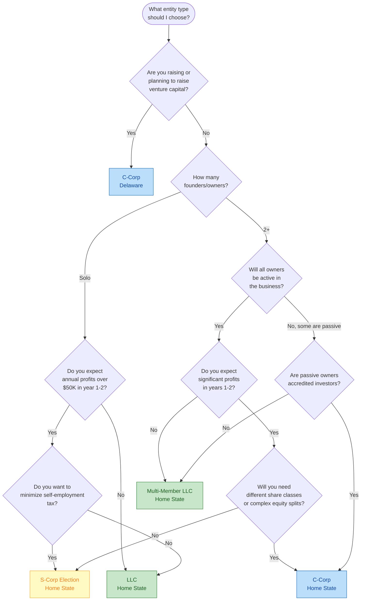

# LLC vs C-Corp vs S-Corp

A structured decision flowchart to help you choose the right business entity for your situation.

## Decision Flowchart

## Comparison Table

| Factor | LLC | S-Corp | C-Corp |
|---|---|---|---|
| **Best for** | Solo founders, small teams, service businesses | Profitable small businesses wanting tax savings | VC-backed startups, companies planning to go public |
| **Taxation** | Pass-through (profits taxed on personal return) | Pass-through with salary/distribution split | Double taxation (corporate tax + dividend tax) |
| **Self-employment tax** | All profits subject to SE tax | Only salary subject to SE tax; distributions are not | Not applicable (you are an employee) |
| **Investor compatibility** | Difficult for institutional investors | Limited to 100 shareholders, US citizens only | Preferred by all investor types |
| **Equity flexibility** | Membership interest percentages | Single class of stock only | Multiple classes (common, preferred, etc.) |
| **Administrative burden** | Minimal | Moderate (payroll required) | High (board meetings, minutes, annual reports) |
| **Formation cost** | $50--$500 | $50--$500 + S-election filing | $300--$1,500 (Delaware: ~$400 + registered agent) |
| **Ongoing cost** | $0--$800/year (state fees) | $1,000--$3,000/year (payroll + filings) | $1,000--$5,000/year (Delaware franchise tax + filings) |

## End States Explained

### LLC (Home State)

The simplest and most flexible entity for most small businesses. An LLC provides liability protection without the administrative overhead of a corporation.

**Choose this when:**
- You are a solo founder or small team
- You are not raising institutional capital
- Your revenue is under $50K/year or you are pre-revenue
- You want maximum simplicity

**Key details:**
- Formed in your home state (where you live and operate)
- Taxed as a disregarded entity (solo) or partnership (multi-member)
- No requirement for payroll, board meetings, or corporate minutes
- Can always convert to a C-Corp later if you raise funding

### S-Corp (Home State)

An S-Corp is not a separate entity type. It is a tax election that an LLC or corporation can make. The primary benefit is reducing self-employment tax on profits above a reasonable salary.

**Choose this when:**
- Your business is consistently profitable ($50K+ annually)
- You want to split income between salary and distributions
- You have no plans to raise venture capital
- You are a US citizen or permanent resident

**Key details:**
- You must pay yourself a "reasonable salary" and run payroll
- Distributions above salary are not subject to self-employment tax
- Limited to 100 shareholders, all must be US persons
- Only one class of stock allowed
- The tax savings typically become meaningful at $50K+ in annual profit

**Example:** If your LLC earns $120K in profit, you pay ~15.3% self-employment tax on all of it (~$18,360). With an S-Corp election and a $70K salary, you pay SE tax only on the salary (~$10,710) and take the remaining $50K as a distribution. Savings: ~$7,650/year.

### C-Corp (Delaware)

The standard structure for venture-backed startups. Delaware is the default jurisdiction because of its well-established corporate law, specialized business court, and investor familiarity.

**Choose this when:**
- You are raising or plan to raise venture capital
- You need multiple classes of stock (common for founders, preferred for investors)
- You are building a company with the goal of a large exit or IPO
- You want to issue stock options through a formal equity incentive plan

**Key details:**
- Delaware formation, but you will also need to register as a foreign corporation in your home state
- Requires a registered agent in Delaware (~$100--$300/year)
- Delaware franchise tax ($400--$200K/year depending on structure)
- Annual board meetings and corporate minutes required
- Double taxation: corporate income taxed at 21%, dividends taxed again on personal returns
- The double taxation issue is largely irrelevant for startups reinvesting all revenue into growth

---

## Decision Points Explained

### Are you raising venture capital?

If yes, stop here. VCs require C-Corps (almost always Delaware) because they need preferred stock, pro-rata rights, and a familiar legal framework. Trying to raise VC into an LLC will waste months and legal fees.

### Do you expect significant profits early?

If your business will be profitable quickly (consulting, SaaS with early customers, e-commerce), an S-Corp election can save thousands in self-employment taxes. If you are burning cash and reinvesting everything, the S-Corp benefit does not apply.

### Will you need different share classes?

If you need to give different rights to different owners (voting vs non-voting, preferred returns, vesting schedules), a C-Corp provides the most flexibility. LLCs can do some of this via operating agreements, but it gets complex.

---

## Common Mistakes

1. **Incorporating in Delaware when you do not need to.** If you are not raising VC, Delaware adds cost and complexity for no benefit. Form in your home state.
2. **Skipping the operating agreement.** Even a single-member LLC needs an operating agreement. Without one, you risk losing your liability protection.
3. **Electing S-Corp too early.** If your business is not yet profitable, the payroll costs of an S-Corp outweigh the tax savings.
4. **Choosing C-Corp for the QSBS exclusion alone.** The Qualified Small Business Stock tax exclusion is valuable, but it has strict requirements. Do not structure your company around a tax benefit you may not qualify for.
5. **Not consulting a CPA.** Entity selection has significant tax implications. A one-hour consultation with a CPA ($150--$300) can save you thousands.

---

> **Disclaimer:** This flowchart is for educational purposes only. Entity selection depends on your specific tax situation, state laws, and business goals. Consult a qualified attorney and CPA before forming your business entity.
