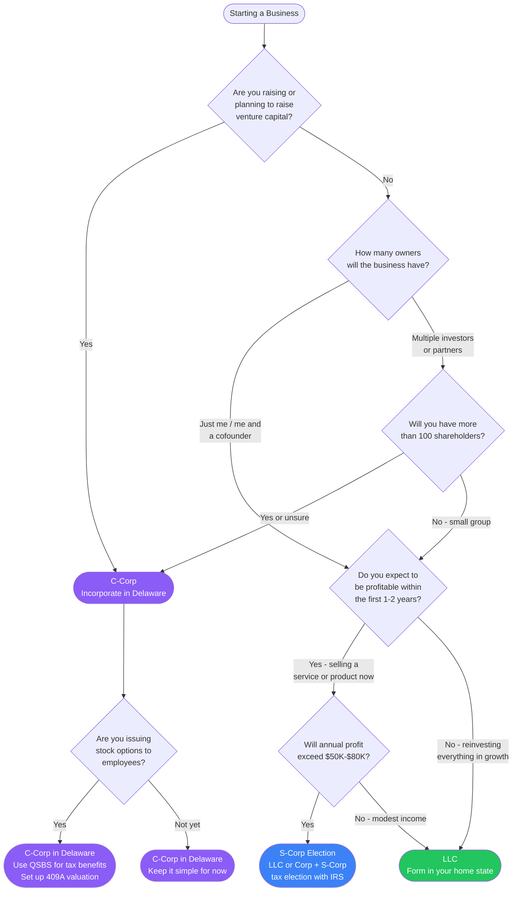

# LLC vs C-Corp vs S-Corp

Choosing your business entity is one of the first legal decisions you will make. This flowchart helps you pick the right structure based on your goals.

## Decision Flowchart

## Decision Points Explained

### Are you raising venture capital?

VCs almost universally require a Delaware C-Corp. This is non-negotiable for institutional investors because:

- C-Corps can issue preferred stock with liquidation preferences, anti-dilution protections, and other terms VCs require.
- Delaware has a well-developed body of corporate law and a specialized Court of Chancery that provides predictable outcomes.
- Standard VC documents (SAFEs, Series A term sheets) are written for Delaware C-Corps.

If there is any chance you will raise VC in the next 2-3 years, start as a C-Corp. Converting from an LLC later is expensive and creates tax complications.

### How many owners will the business have?

S-Corps are limited to 100 shareholders, and all shareholders must be U.S. citizens or residents. If you plan to have foreign investors, multiple classes of stock, or a large number of shareholders, S-Corp is not an option.

LLCs are flexible in ownership structure but can become complicated with many members. Operating agreements for multi-member LLCs should be drafted by an attorney.

### Do you expect to be profitable early?

If you are reinvesting all revenue into growth and not taking a salary, entity choice matters less for taxes right now. An LLC gives you maximum simplicity and flexibility.

If you are profitable and paying yourself, the entity structure significantly affects your tax burden.

### Will annual profit exceed $50K-$80K?

This is the threshold where the S-Corp election typically starts saving money. Here is why:

- **LLC (sole proprietor):** All profit is subject to self-employment tax (15.3% on the first ~$160K).
- **S-Corp:** You pay yourself a "reasonable salary" (subject to payroll tax) and take remaining profit as a distribution (no self-employment tax).

Example: $150K profit
- As an LLC: ~$21K in self-employment tax
- As an S-Corp (with $80K salary): ~$12K in payroll tax, plus distributions are not subject to SE tax

The savings grow as profit increases. Below $50K, the added complexity and payroll costs of an S-Corp usually are not worth it.

## Comparison Table

| Feature | LLC | S-Corp | C-Corp |
|---|---|---|---|
| **Best for** | Solo founders, freelancers, small businesses | Profitable small businesses, consultancies | VC-backed startups, companies issuing stock |
| **Formation state** | Your home state | Your home state | Delaware (almost always) |
| **Taxation** | Pass-through (no entity-level tax) | Pass-through (no entity-level tax) | Double taxation (corporate + dividend) |
| **Self-employment tax** | All profit subject to SE tax | Only salary subject to payroll tax | Salary subject to payroll tax |
| **Ownership limits** | None | 100 shareholders, US only, one class of stock | None |
| **Stock options** | Cannot issue stock options (can do profit interests) | Can issue options but less standard | Standard; ISOs, NSOs, QSBS benefits |
| **VC compatible** | No | No | Yes |
| **Formation cost** | $50-$500 | $50-$500 + S-election filing | $500-$2,000 (legal fees) |
| **Ongoing costs** | Minimal | Payroll processing, annual tax filing | Delaware franchise tax ($400+), registered agent, annual filings |
| **Complexity** | Low | Medium | High |

## Common Paths by Founder Type

**Solo freelancer or consultant earning under $80K:**
Form a single-member LLC in your home state. Simple, cheap, flexible. Revisit when income grows.

**Profitable service business earning $100K+:**
Form an LLC and elect S-Corp status with the IRS (Form 2553). Pay yourself a reasonable salary. Save on self-employment taxes.

**Tech startup planning to raise:**
Incorporate as a Delaware C-Corp from day one. Use Stripe Atlas, Clerky, or a startup attorney. Set up a stock option pool if you plan to hire.

**Two cofounders, bootstrapping, unsure about VC:**
Start as an LLC with a solid operating agreement. If you later decide to raise VC, convert to a C-Corp at that time. The conversion has costs but is manageable if done before significant revenue or valuation.

## Key Warnings

- **Do not form a C-Corp if you are not raising VC.** Double taxation (corporate tax on profits + personal tax on dividends) is painful for small businesses.
- **Do not skip the operating agreement for a multi-member LLC.** Without one, your state's default rules apply, and they may not match what you and your partners agreed to.
- **S-Corp salary must be "reasonable."** The IRS scrutinizes S-Corp owners who pay themselves artificially low salaries to avoid payroll tax. A good rule of thumb: pay yourself what you would pay someone else to do your job.
- **Delaware C-Corp does not mean you operate in Delaware.** You still need to register as a foreign corporation in the state where you actually do business.

> **Disclaimer:** This guide is for educational purposes only. Entity selection has significant tax and legal implications. Consult a CPA and a business attorney before making your decision.
