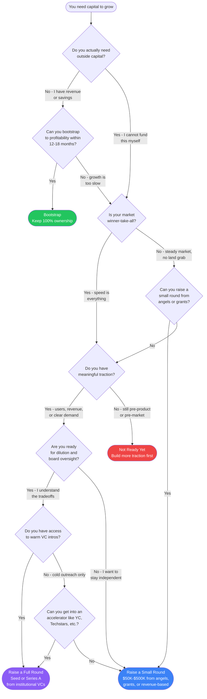

# Should I Raise Funding?

One of the most consequential decisions a founder makes is whether to take outside capital. This flowchart walks you through the key questions.

## Decision Flowchart

## Decision Points Explained

### Do you actually need outside capital?

Many founders assume they need funding when they do not. Ask yourself:

- Can your business generate revenue from day one?
- Do you have personal savings or a working spouse that can cover 12-18 months of lean living?
- Is the core version of your product something you can build yourself or with a cofounder?

If the answer to any of these is yes, you may not need outside capital at all. The best funding is customer revenue.

### Can you bootstrap to profitability?

Bootstrapping means funding the business from revenue and personal resources. It works when:

- Your product can charge customers early (even a small amount).
- Your cost structure stays low (no physical inventory, no large team needed).
- You are comfortable with slower growth in exchange for full ownership.

Bootstrapping does not mean you never raise. Many bootstrapped companies raise later from a position of strength, getting better terms because they have real revenue.

### Is your market winner-take-all?

Some markets reward the first company to reach scale. Network effects (social platforms, marketplaces) and high switching costs (enterprise SaaS with deep integrations) create winner-take-all dynamics. In these markets, speed matters more than capital efficiency.

Signs your market is winner-take-all:
- Strong network effects (each new user makes the product better for all users).
- Customers are unlikely to switch once onboarded.
- Competitors are already well-funded.

If your market is not winner-take-all, you can often win by being more focused, more capital-efficient, and closer to your customers.

### Do you have meaningful traction?

Traction is evidence that people want what you are building. It comes in many forms:

- **Best:** Paying customers or significant revenue growth.
- **Good:** A large and growing waitlist, strong engagement metrics, or LOIs from potential customers.
- **Acceptable for pre-seed:** A working prototype with early user feedback.
- **Not enough:** An idea, a pitch deck, or a landing page with no real engagement.

Without traction, raising a full round is extremely difficult and you will give up too much equity. Focus on building something people want first.

### Are you ready for dilution and board oversight?

Taking venture capital means:

- **Dilution:** A typical seed round dilutes founders by 15-25%. By Series B, founders often own less than 50%.
- **Board seats:** Investors will want a board seat and governance rights.
- **Liquidation preferences:** Investors get paid back first in an exit. A $10M exit might return nothing to founders if you have raised $15M.
- **Growth expectations:** VCs need 10x+ returns. They will push for aggressive growth, even if it increases risk.
- **Timeline pressure:** Most VC funds have a 10-year life. They need you to exit within 7-8 years.

If you want to build a profitable lifestyle business or a steady-growth company, VC is the wrong tool.

### Can you raise a small round?

A small round ($50K-$500K) can come from:

- **Angel investors:** Individual wealthy people who invest their own money.
- **Friends and family:** Be very careful here. Use proper legal documents and only take money people can afford to lose.
- **Grants:** SBIR/STTR (federal), state economic development grants, foundation grants.
- **Revenue-based financing:** Lenders like Pipe or Clearco who advance money against future revenue.
- **Crowdfunding:** Regulation CF allows raising up to $5M from non-accredited investors.

Small rounds let you prove more before giving up significant equity.

### Do you have access to warm VC intros?

Cold emails to VCs have a very low success rate (under 1%). Warm introductions through founders in their portfolio, other VCs, or advisors in their network are far more effective.

If you lack warm intros, an accelerator can provide them. Top accelerators (Y Combinator, Techstars, 500 Global) provide funding, mentorship, and a built-in network of investors for demo day.

## Summary Table

| Outcome | Best For | Typical Amount | What You Give Up |
|---|---|---|---|
| **Bootstrap** | Revenue-generating businesses, lifestyle businesses, solo founders who want full control | $0 (self-funded) | Slower growth |
| **Small Round** | Early-stage companies needing runway to prove a concept, non-VC-scale businesses | $50K-$500K | 5-15% equity |
| **Full Round** | Winner-take-all markets, companies with strong traction, founders ready for the VC path | $1M-$5M (seed) | 15-25% equity + board seat |
| **Not Ready Yet** | Pre-traction founders | N/A | Time (go build traction) |

> **Disclaimer:** This flowchart is an educational tool. Fundraising decisions depend on your specific circumstances, market, and goals. Consult a startup attorney before signing any investment documents.
