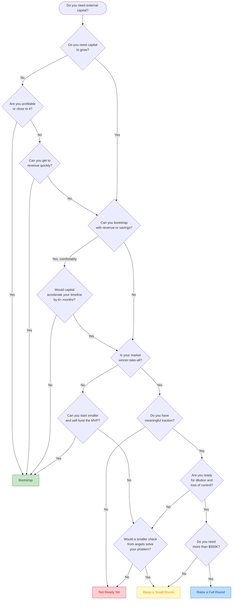

# Should I Raise Funding?

A structured decision flowchart to help you determine whether to bootstrap, raise a small round, or pursue a full venture raise.

## Decision Flowchart

## End States

### Bootstrap
You do not need outside capital right now. This is the strongest position to be in. You retain full ownership, full control, and can move at your own pace. Most successful small businesses never raise a dollar of outside funding.

### Raise a Small Round
An angel round or pre-seed of $50K--$500K from angels, friends-and-family, or a small fund. This gives you runway to prove your concept without the overhead of institutional investors. Typical dilution: 5--15%.

### Raise a Full Round
A seed or Series A from institutional investors ($500K--$5M+). This path makes sense when you have traction, a large market, and need significant capital to capture it. Typical dilution: 15--25% per round.

### Not Ready Yet
You are not in a position to raise effectively. Investors will either say no or offer bad terms. Focus on building traction first, then revisit.

---

## Decision Points Explained

### Do you need capital to grow?

Be honest. Many founders assume they need money when what they actually need is customers. Capital is necessary when:
- You need to build something before you can sell it (hardware, regulated industries)
- Customer acquisition requires significant upfront spend
- You need to hire specialized talent to build the product

Capital is not necessary when:
- You can sell a service first and build the product later
- Your MVP can be built nights-and-weekends
- You are pre-idea and just want a salary

### Can you bootstrap with revenue or savings?

Bootstrapping means funding the business from personal savings, revenue, or a day job. This is viable when:
- You have 6--12 months of personal runway
- You can generate revenue within 3--6 months
- Your burn rate is low (solo founder or small team)

Bootstrapping is not viable when:
- You would go into significant personal debt
- The product requires a large team before generating any revenue
- Your personal financial situation cannot absorb the risk

### Is your market winner-take-all?

Winner-take-all markets have strong network effects or high switching costs. Examples: marketplaces, social networks, infrastructure platforms. In these markets, the first company to reach scale often captures most of the value.

If your market is not winner-take-all, you can grow at a sustainable pace and still build a valuable business. Most markets are not winner-take-all, despite what pitch decks claim.

### Do you have meaningful traction?

Traction means evidence that people want what you are building. This varies by stage:
- **Pre-seed:** Waitlist signups, letters of intent, pilot customers
- **Seed:** Revenue (even small), active users, retention metrics
- **Series A:** Consistent month-over-month growth, clear unit economics

Without traction, you are asking investors to bet on an idea. Some will, but the terms will be worse and the process will be harder.

### Are you ready for dilution and loss of control?

Raising money means selling part of your company. Understand what you are giving up:
- **Equity:** 15--25% per round, compounding over multiple rounds
- **Control:** Board seats, investor approval rights, information obligations
- **Optionality:** Investors expect a large outcome; a $5M exit that would be life-changing for you may be a failure for them

If you are building a lifestyle business or a company you want to run for decades, venture capital is likely the wrong tool.

---

## Common Mistakes

1. **Raising because everyone else is.** Fundraising is not a milestone. It is a tool.
2. **Raising too early.** Pre-traction raises mean maximum dilution for minimum leverage.
3. **Raising too much.** More money means higher expectations and a higher bar for the next round.
4. **Raising too little.** Under-funding leads to desperate follow-on raises at bad terms.
5. **Ignoring alternatives.** Revenue-based financing, SBA loans, grants, and accelerators are all options that do not require equity dilution.

---

> **Disclaimer:** This flowchart is for educational purposes only. Fundraising decisions depend on your specific circumstances. Consult a qualified attorney and financial advisor before making financing decisions.
