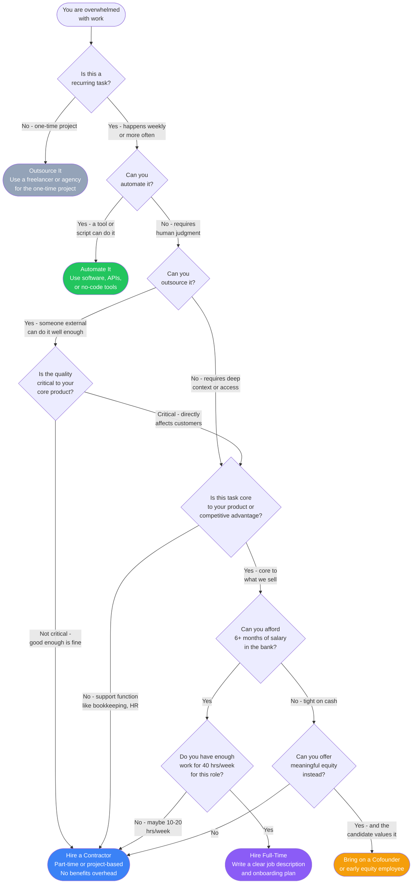

# When to Make Your First Hire

Hiring too early burns cash. Hiring too late burns out the founder. This flowchart helps you decide when and how to bring on help.

## Decision Flowchart

## Decision Points Explained

### Is this a recurring task?

One-time projects (redesigning your website, setting up your accounting system, building a pitch deck) are almost always better outsourced. Hiring someone full-time for a one-time need wastes money and creates an awkward situation when the project ends.

Track your time for two weeks. Write down everything you do and how long it takes. This will show you which tasks are truly recurring.

### Can you automate it?

Before hiring a human, ask whether software can do the job. Common automations founders miss:

- **Customer onboarding emails:** Use an email sequence tool (Mailchimp, ConvertKit, Customer.io).
- **Invoice creation and follow-up:** Use Stripe or QuickBooks recurring invoices.
- **Social media scheduling:** Use Buffer or Hootsuite.
- **Data entry between systems:** Use Zapier, Make, or n8n.
- **Customer support FAQs:** Use a help center with self-service articles.

Automation costs $0-$200/month. A hire costs $3,000-$10,000+/month. Always automate first.

### Can you outsource it?

Outsourcing works when:

- The task is well-defined and has clear deliverables.
- It does not require deep knowledge of your codebase or internal processes.
- Quality can be measured objectively.
- The person does not need to be available instantly at all hours.

Common roles to outsource early: bookkeeping, graphic design, content writing, customer support (with good documentation), QA testing.

### Is it core to your product?

Core functions are things your customers directly experience and that differentiate you from competitors. These eventually need to be in-house because:

- You need tight feedback loops between the person doing the work and the rest of the team.
- Institutional knowledge compounds over time.
- Quality standards are harder to enforce with external contractors.

Non-core functions (bookkeeping, legal, HR, IT) can stay outsourced much longer, often permanently.

### Can you afford 6+ months of salary?

A common startup killer is hiring too early and running out of money. The 6-month rule:

- Calculate the fully-loaded cost of the hire (salary + benefits + payroll taxes + equipment). A rough formula: multiply salary by 1.3.
- Multiply by 6.
- You should have that amount in the bank *in addition to* your other operating expenses.

If you cannot meet this threshold, use a contractor until your revenue supports the hire.

### Do you have 40 hours/week of work for this role?

If you only have 15-20 hours of work per week, a full-time hire will either be underutilized (wasting money) or will drift into tasks that do not matter (creating busywork). Start with a part-time contractor and convert to full-time when the workload justifies it.

## Role Priority by Stage

### Pre-Revenue (0-10 customers)

| Priority | Role | Format |
|---|---|---|
| 1 | Technical cofounder (if non-technical founder) | Cofounder / equity |
| 2 | Designer for MVP | Freelancer / contractor |
| 3 | Nothing else yet | - |

At this stage, every dollar and every hour should go toward finding product-market fit. Do everything else yourself.

### Early Revenue ($1K-$10K MRR)

| Priority | Role | Format |
|---|---|---|
| 1 | Customer support (part-time) | Contractor |
| 2 | Bookkeeper | Outsourced service |
| 3 | Content/marketing (part-time) | Contractor |

You are starting to drown in customer emails and administrative work. Offload the most time-consuming non-core tasks so you can focus on product and sales.

### Growth Stage ($10K-$50K MRR)

| Priority | Role | Format |
|---|---|---|
| 1 | First engineer (if technical product) | Full-time |
| 2 | Customer success / support | Full-time |
| 3 | Marketing or sales (depending on GTM) | Full-time or contractor |
| 4 | Operations / office manager | Part-time contractor |

This is when full-time hires start making sense. You have predictable revenue and enough work to keep people busy.

### Scaling ($50K+ MRR)

| Priority | Role | Format |
|---|---|---|
| 1 | Team leads for engineering, sales, or support | Full-time |
| 2 | Recruiter or recruiting firm | Contractor or full-time |
| 3 | Finance / accounting | Full-time or fractional CFO |
| 4 | HR / people operations | Part-time, then full-time |

You are now building a company, not just a product. Invest in the infrastructure to support your team.

## Common Mistakes

- **Hiring a VP before you have individual contributors.** You do not need a VP of Sales when you have zero salespeople. Hire doers first, then managers.
- **Hiring to fill a role you do not understand.** If you have never done the job yourself, you cannot evaluate candidates or manage them effectively. Do it yourself (even badly) first.
- **Offering too little equity too late.** Early employees take enormous risk. If you want top talent at below-market salary, the equity needs to be meaningful (0.5-2% for first employees).
- **Skipping the trial period.** Whenever possible, start with a paid trial project (1-4 weeks) before committing to a full-time offer.

> **Disclaimer:** This guide is for educational purposes. Employment law varies by state and country. Consult an employment attorney before making your first hire, especially regarding contractor vs. employee classification.
