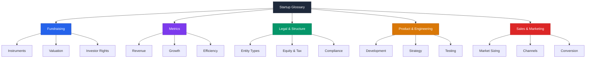

# Startup Glossary

> This glossary defines common startup terms in plain English. It is educational information, not legal or financial advice.

---

## Fundraising

**SAFE (Simple Agreement for Future Equity)** -- A short legal document where an investor gives you money now in exchange for the right to receive shares later, usually when you raise a priced round.

**Convertible Note** -- A loan that converts into equity (ownership shares) at a future fundraising event, typically with interest and a discount for the early risk the investor took.

**Priced Round** -- A fundraising event where a specific dollar value is placed on the company and investors buy shares at a set price per share.

**Pre-Money Valuation** -- The agreed-upon value of your company right before new investment money comes in.

**Post-Money Valuation** -- The value of your company right after new investment money is added; equals pre-money valuation plus the amount invested.

**Dilution** -- The reduction in ownership percentage that existing shareholders experience when new shares are issued to new investors or employees.

**Cap Table (Capitalization Table)** -- A spreadsheet or document that lists every owner of the company, how many shares they hold, and what percentage of the company they own.

**Pro Rata Rights** -- The right of an existing investor to participate in future funding rounds to maintain their ownership percentage.

**Liquidation Preference** -- A term that determines which investors get paid first (and how much) when the company is sold or shut down.

**Anti-Dilution** -- A protection clause that gives investors additional shares if the company later raises money at a lower valuation than what they paid.

**Drag-Along Rights** -- A provision that lets majority shareholders force minority shareholders to join in the sale of the company.

**Tag-Along Rights** -- A provision that lets minority shareholders join a sale initiated by majority shareholders on the same terms.

**Valuation Cap** -- The maximum company valuation at which a SAFE or convertible note will convert into equity, protecting early investors from excessive dilution.

**Discount Rate** -- A percentage reduction on the share price that early investors receive compared to later investors when their note or SAFE converts.

**Term Sheet** -- A non-binding document that outlines the key financial and governance terms of a proposed investment before the full legal paperwork is drafted.

**Lead Investor** -- The investor who sets the terms for a funding round, typically investing the largest amount and often taking a board seat.

**Follow-On Investment** -- Additional money invested in a later round by an investor who already participated in an earlier round.

**Bridge Round** -- A small fundraise designed to keep the company running until it can complete a larger funding round.

**Down Round** -- A funding round where the company raises money at a lower valuation than its previous round, signaling the company's value has decreased.

**Flat Round** -- A funding round at the same valuation as the previous round, meaning the company's perceived value has not changed.

**Angel Investor** -- An individual who invests their own money in early-stage startups, usually before venture capital firms get involved.

**Venture Capital (VC)** -- Professional investment firms that pool money from institutions and wealthy individuals to invest in high-growth startups in exchange for equity.

**Seed Round** -- The first significant round of institutional funding, typically used to build the product and find initial customers.

**Series A** -- The first major venture capital round, usually raised after the company has demonstrated product-market fit and early traction.

**Series B** -- A later funding round focused on scaling the business, often used to expand the team, enter new markets, or accelerate growth.

**Pitch Deck** -- A short presentation (usually 10-15 slides) that explains your business to potential investors.

**Due Diligence** -- The investigation process investors go through to verify your company's claims, finances, legal standing, and market opportunity before investing.

**SPV (Special Purpose Vehicle)** -- A separate legal entity created specifically to pool multiple smaller investors into a single line on your cap table.

**Syndicate** -- A group of investors who pool their money together, typically led by one person, to invest in a startup as a single entity.

**MFN (Most Favored Nation)** -- A clause in a SAFE that guarantees the investor will receive any better terms that are given to future SAFE holders.

---

## Metrics

**MRR (Monthly Recurring Revenue)** -- The predictable revenue your business earns every month from subscriptions or ongoing contracts.

**ARR (Annual Recurring Revenue)** -- Your monthly recurring revenue multiplied by 12, representing the yearly value of your recurring revenue stream.

**CAC (Customer Acquisition Cost)** -- The total amount of money you spend on sales and marketing to acquire one new customer.

**LTV (Lifetime Value)** -- The total revenue you expect to earn from a single customer over the entire time they remain your customer.

**LTV:CAC Ratio** -- The relationship between how much a customer is worth and how much it costs to acquire them; a ratio of 3:1 or higher is generally considered healthy.

**Churn Rate** -- The percentage of customers (or revenue) you lose over a given time period, usually measured monthly or annually.

**Net Revenue Retention (NRR)** -- A measure of how much revenue you keep from existing customers over time, including upgrades and downgrades; above 100% means existing customers are spending more over time.

**Burn Rate** -- The amount of cash your company spends each month beyond what it earns; essentially how fast you are spending your money.

**Runway** -- The number of months your company can continue operating at its current burn rate before running out of cash.

**GMV (Gross Merchandise Value)** -- The total dollar value of goods or services sold through a marketplace before deducting fees, returns, or costs.

**NPS (Net Promoter Score)** -- A customer satisfaction metric based on one question: "How likely are you to recommend us?" Scores range from -100 to 100.

**DAU (Daily Active Users)** -- The number of unique users who engage with your product on a given day.

**MAU (Monthly Active Users)** -- The number of unique users who engage with your product at least once during a month.

**DAU/MAU Ratio** -- The percentage of monthly users who use your product daily; a higher ratio indicates stronger user engagement and habit formation.

**Cohort Analysis** -- A method of grouping users by when they signed up and tracking their behavior over time to spot trends in retention and engagement.

**Gross Margin** -- The percentage of revenue remaining after subtracting the direct costs of delivering your product or service.

**Contribution Margin** -- The revenue remaining after subtracting all variable costs associated with serving a customer, showing whether each additional customer is profitable.

**ARPU (Average Revenue Per User)** -- The average amount of revenue each user or customer generates, typically measured monthly.

**ACV (Annual Contract Value)** -- The average annualized revenue per customer contract, commonly used in enterprise software sales.

**TCV (Total Contract Value)** -- The full value of a customer contract over its entire duration, including all years and one-time fees.

**Payback Period** -- The number of months it takes for the revenue from a new customer to cover the cost of acquiring them.

**Rule of 40** -- A benchmark where your revenue growth rate plus your profit margin should exceed 40%, indicating a healthy balance between growth and profitability.

**Activation Rate** -- The percentage of new sign-ups who complete a key action that indicates they are getting value from the product.

**Virality Coefficient (K-factor)** -- A number that measures how many new users each existing user brings in; a K-factor above 1 means your product is growing through word of mouth alone.

**Revenue Run Rate** -- An estimate of future annual revenue based on current monthly performance, assuming no changes in growth or churn.

**MoM Growth (Month-over-Month)** -- The percentage change in a key metric from one month to the next, used to track short-term momentum.

**Quick Ratio (SaaS)** -- The ratio of revenue added (new plus expansion) to revenue lost (churn plus contraction); a ratio above 4 indicates very healthy growth.

---

## Legal & Structure

**LLC (Limited Liability Company)** -- A business structure that protects the owner's personal assets from business debts while offering flexible taxation options.

**C-Corp (C Corporation)** -- A business structure where the company is taxed separately from its owners; the standard structure for venture-backed startups because investors prefer it.

**S-Corp (S Corporation)** -- A tax election that lets a corporation pass profits and losses through to the owners' personal tax returns, avoiding double taxation, but with restrictions on number and type of shareholders.

**83(b) Election** -- A tax filing that lets founders and employees pay taxes on stock at its current (low) value rather than at a potentially much higher future value when it vests.

**Vesting** -- A schedule that determines when you actually earn your shares over time, designed to keep founders and employees committed to the company.

**Cliff** -- A waiting period (usually one year) before any shares vest; if you leave before the cliff, you get nothing.

**QSBS (Qualified Small Business Stock)** -- A federal tax benefit that can exclude up to 100% of the capital gains from selling stock in a qualifying small business, potentially saving millions in taxes.

**409A Valuation** -- An independent appraisal of your company's fair market value required by the IRS to set the exercise price of stock options.

**EIN (Employer Identification Number)** -- A unique number assigned by the IRS that identifies your business for tax purposes, similar to a Social Security number for your company.

**Stock Option** -- The right to buy shares in the company at a fixed price (the strike price) at a future date, commonly used to compensate employees.

**ISO (Incentive Stock Option)** -- A type of stock option that receives favorable tax treatment for employees, but comes with specific IRS rules and limitations.

**NSO (Non-Qualified Stock Option)** -- A type of stock option that is taxed as ordinary income when exercised; available to employees, contractors, and advisors.

**RSU (Restricted Stock Unit)** -- A promise from the company to give you shares at a future date, typically when they vest; commonly used by later-stage companies.

**Exercise Price (Strike Price)** -- The fixed price per share that an option holder pays to buy their shares when they exercise their options.

**Bylaws** -- The internal rules that govern how a corporation operates, including meeting requirements, voting procedures, and officer responsibilities.

**Operating Agreement** -- The governing document of an LLC that defines ownership percentages, profit sharing, and decision-making rules among members.

**Articles of Incorporation** -- The legal document filed with the state to officially create a corporation.

**Registered Agent** -- A person or company designated to receive official legal and government documents on behalf of your business.

**Board of Directors** -- A group of individuals elected by shareholders to oversee the company's management and make major strategic decisions.

**Board Observer** -- An individual who can attend board meetings and listen but does not have voting rights.

**Fiduciary Duty** -- The legal obligation of directors and officers to act in the best interest of the company and its shareholders.

**IP Assignment Agreement** -- A legal document where founders and employees transfer ownership of any work-related intellectual property to the company.

**Non-Compete Agreement** -- A contract that restricts someone from starting or working for a competing business for a specified time period after leaving the company.

**Non-Solicitation Agreement** -- A contract that prevents a departing employee from recruiting the company's other employees or customers.

**CIIA (Confidential Information and Inventions Assignment)** -- A standard employee agreement covering confidentiality and ensuring the company owns all work-related inventions.

---

## Product & Engineering

**MVP (Minimum Viable Product)** -- The simplest version of your product that lets you test your core idea with real users and learn whether it solves their problem.

**PMF (Product-Market Fit)** -- The point where your product clearly satisfies a strong market demand, evidenced by organic growth and enthusiastic customers.

**Sprint** -- A fixed time period (usually 1-2 weeks) during which a team completes a planned set of work items.

**Iteration** -- The process of making repeated small improvements to a product based on user feedback and data.

**Pivot** -- A fundamental change in your business strategy, target customer, or product approach based on what you have learned from the market.

**Feature Flag** -- A software technique that lets you turn specific features on or off for different users without deploying new code.

**A/B Test** -- An experiment where you show two different versions of something to different user groups and measure which performs better.

**User Story** -- A short, plain-language description of a feature from the user's perspective, typically following the format "As a [user], I want [action] so that [benefit]."

**Technical Debt** -- The accumulated cost of shortcuts or quick fixes in code that will need to be cleaned up later, slowing down future development.

**Scrum** -- A framework for organizing work into sprints with defined roles (product owner, scrum master, developer) and regular ceremonies (standups, retrospectives).

**Kanban** -- A visual workflow management method that uses a board with columns to track tasks as they move from "to do" to "done."

**Agile** -- A philosophy of building software through short cycles, frequent feedback, and continuous adaptation rather than long planning phases.

**API (Application Programming Interface)** -- A set of rules and tools that lets different software programs communicate with each other and share data.

**Microservices** -- An architectural approach where a large application is broken into small, independent services that each handle one specific function.

**Monolith** -- A single, unified codebase where all parts of the application are tightly connected; simpler to start with but harder to scale.

**CI/CD (Continuous Integration/Continuous Deployment)** -- An automated process that tests code changes and pushes them to production quickly and reliably.

**SaaS (Software as a Service)** -- A software delivery model where customers access the application through the internet and pay a recurring subscription fee.

**PaaS (Platform as a Service)** -- A cloud computing model that provides a platform for developers to build, run, and manage applications without managing the underlying infrastructure.

**Open Source** -- Software whose source code is publicly available and can be used, modified, and distributed by anyone under a specific license.

**Dogfooding** -- The practice of using your own product internally to find bugs, understand the user experience, and demonstrate confidence in what you are building.

**North Star Metric** -- The single most important metric that best captures the core value your product delivers to customers.

**Scope Creep** -- The gradual expansion of a project beyond its original goals, usually caused by adding features or requirements without adjusting timeline or resources.

**Wireframe** -- A basic visual layout of a page or screen that shows structure and functionality without detailed design, used for early planning.

**Prototype** -- A working model of your product (or part of it) built to test concepts and gather feedback before investing in full development.

---

## Sales & Marketing

**ICP (Ideal Customer Profile)** -- A detailed description of the type of company or person who gets the most value from your product and is most likely to buy.

**TAM (Total Addressable Market)** -- The total revenue opportunity available if you captured 100% of your target market with no competition.

**SAM (Serviceable Addressable Market)** -- The portion of the total market that your product can realistically serve given its features, geography, and delivery model.

**SOM (Serviceable Obtainable Market)** -- The realistic share of your serviceable market that you can capture in the near term, given your current resources and competition.

**GTM (Go-to-Market)** -- Your plan for how you will reach customers, sell your product, and generate revenue when you launch or enter a new market.

**Funnel** -- The step-by-step path a potential customer takes from first hearing about you to making a purchase; each step typically has fewer people than the last.

**Conversion Rate** -- The percentage of people who complete a desired action (like signing up or buying) out of the total who had the opportunity.

**Lead Generation (Lead Gen)** -- The process of attracting and identifying potential customers who might be interested in your product.

**MQL (Marketing Qualified Lead)** -- A potential customer who has shown interest through marketing activities (downloading content, attending webinars) but is not yet ready for a sales conversation.

**SQL (Sales Qualified Lead)** -- A potential customer who has been evaluated by the sales team and is considered ready for a direct sales conversation.

**Pipeline** -- The collection of all active sales opportunities at various stages of the sales process, representing potential future revenue.

**AE (Account Executive)** -- A salesperson responsible for managing deals from initial qualification through closing the sale.

**SDR (Sales Development Representative)** -- A salesperson focused on outbound prospecting and qualifying leads before handing them to an account executive.

**BDR (Business Development Representative)** -- A role similar to an SDR, often focused on identifying and developing new business opportunities through outreach and partnerships.

**ARR Booking** -- The annualized value of a new subscription contract at the time it is signed.

**Churn (Customer)** -- When a customer stops paying for your product and cancels their subscription.

**Expansion Revenue** -- Additional revenue earned from existing customers through upselling, cross-selling, or usage increases.

**Upsell** -- Selling a more expensive plan or tier to an existing customer.

**Cross-Sell** -- Selling additional, complementary products or features to an existing customer.

**PLG (Product-Led Growth)** -- A business strategy where the product itself is the primary driver of customer acquisition, conversion, and expansion, rather than a sales team.

**SLG (Sales-Led Growth)** -- A business strategy where a dedicated sales team is the primary driver of customer acquisition through direct outreach and relationship building.

**Inbound Marketing** -- Attracting customers to you by creating valuable content, SEO, and social media presence rather than reaching out directly.

**Outbound Sales** -- Proactively reaching out to potential customers through cold emails, calls, or LinkedIn messages.

**CRM (Customer Relationship Management)** -- Software that tracks all interactions with prospects and customers, managing your sales pipeline and customer data.

**CAC Payback** -- The number of months of revenue needed to recover the cost of acquiring a customer.

**Retention Rate** -- The percentage of customers who continue using and paying for your product over a given time period.

**SEO (Search Engine Optimization)** -- The practice of improving your website's visibility in search engine results to attract more organic (non-paid) traffic.

**SEM (Search Engine Marketing)** -- Paid advertising on search engines where you bid on keywords to show ads to people searching for relevant terms.

**Content Marketing** -- Creating and distributing valuable content (blog posts, videos, guides) to attract and retain a clearly defined audience.

**Demand Generation (Demand Gen)** -- Marketing activities focused on creating awareness and interest in your product category and brand, building long-term pipeline.

**ABM (Account-Based Marketing)** -- A strategy that focuses marketing and sales resources on a specific set of high-value target accounts rather than casting a wide net.

---

## Quick Reference: Acronym Index

| Acronym | Full Term | Category |
|---------|-----------|----------|
| ABM | Account-Based Marketing | Sales & Marketing |
| ACV | Annual Contract Value | Metrics |
| AE | Account Executive | Sales & Marketing |
| API | Application Programming Interface | Product |
| ARR | Annual Recurring Revenue | Metrics |
| ARPU | Average Revenue Per User | Metrics |
| BDR | Business Development Representative | Sales & Marketing |
| CAC | Customer Acquisition Cost | Metrics |
| CI/CD | Continuous Integration/Continuous Deployment | Product |
| CIIA | Confidential Information and Inventions Assignment | Legal |
| CRM | Customer Relationship Management | Sales & Marketing |
| DAU | Daily Active Users | Metrics |
| EIN | Employer Identification Number | Legal |
| GMV | Gross Merchandise Value | Metrics |
| GTM | Go-to-Market | Sales & Marketing |
| ICP | Ideal Customer Profile | Sales & Marketing |
| ISO | Incentive Stock Option | Legal |
| LLC | Limited Liability Company | Legal |
| LTV | Lifetime Value | Metrics |
| MAU | Monthly Active Users | Metrics |
| MFN | Most Favored Nation | Fundraising |
| MQL | Marketing Qualified Lead | Sales & Marketing |
| MRR | Monthly Recurring Revenue | Metrics |
| MVP | Minimum Viable Product | Product |
| NPS | Net Promoter Score | Metrics |
| NRR | Net Revenue Retention | Metrics |
| NSO | Non-Qualified Stock Option | Legal |
| PaaS | Platform as a Service | Product |
| PLG | Product-Led Growth | Sales & Marketing |
| PMF | Product-Market Fit | Product |
| QSBS | Qualified Small Business Stock | Legal |
| RSU | Restricted Stock Unit | Legal |
| SaaS | Software as a Service | Product |
| SAFE | Simple Agreement for Future Equity | Fundraising |
| SAM | Serviceable Addressable Market | Sales & Marketing |
| SDR | Sales Development Representative | Sales & Marketing |
| SEM | Search Engine Marketing | Sales & Marketing |
| SEO | Search Engine Optimization | Sales & Marketing |
| SLG | Sales-Led Growth | Sales & Marketing |
| SOM | Serviceable Obtainable Market | Sales & Marketing |
| SPV | Special Purpose Vehicle | Fundraising |
| SQL | Sales Qualified Lead | Sales & Marketing |
| TAM | Total Addressable Market | Sales & Marketing |
| TCV | Total Contract Value | Metrics |
| VC | Venture Capital | Fundraising |

---

*This glossary is educational information only. It is not legal, financial, or tax advice. Consult qualified professionals for your specific situation.*
