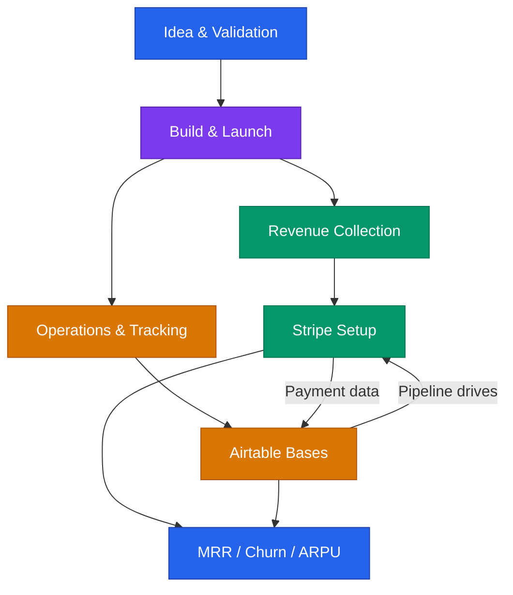

# Integrations Directory

> **Disclaimer:** This is educational information for startup operations. Specific platform features and pricing may change; verify against current documentation.

---

## What This Directory Covers

Integrations are the connective tissue between your idea and your revenue. This directory provides step-by-step setup guides for the tools that matter most in the first 12 months.

---

## Available Guides

### [Airtable Starter Bases](airtable-starter-bases.md)
Copy-paste-ready base structures for the five systems every startup needs:
- CRM / Sales Pipeline
- Investor Tracker
- Content Calendar
- OKR Tracker
- Hiring Pipeline

**When to use:** Day 1. Set these up before you need them.

### [Stripe Revenue Infrastructure](stripe-setup.md)
End-to-end guide for collecting money, from account setup through subscription management and revenue metrics.
- Account configuration and tax setup
- Products, prices, and payment links
- Subscription billing with annual discounts
- B2B invoicing and customer portal
- Webhook basics and revenue dashboards

**When to use:** As soon as you have something to sell. Even a pre-sale needs a payment link.

---

## How Integrations Fit the Startup Workflow

| Stage | Integration | Purpose |
|---|---|---|
| Validation | Airtable | Track interview notes, prospects, patterns |
| Pre-sale | Stripe | Payment links for deposits and pre-orders |
| Launch | Stripe + Airtable | Collect revenue, track customers |
| Growth | Both + webhooks | Automate pipeline, trigger follow-ups |
| Fundraising | Airtable | Investor tracker, metrics dashboard |

---

## Adding New Integrations

To add a new integration guide:
1. Create a new `.md` file in this directory
2. Follow the format of existing guides (mermaid diagram, step-by-step, templates)
3. Update this README with a link and summary
4. Keep under 300 lines where possible
