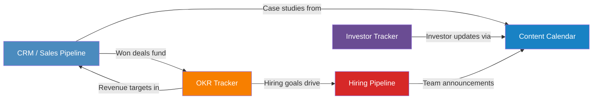

# Airtable Starter Bases for Startups

> **Disclaimer:** This is educational information for startup operations. Adapt all structures to your specific business needs. Airtable field types and features may change; verify against current Airtable documentation.

---

## How to Use This Guide

Each base below includes:
- Table structures with exact field names and types (copy-paste ready)
- Recommended views to create after setup
- Automation suggestions to reduce manual work

Create each base separately in Airtable, then link them using the cross-base linking suggestions at the end.

---

## 1. CRM / Sales Pipeline

### Table: Contacts

| Field Name | Field Type | Notes |
|---|---|---|
| Full Name | Single line text | Primary field |
| Email | Email | |
| Phone | Phone number | |
| Title | Single line text | Job title |
| Company | Link to another record | Links to Companies table |
| Source | Single select | `Inbound`, `Outbound`, `Referral`, `Event`, `Website`, `LinkedIn` |
| LinkedIn URL | URL | |
| Notes | Long text | Rich text enabled |
| Created Date | Created time | Auto-populated |
| Last Contacted | Date | Manual or automation-updated |
| Owner | Collaborator | Team member responsible |

### Table: Companies

| Field Name | Field Type | Notes |
|---|---|---|
| Company Name | Single line text | Primary field |
| Website | URL | |
| Industry | Single select | Customize to your market |
| Company Size | Single select | `1-10`, `11-50`, `51-200`, `201-500`, `500+` |
| Contacts | Link to another record | Links to Contacts table |
| Deals | Link to another record | Links to Deals table |
| Annual Revenue | Currency | Estimated |
| Address | Long text | |
| Notes | Long text | |

### Table: Deals

| Field Name | Field Type | Notes |
|---|---|---|
| Deal Name | Single line text | Primary field |
| Company | Link to another record | Links to Companies table |
| Primary Contact | Link to another record | Links to Contacts table |
| Stage | Single select | `Lead`, `Qualified`, `Proposal`, `Negotiation`, `Closed Won`, `Closed Lost` |
| Deal Value | Currency | USD |
| Close Date | Date | Expected close |
| Probability | Percent | Win likelihood |
| Weighted Value | Formula | `{Deal Value} * {Probability}` |
| Source | Single select | `Inbound`, `Outbound`, `Referral`, `Partner`, `Event` |
| Activities | Link to another record | Links to Activities table |
| Days in Stage | Formula | `DATETIME_DIFF(TODAY(), {Last Stage Change}, 'days')` |
| Last Stage Change | Date | Update when stage changes |
| Owner | Collaborator | |
| Lost Reason | Single select | `Price`, `Competitor`, `Timing`, `No Budget`, `No Response`, `Bad Fit` |

### Table: Activities

| Field Name | Field Type | Notes |
|---|---|---|
| Activity | Single line text | Primary field |
| Type | Single select | `Call`, `Email`, `Meeting`, `Demo`, `Follow-up`, `Proposal Sent` |
| Deal | Link to another record | Links to Deals table |
| Contact | Link to another record | Links to Contacts table |
| Date | Date | Include time |
| Notes | Long text | |
| Outcome | Single select | `Positive`, `Neutral`, `Negative`, `No Show` |
| Next Step | Single line text | |
| Owner | Collaborator | |

### Recommended Views

- **Kanban: Pipeline Board** -- Group by Stage on the Deals table. This is your primary sales view.
- **Calendar: Close Dates** -- Calendar view on Deals, using Close Date. See what is expected to close when.
- **Grid: My Deals** -- Filtered to current user, sorted by Close Date ascending.
- **Grid: Stale Deals** -- Filter where Days in Stage > 14. Follow up on stuck opportunities.
- **Gallery: Company Cards** -- Gallery view on Companies showing key stats at a glance.

### Automation Suggestions

- **When Stage changes to Closed Won:** Send a Slack notification to the team channel.
- **When a new Deal is created:** Send an email to the Owner with deal details.
- **Every Monday at 9am:** Send a summary of deals closing this week to the sales team.
- **When Days in Stage > 7:** Send a reminder to the deal Owner.

---

## 2. Investor Tracker

### Table: Investors

| Field Name | Field Type | Notes |
|---|---|---|
| Investor / Firm Name | Single line text | Primary field |
| Type | Single select | `Angel`, `Pre-Seed Fund`, `Seed Fund`, `Series A Fund`, `Family Office`, `Accelerator`, `Corporate VC` |
| Check Size Min | Currency | Minimum investment |
| Check Size Max | Currency | Maximum investment |
| Thesis / Focus | Long text | What they invest in |
| Portfolio Companies | Long text | Notable investments |
| Website | URL | |
| Location | Single line text | City, State |
| Status | Single select | `Researching`, `Intro Requested`, `Meeting Scheduled`, `Pitched`, `Term Sheet`, `Passed` |
| Warm Intro Contact | Single line text | Who can make the introduction |
| Warm Intro Relationship | Single select | `Strong`, `Medium`, `Weak`, `Cold` |
| Meetings | Link to another record | Links to Meetings table |
| Follow-ups | Link to another record | Links to Follow-ups table |
| Priority | Single select | `High`, `Medium`, `Low` |
| Notes | Long text | |
| Last Contact Date | Date | |

### Table: Meetings

| Field Name | Field Type | Notes |
|---|---|---|
| Meeting Title | Single line text | Primary field |
| Investor | Link to another record | Links to Investors table |
| Date | Date | Include time |
| Type | Single select | `Intro Call`, `First Pitch`, `Partner Meeting`, `Due Diligence`, `Term Sheet Discussion` |
| Attendees | Long text | Names and roles |
| Key Questions Asked | Long text | What they wanted to know |
| Our Answers | Long text | How we responded |
| Their Feedback | Long text | Candid notes |
| Sentiment | Single select | `Very Positive`, `Positive`, `Neutral`, `Negative` |
| Next Steps | Long text | |
| Deck Version Sent | Single line text | Track which version they saw |
| Follow-up Due | Date | |

### Table: Follow-ups

| Field Name | Field Type | Notes |
|---|---|---|
| Follow-up Task | Single line text | Primary field |
| Investor | Link to another record | Links to Investors table |
| Meeting | Link to another record | Links to Meetings table |
| Due Date | Date | |
| Status | Single select | `Pending`, `Sent`, `Complete`, `Overdue` |
| Type | Single select | `Thank You Email`, `Data Room Access`, `Financial Model`, `Customer Reference`, `Product Demo`, `Other` |
| Notes | Long text | |
| Owner | Collaborator | |

### Recommended Views

- **Kanban: Fundraise Pipeline** -- Group by Status on Investors. Your fundraising command center.
- **Calendar: Meeting Schedule** -- Calendar view on Meetings.
- **Grid: Hot Leads** -- Investors filtered to Priority = High, sorted by Last Contact Date.
- **Grid: Overdue Follow-ups** -- Follow-ups where Due Date < Today and Status != Complete.
- **Grid: By Check Size** -- Investors sorted by Check Size Max descending.

### Automation Suggestions

- **When Meeting is created:** Auto-create a Follow-up record due 24 hours after meeting date with Type = Thank You Email.
- **When Follow-up Due Date passes:** Change Status to Overdue and notify Owner.
- **When Investor Status changes to Passed:** Prompt to record the reason in Notes.
- **Weekly digest:** Send summary of upcoming meetings and overdue follow-ups.

---

## 3. Content Calendar

### Table: Content Pieces

| Field Name | Field Type | Notes |
|---|---|---|
| Title | Single line text | Primary field |
| Platform | Multiple select | `Blog`, `Twitter/X`, `LinkedIn`, `YouTube`, `Newsletter`, `Podcast`, `Instagram`, `TikTok` |
| Content Type | Single select | `Article`, `Thread`, `Video`, `Short-form Video`, `Carousel`, `Infographic`, `Case Study`, `Newsletter Issue` |
| Status | Single select | `Idea`, `Drafting`, `Review`, `Scheduled`, `Published` |
| Author | Collaborator | |
| Publish Date | Date | Scheduled or actual |
| Topic / Theme | Single select | Customize: `Product`, `Industry`, `Culture`, `Customer Story`, `How-To`, `Thought Leadership` |
| Draft Link | URL | Google Doc, Notion, etc. |
| Final Asset Link | URL | Link to published piece |
| CTA | Single line text | Call to action included |
| Target Audience | Single select | `Prospects`, `Customers`, `Investors`, `Talent`, `General` |
| SEO Keywords | Long text | For blog/web content |
| Notes | Long text | |

### Table: Performance Metrics

| Field Name | Field Type | Notes |
|---|---|---|
| Metric Entry | Single line text | Primary field (auto: Title + Date) |
| Content Piece | Link to another record | Links to Content Pieces |
| Date Measured | Date | |
| Views / Impressions | Number | |
| Clicks / Engagement | Number | |
| Shares / Reposts | Number | |
| Comments | Number | |
| Conversions | Number | Signups, demos, etc. |
| Engagement Rate | Formula | `{Clicks / Engagement} / {Views / Impressions}` |
| Notes | Long text | |

### Recommended Views

- **Kanban: Content Pipeline** -- Group by Status. Drag content through your workflow.
- **Calendar: Publishing Calendar** -- Calendar view on Content Pieces using Publish Date.
- **Gallery: Published Content** -- Filter Status = Published, show as gallery cards.
- **Grid: By Platform** -- Group by Platform to see content distribution.
- **Grid: Top Performers** -- Performance Metrics sorted by Engagement Rate descending.

### Automation Suggestions

- **When Status changes to Published:** Prompt to create a Performance Metrics record for 7-day check-in.
- **When a new Idea is added:** Notify the content lead via Slack or email.
- **Every Friday at 10am:** Send a digest of content scheduled for the following week.
- **When Publish Date is tomorrow and Status is not Scheduled:** Send an alert.

---

## 4. OKR Tracker

### Table: Objectives

| Field Name | Field Type | Notes |
|---|---|---|
| Objective | Single line text | Primary field |
| Quarter | Single select | `Q1 2026`, `Q2 2026`, `Q3 2026`, `Q4 2026` (update yearly) |
| Owner | Collaborator | Executive or team lead |
| Category | Single select | `Growth`, `Product`, `Revenue`, `Team`, `Operations` |
| Status | Single select | `On Track`, `At Risk`, `Behind`, `Complete`, `Cancelled` |
| Key Results | Link to another record | Links to Key Results table |
| Overall Progress | Rollup | Average of Key Results Progress % |
| Notes | Long text | |
| Created Date | Created time | |

### Table: Key Results

| Field Name | Field Type | Notes |
|---|---|---|
| Key Result | Single line text | Primary field |
| Objective | Link to another record | Links to Objectives table |
| Owner | Collaborator | Individual responsible |
| Target Value | Number | The goal number |
| Current Value | Number | Updated regularly |
| Unit | Single select | `%`, `$`, `#`, `NPS`, `Days`, `Users` |
| Progress % | Formula | `MIN({Current Value} / {Target Value}, 1)` |
| Status | Single select | `Not Started`, `On Track`, `At Risk`, `Behind`, `Complete` |
| Quarter | Lookup | From linked Objective |
| Due Date | Date | End of quarter or custom |
| Updates | Long text | Weekly check-in notes |
| Last Updated | Last modified time | |

### Recommended Views

- **Kanban: By Status** -- Group by Status on Objectives. Quick health check.
- **Grid: Current Quarter** -- Filter Objectives to current quarter, expand Key Results.
- **Grid: My OKRs** -- Filtered to current user across both tables.
- **Grid: At Risk Items** -- Filter Key Results where Status = At Risk or Behind.
- **Grid: Quarterly Summary** -- Group by Quarter, show Overall Progress.

### Automation Suggestions

- **Every Monday at 9am:** Send a reminder to all Key Result Owners to update Current Value.
- **When Progress % reaches 100%:** Set Status to Complete and notify the Objective Owner.
- **When Progress % < 50% and quarter is > 50% elapsed:** Set Status to At Risk.
- **End of quarter:** Generate a summary report of all Objectives and their completion rates.

---

## 5. Hiring Pipeline

### Table: Roles

| Field Name | Field Type | Notes |
|---|---|---|
| Role Title | Single line text | Primary field |
| Department | Single select | `Engineering`, `Product`, `Design`, `Sales`, `Marketing`, `Operations`, `Finance` |
| Level | Single select | `Intern`, `Junior`, `Mid`, `Senior`, `Lead`, `Manager`, `Director`, `VP` |
| Status | Single select | `Draft`, `Open`, `On Hold`, `Filled`, `Cancelled` |
| Hiring Manager | Collaborator | |
| Salary Range Min | Currency | |
| Salary Range Max | Currency | |
| Priority | Single select | `Urgent`, `High`, `Medium`, `Low` |
| Job Description Link | URL | |
| Target Start Date | Date | |
| Candidates | Link to another record | Links to Candidates table |
| Date Opened | Date | |

### Table: Candidates

| Field Name | Field Type | Notes |
|---|---|---|
| Candidate Name | Single line text | Primary field |
| Email | Email | |
| Phone | Phone number | |
| Role | Link to another record | Links to Roles table |
| Stage | Single select | `Applied`, `Phone Screen`, `Interview`, `Offer`, `Hired`, `Rejected` |
| Source | Single select | `Job Board`, `Referral`, `LinkedIn`, `Recruiter`, `Inbound`, `University` |
| Resume Link | URL | Link to resume/CV |
| Portfolio Link | URL | |
| LinkedIn | URL | |
| Interview Date | Date | Next scheduled interview |
| Interviewer(s) | Multiple collaborators | |
| Interview Score | Rating | 1-5 stars |
| Salary Expectation | Currency | |
| Notes | Long text | Interview feedback, observations |
| Rejection Reason | Single select | `Culture Fit`, `Skills Gap`, `Overqualified`, `Compensation`, `Chose Other Offer`, `Position Filled`, `No Show` |
| Referral Source | Single line text | Who referred them |
| Days in Stage | Formula | `DATETIME_DIFF(TODAY(), {Last Stage Change}, 'days')` |
| Last Stage Change | Date | |
| Offer Date | Date | |
| Start Date | Date | |

### Recommended Views

- **Kanban: Hiring Pipeline** -- Group by Stage on Candidates. Your main recruiting view.
- **Calendar: Interviews** -- Calendar view on Candidates using Interview Date.
- **Grid: By Role** -- Group Candidates by Role.
- **Grid: Open Roles Dashboard** -- Roles filtered to Status = Open, with candidate count rollup.
- **Gallery: Candidate Cards** -- Gallery view showing name, role, stage, and interview score.

### Automation Suggestions

- **When a new Candidate is added:** Send a Slack notification to the Hiring Manager.
- **When Stage changes to Interview:** Send calendar invite details to interviewer(s).
- **When Stage changes to Offer:** Alert the HR/ops lead to prepare offer letter.
- **When Days in Stage > 5 and Stage = Applied:** Remind Hiring Manager to review.
- **When Stage changes to Rejected:** Send a (customizable) rejection email template.

---

## Cross-Base Linking Strategy

Airtable does not natively support cross-base record linking, but you can connect these bases using these approaches:

1. **Airtable Sync:** Use synced tables to pull key records (e.g., Closed Won deals from CRM into OKR Tracker as revenue data).
2. **Automations with webhooks:** When a deal closes in CRM, trigger a content calendar entry for a case study.
3. **Shared lookup fields:** Use a common identifier (e.g., company name) across bases for manual cross-referencing.
4. **Airtable Extensions:** Use the Scripting extension to pull data between bases via the Airtable API.

### Recommended Syncs

| Source Base | Source Table | Destination Base | Purpose |
|---|---|---|---|
| CRM | Deals (Closed Won) | OKR Tracker | Track revenue Key Results |
| CRM | Deals (Closed Won) | Content Calendar | Trigger case study creation |
| Hiring Pipeline | Candidates (Hired) | OKR Tracker | Track hiring Key Results |
| Investor Tracker | Investors | CRM | Post-investment relationship management |
| Content Calendar | Performance Metrics | OKR Tracker | Track content/marketing Key Results |

---

## Quick Start Checklist

- [ ] Create each base from the tables above
- [ ] Set up the recommended views for each base
- [ ] Invite team members and assign Collaborator fields
- [ ] Configure 2-3 automations per base (start simple)
- [ ] Set up cross-base syncs for your most critical data flows
- [ ] Schedule a weekly review to keep data current
