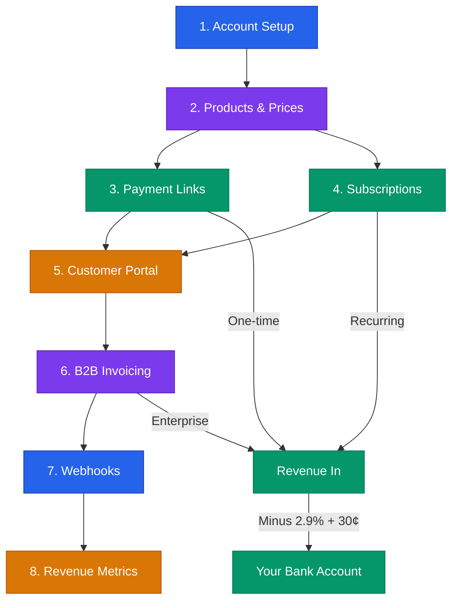

# Stripe Revenue Infrastructure Playbook



> **Disclaimer:** This is educational information for startup operations. Stripe features, pricing, and APIs change; verify against current Stripe documentation at stripe.com/docs. This is not financial or legal advice.

---

## Cost Breakdown

| Fee Type | Rate | Example |
|---|---|---|
| Standard card processing | 2.9% + $0.30 per transaction | $100 charge = $96.80 net |
| International cards | +1.5% | $100 charge = $95.30 net |
| Currency conversion | +1% | Stacks with above |
| ACH / bank transfer | 0.8% (capped at $5) | Better for large B2B invoices |
| Invoicing | Free (payment fees still apply) | No extra charge for sending |
| Billing (subscriptions) | Free on Starter | Paid plans add features |
| Disputes/chargebacks | $15 per dispute | Refunded if you win |

**Bottom line:** For most early-stage startups, budget 3.2% total cost per transaction after accounting for the occasional international card and the per-transaction flat fee on small charges.

---

## 1. Account Setup

### What You Need

```
Business Information:
- Legal business name (or your name if sole proprietor)
- EIN or SSN
- Business address
- Business website or social media URL
- Industry / MCC code (Stripe auto-selects usually)

Bank Account:
- Routing number
- Account number
- Must be a US checking account for US businesses

Tax Setup:
- Go to Settings → Tax → Tax registrations
- Add states where you have nexus
- Enable Stripe Tax for automatic calculation (0.5% per transaction)
```

### Setup Checklist

```
[ ] Create Stripe account at dashboard.stripe.com
[ ] Verify email address
[ ] Complete business verification (2-3 business days)
[ ] Add bank account for payouts
[ ] Set payout schedule (daily, weekly, or monthly)
[ ] Turn on two-factor authentication (mandatory for your protection)
[ ] Add a second team member with admin access (bus factor)
[ ] Upload your logo in Settings → Branding
[ ] Set statement descriptor (what customers see on their bank statement)
[ ] Configure tax settings if selling to US consumers
```

**Payout timing:** First payout takes 7 days. After that, daily payouts arrive in 2 business days (US).

---

## 2. Creating Products and Prices

Products and prices are separate objects in Stripe. One product can have multiple prices (monthly, annual, one-time, different tiers).

### Create Your First Product

```
Dashboard → Products → + Add product

Product Name: [Your Product Name]
Description: [One line - shows on invoices and receipts]
Image: [Optional - shows on payment links and checkout]
```

### Price Structures

**One-time price:**
```
Price: $[AMOUNT]
Type: One-time
```

**Recurring price (monthly):**
```
Price: $[AMOUNT]/month
Type: Recurring
Billing period: Monthly
```

**Recurring price (annual with discount):**
```
Price: $[ANNUAL_AMOUNT]/year  (typically 2 months free = 10 × monthly)
Type: Recurring
Billing period: Yearly
```

### Naming Convention

Keep it clean for customer-facing receipts:

```
Product: "[Company] Pro Plan"
  - Price 1: $49/month
  - Price 2: $490/year (save $98)

Product: "[Company] Starter Plan"
  - Price 1: $19/month
  - Price 2: $190/year (save $38)

Product: "Setup / Onboarding Fee"
  - Price 1: $500 (one-time)
```

---

## 3. Payment Links (Fastest Path to Revenue)

Payment links are the fastest way to collect money. No code needed. Share a URL, get paid.

### When to Use Payment Links

- Pre-sales and deposits
- One-time purchases
- Simple subscription signups
- Selling before your website is ready
- Event tickets or workshop fees

### Create a Payment Link

```
Dashboard → Payment Links → + Create payment link

Select product and price
Options:
  - Allow customers to adjust quantity: [Yes/No]
  - Collect phone number: [Usually no]
  - Collect billing address: [Yes if physical goods or tax compliance]
  - Collect shipping address: [Only for physical goods]
  - Allow promotion codes: [Yes if you plan to use coupons]

After payment:
  - Redirect to your website: [THANK_YOU_PAGE_URL]
  - Or show confirmation page (default)
```

### Where to Put Payment Links

```
[ ] Email signature
[ ] Social media bio (LinkedIn, Twitter)
[ ] Pitch deck last slide
[ ] Landing page CTA button
[ ] Invoice follow-ups
[ ] DM conversations after sales calls
```

**Template — Pre-sale Email with Payment Link:**

```
Subject: Reserve your spot — [Product] early access

Hi [Name],

Thanks for the conversation about [their problem].

I am building [Product] to solve exactly this. Early customers get
[specific benefit — discount, input on features, priority support].

Reserve your spot here: [PAYMENT_LINK]

Price: $[AMOUNT] (early access — goes up to $[HIGHER_AMOUNT] at launch)

If it is not a fit when we launch, full refund, no questions.

[Your Name]
```

---

## 4. Subscription Setup

### Monthly + Annual with Discount

Standard practice: offer annual billing at a 15-20% discount. This improves cash flow and reduces churn.

```
Monthly: $49/month
Annual: $490/year ($40.83/month — save $98/year)
```

### Create a Subscription Product

```
Dashboard → Products → + Add product

Product: "[Company] [Tier Name]"
Add two prices:
  1. $49/month — Recurring — Monthly
  2. $490/year — Recurring — Yearly
```

### Trial Periods

```
Settings per subscription:
  - Free trial: 7 or 14 days (no card required)
  - Card-upfront trial: 14 days (card collected, not charged)
```

**Recommendation:** Require a card upfront. Trial-to-paid conversion rates:

| Trial Type | Typical Conversion |
|---|---|
| No card required | 2-5% |
| Card upfront | 40-60% |

### Handling Plan Changes

Stripe handles prorations automatically. If a customer upgrades mid-cycle, they are charged the difference. If they downgrade, they get a credit.

```
Default behavior: Prorate on upgrade, credit on downgrade
Recommended: Keep default unless you have a reason to change
```

---

## 5. Customer Portal

The customer portal lets customers manage their own subscriptions, update payment methods, and download invoices. This eliminates support tickets.

### Enable the Portal

```
Dashboard → Settings → Billing → Customer portal

Configure:
  [ ] Allow customers to update payment methods
  [ ] Allow customers to cancel subscriptions
  [ ] Allow customers to switch plans
  [ ] Show invoice history
  [ ] Add your terms of service URL
  [ ] Add your privacy policy URL
```

### Link to the Portal

Add a "Manage Subscription" link in your app or email footer. Stripe generates a unique portal URL per customer.

```
For no-code: Use the portal link from the Dashboard
For developers: Create a portal session via API
  POST /v1/billing_portal/sessions
  { customer: "cus_xxx", return_url: "https://yourapp.com/account" }
```

---

## 6. Invoicing for B2B / Enterprise

Payment links work for self-serve. For B2B deals — especially above $1K — send invoices.

### When to Use Invoices

- Enterprise deals with procurement departments
- Custom pricing or negotiated contracts
- Net-30 or Net-60 payment terms
- Customers who need a formal document for their records

### Create an Invoice

```
Dashboard → Invoices → + Create invoice

Customer: [Select or create]
Line items:
  - [Product/Service description]: $[AMOUNT]
  - [Optional: Setup fee]: $[AMOUNT]
Due date: [Net-30 is standard]
Memo: [PO number, contract reference, etc.]
```

### Invoice Settings

```
[ ] Auto-charge if payment method on file: [Yes for subscriptions]
[ ] Send reminders for overdue invoices: [Yes — 3, 7, 14 days]
[ ] Add your company logo and details
[ ] Include your payment terms
[ ] Add late payment policy (optional but recommended for enterprise)
```

**Template — Invoice Follow-up Email:**

```
Subject: Invoice #[NUMBER] from [Company] — due [DATE]

Hi [Name],

Attaching invoice #[NUMBER] for [description of work/product].

Amount: $[AMOUNT]
Due: [DATE]
Pay online: [STRIPE_INVOICE_LINK]

Let me know if you need anything adjusted for your records.

[Your Name]
```

---

## 7. Webhook Basics

Webhooks let Stripe notify your systems when events happen — payment succeeded, subscription canceled, invoice overdue.

### Essential Webhooks for Startups

| Event | What It Means | Action |
|---|---|---|
| `checkout.session.completed` | Customer paid via payment link or checkout | Deliver access / send confirmation |
| `invoice.paid` | Subscription renewed successfully | Update account status |
| `invoice.payment_failed` | Card declined on renewal | Send dunning email |
| `customer.subscription.deleted` | Subscription canceled | Revoke access, trigger win-back |
| `charge.dispute.created` | Customer filed a chargeback | Respond within 7 days with evidence |

### Setup Without Code

If you do not have a developer yet, use Stripe's built-in email receipts and the customer portal. That covers 80% of what you need.

For the remaining 20%, services like Zapier or Make can listen to Stripe webhooks and trigger actions (send emails, update Airtable, post to Slack).

### Setup With Code

```
Dashboard → Developers → Webhooks → + Add endpoint

Endpoint URL: https://yourapp.com/webhooks/stripe
Events to listen for:
  - checkout.session.completed
  - invoice.paid
  - invoice.payment_failed
  - customer.subscription.deleted
```

**Critical:** Always verify webhook signatures. Never trust raw POST data without checking the `Stripe-Signature` header.

---

## 8. Revenue Metrics from Stripe

### Key Metrics to Track

| Metric | Definition | Healthy Benchmark |
|---|---|---|
| MRR | Monthly Recurring Revenue — sum of all active monthly subscriptions | Growing month-over-month |
| ARR | Annual Recurring Revenue — MRR × 12 | Use for fundraising conversations |
| Churn Rate | % of subscribers who cancel per month | Below 5% monthly for SMB, below 2% for enterprise |
| ARPU | Average Revenue Per User — MRR ÷ active customers | Increasing over time (upsells working) |
| LTV | Lifetime Value — ARPU ÷ monthly churn rate | At least 3× CAC |
| Net Revenue Retention | Revenue from existing customers including upgrades minus churn | Above 100% means growth without new customers |

### Where to Find These in Stripe

```
Dashboard → Billing → Overview
  - MRR (shown directly)
  - Subscriber count
  - Churn (shown as "Canceled")

Dashboard → Billing → Revenue recovery
  - Failed payment recovery rate
  - Dunning email effectiveness

Dashboard → Reports → Revenue
  - Monthly revenue breakdown
  - Refund totals
```

### Quick MRR Calculation

```
MRR Components:
  + New MRR (new subscribers this month)
  + Expansion MRR (upgrades this month)
  - Contraction MRR (downgrades this month)
  - Churned MRR (cancellations this month)
  = Net New MRR

Total MRR = Previous MRR + Net New MRR
```

### Reporting Template

```
Monthly Revenue Report — [MONTH YEAR]

MRR: $[AMOUNT]
  New: +$[AMOUNT] ([NUMBER] customers)
  Expansion: +$[AMOUNT]
  Contraction: -$[AMOUNT]
  Churned: -$[AMOUNT] ([NUMBER] customers)
  Net New MRR: $[AMOUNT]

ARPU: $[AMOUNT]
Monthly Churn: [PERCENT]%
LTV: $[AMOUNT]

One-time revenue: $[AMOUNT]
Total revenue: $[AMOUNT]

Notes:
- [Key observation]
- [Action item for next month]
```

---

## 9. Common Mistakes

### Pricing Mistakes

- **Setting prices too low.** Stripe fees eat a bigger percentage of small transactions. A $5 charge loses 8.9% to fees ($0.30 + $0.15). A $100 charge loses 3.2%.
- **Not offering annual billing.** You leave cash flow on the table and increase churn.
- **Too many tiers.** Start with one or two. Add tiers when customers ask for them.

### Setup Mistakes

- **Skipping test mode.** Always test payment flows in test mode first (use card 4242 4242 4242 4242).
- **No statement descriptor.** Customers see a random string on their bank statement and file chargebacks.
- **No receipt emails.** Turn on automatic receipts in Settings → Emails.
- **Single admin account.** Add a co-founder or trusted team member as a second admin.

### Operational Mistakes

- **Ignoring failed payments.** Set up dunning emails (Settings → Billing → Subscriptions → Manage failed payments). 15-30% of failed payments can be recovered with automated retries and emails.
- **Not monitoring disputes.** You have 7 days to respond. Set up email alerts for `charge.dispute.created`.
- **Manual invoicing when you could automate.** If you send the same invoice more than twice, create a subscription or recurring invoice instead.
- **Not reconciling.** Compare Stripe payouts to your bank deposits weekly. Stripe batches transactions, so individual charges do not match 1:1 with deposits.

---

## Quick Start Checklist

For founders who want to start collecting revenue today:

```
[ ] Create Stripe account (10 minutes)
[ ] Complete business verification (submit and wait 2-3 days)
[ ] Create one product with one price (5 minutes)
[ ] Generate a payment link (2 minutes)
[ ] Send the payment link to your first customer (right now)
[ ] Set up receipt emails (Settings → Emails, 1 minute)
[ ] Enable customer portal (Settings → Billing, 5 minutes)
[ ] Add annual pricing at 15-20% discount (5 minutes)
[ ] Set up failed payment recovery emails (5 minutes)
[ ] Bookmark the Billing → Overview page for weekly check-ins
```

Total time to first payment link: under 20 minutes.
