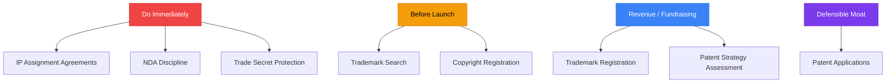
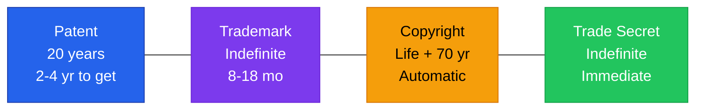

# Intellectual Property for Startups

**Disclaimer:** IP law is complex and jurisdiction-specific. This is educational context. Consult a licensed IP attorney before filing any application or making IP strategy decisions.

---

## IP Strategy Priority



## The Four IP Assets



## Files in This Directory

| File | Contents |
|------|----------|
| `README.md` (this file) | IP strategy overview, priority framework, key principles |
| `patents.md` | Patent strategy, provisional applications, when to file, costs |
| `trademarks.md` | Trademark search, registration, enforcement, brand protection |
| `trade-secrets.md` | Trade secret protection, NDA strategy, employee obligations |
| `copyright.md` | Copyright basics, software copyright, open source risk |
| `ip-assignments.md` | Why IP assignment matters, what to require from founders/employees/contractors |

---

## IP Strategy Framework for Startups

### The Four IP Assets

| Type | What It Protects | Time to Get | Cost | Duration |
|------|-----------------|-------------|------|----------|
| **Patent** | Novel inventions, processes, software methods | 2–4 years (utility) | $15K–$50K+ | 20 years from filing |
| **Trademark** | Brand name, logo, slogan | 8–18 months | $1,500–$5,000 | Indefinitely (with maintenance) |
| **Copyright** | Original creative works (code, content, design) | Automatic on creation; registration for enforcement | $35–$55 (registration) | Life + 70 years |
| **Trade Secret** | Confidential business information | Immediate (if protected properly) | Cost of protection | Indefinitely (if kept secret) |

---

## IP Priority for Early-Stage Missouri Startups

### Do Immediately (Before Anything Else):
1. **IP Assignment Agreements** — All founders, employees, and contractors must assign IP to the company. This is non-negotiable. See `ip-assignments.md`.

2. **NDA Discipline** — Sign NDAs before sharing proprietary technical information with anyone outside the company.

3. **Basic Trade Secret Protection** — Mark confidential documents as "Confidential." Limit access. Document what you're protecting. See `trade-secrets.md`.

### Do Before Launch:
4. **Trademark Search** — Before you invest in branding, confirm your name and logo are available. A conflict discovered after launch is expensive.

5. **Copyright Registration on Key Assets** — Register copyrights on core software, content, or creative assets you want maximum protection on.

### Do When You Have Revenue or Before Fundraising:
6. **Trademark Registration** — File federal trademark application for company name, product name, and logo.

7. **Patent Strategy Assessment** — Determine if your core technology is patentable and whether patents fit your competitive strategy.

### Do When You Have a Defensible Technical Moat:
8. **Patent Applications** — File provisional patent application to establish priority date; convert to utility patent within 12 months.

---

## IP and Investor Due Diligence

Investors will check these in diligence:

```
IP DUE DILIGENCE CHECKLIST

[ ] IP assignment agreements signed by all founders
[ ] IP assignment agreements signed by all employees and contractors
[ ] No prior employer IP claims on any founder's work
[ ] Trademark search completed; no material conflicts
[ ] Trademark application filed (or in process)
[ ] No open source licenses that contaminate proprietary code (GPL risk)
[ ] Any patents filed or pending
[ ] No material IP litigation pending or threatened
[ ] Domain name registered and controlled by company
[ ] Social media handles secured for company name
```

**Deals have been killed by missing IP assignments.** If a founder built the core product before the company was formed, that IP may belong to the founder personally — not the company. Fix this immediately.

---

## Open Source Risk

Open source software is everywhere in startup codebases. Not all licenses are equal.

### License Risk Spectrum

**Low risk (permissive):**
- MIT License — use freely; attribution required
- Apache 2.0 — use freely; attribution and patent grant
- BSD — similar to MIT

**High risk (copyleft):**
- GPL (GNU General Public License) — if you use GPL code in your product, your product must also be GPL (open source)
- LGPL — weaker copyleft; can link to LGPL libraries without triggering copyleft
- AGPL — strongest copyleft; even SaaS use requires open sourcing

**Practical rule:** Your core proprietary product should not incorporate GPL or AGPL code.

**Tools to scan your codebase for license risk:**
- FOSSA (fossa.io) — automated open source license compliance
- Black Duck (synopsys.com)
- WhiteSource / Mend
- Manual audit: Check every dependency in package.json, requirements.txt, etc.

---

## Missouri IP Resources

### Armstrong Teasdale (St. Louis)
- Strong patent prosecution practice; handles software and tech patents
- armstrongteasdale.com

### Thompson Coburn (St. Louis)
- IP litigation and prosecution
- thompsoncoburn.com

### Polsinelli (Kansas City)
- Healthcare IP; pharma; medical devices
- polsinelli.com

### USPTO Resources (Federal)
- **Patent search:** patents.google.com (free, comprehensive)
- **Trademark search:** tmsearch.uspto.gov (TESS — free)
- **USPTO website:** uspto.gov
- **Pro Se assistance:** USPTO Patent Pro Bono Program (usptopatentprobono.org) — free legal help for qualifying inventors

### Missouri Bar IP Referral
- mobar.org → Lawyer Referral Service → select IP specialty
