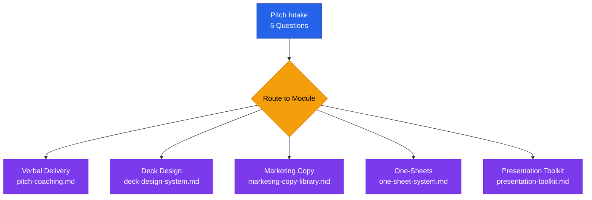
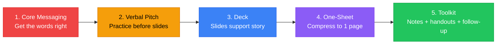

# Pitch Generator — Directory Index

## Pitch System Overview



## Pitch Build Order



## Purpose

This directory coaches founders through every dimension of pitching — from the first words out of their mouth to the slide design system to the leave-behind one-sheet. It is a complete pitch preparation and materials system.

**Load this directory when a founder says:**
- "Help me with my pitch"
- "I have an investor meeting next week"
- "Can you help me practice my pitch?"
- "I need a pitch deck"
- "I need a one-sheet / leave-behind"
- "How long should my pitch be?"
- "I'm nervous about presenting"
- "I need marketing materials for my startup"
- "What should I say when someone asks what I do?"
- `/pitch` `/deck` `/simulate` commands

---

## Files in This Directory

| File | What It Contains | Load When |
|------|-----------------|-----------|
| `pitch-coaching.md` | Verbal pitch scripts by context (elevator, investor meeting, demo), timing guides, delivery coaching, body language, handling nerves, Q&A strategies | Preparing for any live pitch or presentation |
| `deck-design-system.md` | Slide-by-slide design specs, layout rules, color/typography system, do's and don'ts, visual storytelling principles, tool recommendations | Building or redesigning a pitch deck |
| `marketing-copy-library.md` | Every marketing asset a founder needs — all with multiple character-count variants (Twitter/X, LinkedIn, email subject, tagline, bio, ad copy, etc.) | Drafting any marketing copy or brand messaging |
| `one-sheet-system.md` | Investor one-sheet, product one-sheet, speaker one-sheet — full templates with layout specs and copy guidance | Creating leave-behind materials |
| `presentation-toolkit.md` | Speaker notes templates, slide handout formats, follow-up email sequences, post-pitch checklist, supporting materials | After the deck is built; preparing to present |

---

## Pitch Generator — Quick Start

When a founder says "help me with my pitch," start here:

**Step 1 — Intake (5 questions):**
1. What does your company do? (one sentence)
2. Who is the pitch for? (investor / customer / partner / conference / competition)
3. How long do you have? (30 sec / 2 min / 5 min / 10 min / 20 min)
4. What's your best traction signal?
5. What outcome do you want from this pitch? (next meeting / investment / a sale / awareness)

**Step 2 — Route to the right file:**
- Verbal delivery → `pitch-coaching.md`
- Deck design → `deck-design-system.md`
- Copy for materials → `marketing-copy-library.md`
- One-sheet or handout → `one-sheet-system.md`
- Full presentation prep → `presentation-toolkit.md`

**Step 3 — Build in this order:**
1. Core messaging (from `marketing-copy-library.md`) — get the words right first
2. Verbal pitch (from `pitch-coaching.md`) — practice before building slides
3. Deck (from `deck-design-system.md`) — slides support the verbal story
4. One-sheet (from `one-sheet-system.md`) — compress the deck into a single page
5. Presentation toolkit (from `presentation-toolkit.md`) — speaker notes, handouts, follow-up

---

## The Pitch Hierarchy

```
BRAND MESSAGE (the foundation — what you stand for)
    ↓
CORE MESSAGING PILLARS (3 key points that support every pitch)
    ↓
PITCH VARIANTS (different length/format for different contexts)
    ↓
SUPPORTING MATERIALS (deck, one-sheet, handout, demo)
    ↓
FOLLOW-UP ASSETS (email, leave-behind, data room)
```

Everything flows from the brand message down. Get the words right first. Then build the materials.
