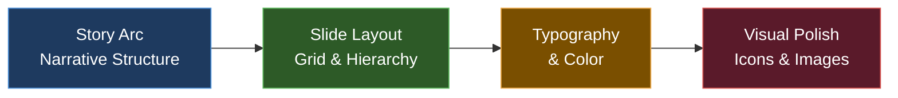

# Pitch Deck Design System



## Design Philosophy

A great pitch deck does one thing: **makes the story impossible to misunderstand.**

Design serves clarity. Every design decision should make the message clearer — never more ornate.

**The investor reads your deck in 3 minutes or less on a first pass.** Every slide must work in 5 seconds: one clear message, one visual anchor, no clutter.

---

## Deck Specifications

### Canvas Dimensions
- **Standard widescreen:** 16:9 ratio — 1920 × 1080px (preferred for all modern presentations)
- **Square (LinkedIn/social preview):** 1080 × 1080px
- **Print-ready:** 10" × 7.5" at 300 DPI for physical handouts
- **Mobile-optimized:** 9:16 (1080 × 1920px) for story/mobile sharing

### Recommended Tools
| Tool | Best For | Cost |
|------|---------|------|
| **Pitch** (pitch.com) | Startup pitch decks; templates; collaboration | Free tier available |
| **Figma** | Full design control; designer-friendly | Free tier available |
| **Canva** | Fast production; non-designers | Free tier; Pro $12/mo |
| **Google Slides** | Quick iteration; easy sharing | Free |
| **PowerPoint** | Enterprise delivery; animations | Microsoft 365 |
| **Beautiful.ai** | AI-assisted layout; smart slides | $12/mo |

**Recommendation for most founders:** Pitch.com (purpose-built for pitch decks) or Canva (fast, beautiful, no design skill required).

---

## Typography System

### Font Pairings (Modern Startup Aesthetic)

**Option 1 — Clean & Confident (recommended)**
- Headline: **Inter Bold** or **DM Sans Bold** — weight 700–800
- Body: **Inter Regular** or **DM Sans Regular** — weight 400
- Accent/Label: **Inter Medium** — weight 500, all caps, tracked

**Option 2 — Premium & Authoritative**
- Headline: **Neue Haas Grotesk Bold** or **GT Walsheim Bold**
- Body: **Neue Haas Grotesk Regular**
- Accent: **Neue Haas Grotesk Medium**, letter-spaced

**Option 3 — Friendly & Approachable**
- Headline: **Plus Jakarta Sans Bold**
- Body: **Plus Jakarta Sans Regular**
- Accent: **Plus Jakarta Sans Medium**

All fonts above are free on Google Fonts. Download and install before building.

### Type Scale (1920×1080 canvas)

| Element | Size | Weight | Line Height |
|---------|------|--------|-------------|
| Slide headline | 48–64pt | Bold (700) | 1.1 |
| Subheadline | 28–36pt | SemiBold (600) | 1.2 |
| Body copy | 20–24pt | Regular (400) | 1.5 |
| Data labels | 16–18pt | Medium (500) | 1.3 |
| Caption/footnote | 13–14pt | Regular (400) | 1.4 |
| Section label | 12–13pt | Medium (500), ALL CAPS | 1.4 |

**Rule:** Never go below 18pt for anything visible to an audience. Never below 14pt in a PDF-only deck.

---

## Color System

### Primary Palette — Build Your Brand Colors Around These Roles

```
PRIMARY (brand color — used for CTAs, headlines, key data)
  Hex: [your brand color]
  Use: Slide headlines, key stat callouts, primary buttons

SECONDARY (supporting brand color — accent and variety)
  Hex: [your secondary color]
  Use: Charts, secondary callouts, decorative elements

DARK (near-black — primary text color)
  Recommended: #0F1117 or #1A1A2E (richer than pure black)
  Use: All body text, subheadings

LIGHT (near-white — background and reversed text)
  Recommended: #FAFAFA or #F8F9FC
  Use: Slide backgrounds, text on dark slides

GRAY (neutral — supporting text, labels, borders)
  Mid-gray: #6B7280 or #8D9AB1
  Light gray: #E5E7EB or #EEF0F4

ACCENT (high-attention — use sparingly, 1–2 elements per slide max)
  Choose one: Electric blue #3B82F6 / Emerald #10B981 / Amber #F59E0B
  Use: Single key number, important callout, progress indicator
```

### Color Rules
- **Max 3 colors visible on any single slide** (excluding white/black)
- **60-30-10 rule:** 60% primary background, 30% secondary, 10% accent
- **Dark slides** (white text on dark): powerful for financial slides, quotes, and section breaks — use sparingly
- **Never:** Red + Green together (colorblind inaccessible). Always: sufficient contrast (4.5:1 minimum ratio)
- **Investor meetings:** Slightly more conservative palette (deep navy, white, single accent) over bright consumer-y colors

### Recommended Startup Color Palettes

**Enterprise / B2B / Professional:**
```
Primary: Deep Navy #0F2B5B
Secondary: Steel Blue #3B82F6  
Text: #1A1A2E
Background: #FFFFFF
Accent: Electric Blue #60A5FA
```

**Health / Wellness / Consumer:**
```
Primary: Teal #0D9488
Secondary: Slate #334155
Text: #0F1117
Background: #F8FFFE
Accent: Emerald #34D399
```

**Tech / AI / Innovation:**
```
Primary: Dark #0F1117
Secondary: Violet #7C3AED
Text: #FFFFFF (on dark) / #0F1117 (on light)
Background: #0F1117 (dark mode) or #FAFAFA (light mode)
Accent: Cyan #22D3EE
```

**Legal / Finance / Trust:**
```
Primary: Charcoal #1C2B4A
Secondary: Gold #B8963E
Text: #1C2B4A
Background: #FFFFFF
Accent: Mid-blue #4A7FC1
```

---

## Slide Layout System

### The Grid
All slides use an invisible 12-column grid with consistent margins:
- **Margins:** 80px left/right, 60px top/bottom (on 1920×1080 canvas)
- **Safe zone:** Keep all critical content 80px from edges
- **Gutter:** 24px between columns

### Layout Templates by Slide Type

**TITLE SLIDE**
```
[Logo — top left, 40px from corner]
                    
[Company Name — centered, 64pt bold]
[Tagline — centered, 28pt regular, 50% opacity]

[Presenter name | Event | Date — bottom left, 14pt]
[Website — bottom right, 14pt]
[Background: brand color or high-quality photo with overlay]
```

**SINGLE STAT CALLOUT** (best for traction, market size)
```
[Section label — top left, 12pt all caps, brand color]

[Number — centered or left-aligned, 80–120pt bold, high contrast]
[Descriptor — directly below, 24pt regular]

[1–2 sentence context — bottom third, 20pt, muted]
```

**PROBLEM / SOLUTION SPLIT**
```
[Headline — top, 48pt]

[LEFT COLUMN (45% width):]          [RIGHT COLUMN (45% width):]
[Problem description]               [Solution description]
[3 bullet points, 20pt]            [3 bullet points, 20pt]
[Optional: red/warning visual]      [Optional: green/check visual]
```

**3-COLUMN FEATURE / BENEFIT**
```
[Headline — top, 48pt]

[Column 1]        [Column 2]        [Column 3]
[Icon 64px]       [Icon 64px]       [Icon 64px]
[Feature name]    [Feature name]    [Feature name]
[2-line desc]     [2-line desc]     [2-line desc]
```

**FULL-BLEED QUOTE**
```
[Dark or brand-color background]

[Large quotation mark graphic — decorative]
"[Customer quote — 24–32pt, white, centered]"
[— Customer Name, Title, Company — 18pt, 70% opacity]
```

**COMPETITIVE LANDSCAPE (2x2 matrix)**
```
[Y-axis label — left vertical]    [Headline]
                    
HIGH ↑
      [Competitor B]
      
                    [US ●] ← Your position
      [Competitor A]
      
LOW ↓
      LOW ←————————→ HIGH
           [X-axis label]
```

**TEAM SLIDE**
```
[Headline: "The Team" — top]

[Photo 200×200px, circular] [Photo 200×200px, circular] [Photo 200×200px, circular]
[Name — 22pt bold]          [Name — 22pt bold]          [Name — 22pt bold]
[Title — 18pt]              [Title — 18pt]              [Title — 18pt]  
[2-line bio — 16pt]         [2-line bio — 16pt]         [2-line bio — 16pt]
[LinkedIn icon]             [LinkedIn icon]             [LinkedIn icon]
```

**FINANCIALS / METRICS**
```
[Headline — top, 48pt]

[KEY METRIC CARDS — 3–4 across]
┌─────────────┐ ┌─────────────┐ ┌─────────────┐
│ $12K        │ │ 20%         │ │ 18 mo       │
│ MRR         │ │ MoM Growth  │ │ Runway      │
│ ↑ from $8K  │ │ 3-month avg │ │             │
└─────────────┘ └─────────────┘ └─────────────┘

[Chart — bottom two-thirds of slide]
```

---

## Slide-by-Slide Content Specs

### Slide 1: Cover
- **Headline:** Company name — 64pt bold
- **Subheadline:** Tagline — 28pt regular *(see marketing-copy-library.md for tagline variants)*
- **Logo:** Top left or centered above name
- **Background:** Brand color, hero image with overlay, or dark gradient
- **Max words on slide:** 15

### Slide 2: Problem
- **Headline:** The problem in one phrase — 48pt bold (e.g., "Co-parents drown in documentation")
- **Body:** 3 bullet points, each one sentence, 20pt — the 3 dimensions of the pain
- **Visual:** Photo of a frustrated customer, a chaotic spreadsheet, a failed alternative — make pain visible
- **Optional:** Pull quote from customer interview in bold
- **Max words on slide:** 60

### Slide 3: Solution
- **Headline:** What you do — 48pt bold (e.g., "One platform. Court-ready documentation.")
- **Body:** 2–3 sentences or 3 benefit bullets, 20pt
- **Visual:** Product screenshot, 3-step flow diagram, or before/after split
- **Max words on slide:** 50

### Slide 4: Why Now
- **Headline:** The timing insight — 48pt bold (e.g., "The market just changed")
- **Body:** 2–3 bullets naming the specific forces: technology shift, regulatory change, behavioral change, market event
- **Visual:** Timeline, trend chart, news headline as visual anchor
- **Max words on slide:** 50

### Slide 5: Market Size
- **Headline:** "$XB Market" or "A Massive, Growing Market" — 48pt bold
- **Visual:** Concentric circles (TAM/SAM/SOM) or bar chart with CAGR
- **Numbers:** 3 numbers — TAM, SAM, SOM — each with label and source
- **Body:** 1–2 sentences on market growth rate and timing
- **Max words on slide:** 40

### Slide 6: Product
- **Headline:** Short functional statement — 48pt bold (e.g., "Documentation in 60 seconds")
- **Visual:** LARGE — fills 60–70% of the slide. Real product screenshot, not mockup. Add device frame.
- **Callout labels:** 3–5 arrows pointing to key features with 2–3 word labels, 16pt
- **Max words on slide:** 30 (let the product speak)

### Slide 7: Traction
- **Headline:** Your best metric as the headline — 64pt bold (e.g., "$12K MRR") + descriptor
- **Supporting metrics:** 3–4 metric cards with numbers + labels
- **Chart:** Revenue or user growth — keep it simple, label axes, show the trend
- **Max words on slide:** 50 (numbers do the talking)

### Slide 8: Business Model
- **Headline:** "How We Make Money" or pricing tiers — 48pt bold
- **Visual:** 2–3 pricing tiers in card format, or a simple table
- **Key economics:** CAC / LTV / Payback — 3 numbers with labels
- **Max words on slide:** 60

### Slide 9: Go-To-Market
- **Headline:** "How We Reach Customers" — 48pt bold
- **Visual:** Funnel diagram, channel map, or growth flywheel
- **Content:** Current channel(s) + conversion metrics + scalable channel hypothesis
- **Max words on slide:** 60

### Slide 10: Competitive Landscape
- **Headline:** "A Differentiated Position" or "Why We Win" — 48pt bold
- **Visual:** 2×2 matrix (most readable) or feature comparison table (max 5 competitors, 6 features)
- **Your position:** Clearly marked, ideally in the top-right quadrant with room around you
- **Max words on slide:** 50 (let the visual carry it)

### Slide 11: Team
- **Headline:** "The Team" or "Why Us" — 48pt bold
- **Photos:** Circular crop, professional, consistent style
- **Per person:** Name (22pt bold), Title (18pt), 2-line relevant credential (16pt)
- **Do not:** Include everyone. 2–4 people max. Add advisors separately if strong.
- **Max words on slide:** 80

### Slide 12: The Ask
- **Headline:** "Raising $[X]" — 64pt bold
- **Content block:**
  - Amount + instrument (SAFE, note, priced) — 28pt
  - Use of funds: 3 line items with % — 20pt
  - Milestone this round funds — 20pt
- **Visual:** Simple pie chart for use of funds, or milestone roadmap
- **Max words on slide:** 60

---

## Design Do's and Don'ts

### DO:
- **One idea per slide.** If you're tempted to add a second point, make a second slide.
- **Use white space aggressively.** Empty space is not wasted space — it directs attention.
- **Make numbers big.** Your best metric should be the largest text on the slide.
- **Use real photos.** Stock photos signal inauthenticity. Real product, real team, real customers.
- **Align everything.** Misaligned elements signal carelessness. Use snap-to-grid.
- **Consistent slide headers.** Same position, same size, same weight on every slide.
- **Label your axes.** Every chart needs labeled axes and a data source.
- **High contrast.** Test your deck on a projector before any in-person meeting.

### DON'T:
- **Don't use more than 3 fonts** on any slide. Two is better. One is fine.
- **Don't use clip art or generic icons.** Use Lucide, Heroicons, or Noun Project for clean line icons.
- **Don't use full sentences as headlines.** Headlines are hooks, not topic sentences.
- **Don't use more than 6 bullet points per slide.** If you have 7 bullets, split the slide.
- **Don't use low-resolution images.** All images should be at least 1200px wide. Use Unsplash or your own photos.
- **Don't animate excessively.** One subtle entrance animation per slide max — or none at all.
- **Don't use red for text.** Reserve red for danger/warning indicators only.
- **Don't put your logo on every slide.** Cover slide and final slide only.
- **Don't use pie charts for more than 3 segments.** Use bars instead.
- **Don't build slides in Google Docs or Word.** Use a dedicated presentation tool.

---

## Accessibility Checklist

Before finalizing your deck:
```
[ ] Minimum contrast ratio 4.5:1 for all text (test at webaim.org/resources/contrastchecker)
[ ] Never convey meaning by color alone (add labels, patterns, or icons)
[ ] All images have alt text (for PDF accessibility)
[ ] Font size minimum 14pt for any text (18pt preferred)
[ ] No red + green used together as the only differentiator
[ ] Slide numbers on every slide (for reference during Q&A)
[ ] File saved as both .pptx/.key AND .pdf (PDF preserves fonts)
```

---

## Export Settings

**For email / sharing (PDF):**
- Export as PDF, high quality
- File size target: < 10MB for easy email attachment
- Compress images if needed (Smallpdf, Adobe Compress)

**For presentation (native file):**
- Keep native .pptx or .key for presentation
- Test on the actual display device before the meeting
- Bring a USB backup AND a cloud link

**For Docsend / analytics:**
- Upload PDF to Docsend to track opens, time per slide, and investor engagement
- Use Docsend link instead of email attachment when sending to investors
