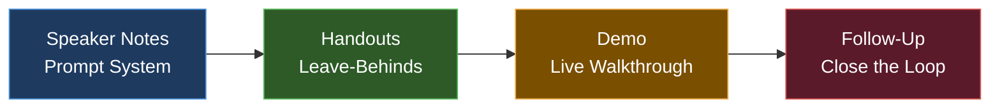

# Presentation Toolkit



## Purpose

This file covers everything that happens around the pitch — before, during, and after. Speaker notes, handouts, supporting materials, and the follow-up system that closes deals.

The deck gets you in the room. The toolkit determines what happens next.

---

## SPEAKER NOTES SYSTEM

### How to Write Speaker Notes That Actually Help

Bad speaker notes are a transcript of what you're going to say — which causes you to read them.

Good speaker notes are **a prompt system** — they remind you of your flow, flag your key transitions, and tell you what to emphasize.

### Speaker Notes Template (Per Slide)

```
SLIDE [NUMBER]: [Slide title]

OPEN WITH:
[First sentence you say when this slide appears — memorized]

KEY POINT:
[The one thing they must remember from this slide — in bold]

TRANSITION TO NEXT:
[Exact phrase that bridges to the next slide — so you don't stall]

TIMING: [X] seconds / [X] minutes

IF THEY ASK [anticipated question]:
[Your prepared answer in 2–3 sentences]

ENERGY NOTE:
[How to deliver this slide — slow down / pause after / step forward / let visual breathe]
```

### Filled-In Example (Traction Slide)

```
SLIDE 7: Traction

OPEN WITH:
"Let me show you what we've built in the last six months."

KEY POINT:
$12K MRR, growing 20% month over month — NOT the user count

TRANSITION TO NEXT:
"These numbers are growing because our business model works. Let me show you how we make money."

TIMING: 45 seconds

IF THEY ASK "How do you define MRR?":
"MRR is recurring monthly subscription revenue from active paying customers. 
We don't include one-time fees or pilots that haven't converted."

ENERGY NOTE:
Pause after saying the MRR number. 2 full seconds. Let it land.
```

---

## SLIDE-BY-SLIDE SPEAKER NOTES TEMPLATE

Complete this for every slide before any live pitch.

```
━━━━━━━━━━━━━━━━━━━━━━━━━━━━━━━━━━━━━━━━━━━━━━━━
SLIDE 1: COVER
━━━━━━━━━━━━━━━━━━━━━━━━━━━━━━━━━━━━━━━━━━━━━━━━
OPEN WITH: "Thank you for making time. I want to tell you about 
           [Company] and why I think this is the right moment for it."
KEY POINT: Your name. Company. Stick in their mind.
TIMING: 15 seconds
━━━━━━━━━━━━━━━━━━━━━━━━━━━━━━━━━━━━━━━━━━━━━━━━

SLIDE 2: PROBLEM
━━━━━━━━━━━━━━━━━━━━━━━━━━━━━━━━━━━━━━━━━━━━━━━━
OPEN WITH: [Your hook — story, stat, or question]
KEY POINT: [The pain must feel real. Not abstract.]
TRANSITION: "And here's what we built to solve it."
TIMING: 45–60 seconds
━━━━━━━━━━━━━━━━━━━━━━━━━━━━━━━━━━━━━━━━━━━━━━━━

SLIDE 3: SOLUTION
━━━━━━━━━━━━━━━━━━━━━━━━━━━━━━━━━━━━━━━━━━━━━━━━
OPEN WITH: "[Company] is [one sentence — what it is and for whom]."
KEY POINT: The mechanism — HOW it works, not just what it is
TRANSITION: "And this is possible now because..."
TIMING: 45–60 seconds
━━━━━━━━━━━━━━━━━━━━━━━━━━━━━━━━━━━━━━━━━━━━━━━━

SLIDE 4: WHY NOW
━━━━━━━━━━━━━━━━━━━━━━━━━━━━━━━━━━━━━━━━━━━━━━━━
OPEN WITH: "Three things have changed that make this the right moment."
KEY POINT: Name the specific change — not vague trends
TRANSITION: "And the market this serves is significant."
TIMING: 30–45 seconds
━━━━━━━━━━━━━━━━━━━━━━━━━━━━━━━━━━━━━━━━━━━━━━━━

SLIDE 5: MARKET SIZE
━━━━━━━━━━━━━━━━━━━━━━━━━━━━━━━━━━━━━━━━━━━━━━━━
OPEN WITH: "The total addressable market is $[X] billion."
KEY POINT: The beachhead — not just the TAM. Where you start and why.
TRANSITION: "And here's the product that captures that market."
TIMING: 30 seconds
━━━━━━━━━━━━━━━━━━━━━━━━━━━━━━━━━━━━━━━━━━━━━━━━

SLIDE 6: PRODUCT
━━━━━━━━━━━━━━━━━━━━━━━━━━━━━━━━━━━━━━━━━━━━━━━━
OPEN WITH: "Let me show you what a customer sees."
KEY POINT: The aha moment — what makes the customer say "I need this"
TRANSITION: "And it's working. Let me show you our numbers."
TIMING: 60–90 seconds (demo if live)
━━━━━━━━━━━━━━━━━━━━━━━━━━━━━━━━━━━━━━━━━━━━━━━━

SLIDE 7: TRACTION
━━━━━━━━━━━━━━━━━━━━━━━━━━━━━━━━━━━━━━━━━━━━━━━━
OPEN WITH: "Here's where we are today."
KEY POINT: [Your best number — headline it]
TRANSITION: "These numbers are growing because our model works."
TIMING: 45 seconds
━━━━━━━━━━━━━━━━━━━━━━━━━━━━━━━━━━━━━━━━━━━━━━━━

SLIDE 8: BUSINESS MODEL
━━━━━━━━━━━━━━━━━━━━━━━━━━━━━━━━━━━━━━━━━━━━━━━━
OPEN WITH: "We charge [pricing structure]. Here's the unit economics."
KEY POINT: LTV:CAC ratio — if it's favorable, say the number out loud
TRANSITION: "And we reach customers through a repeatable channel."
TIMING: 30–45 seconds
━━━━━━━━━━━━━━━━━━━━━━━━━━━━━━━━━━━━━━━━━━━━━━━━

SLIDE 9: GO-TO-MARKET
━━━━━━━━━━━━━━━━━━━━━━━━━━━━━━━━━━━━━━━━━━━━━━━━
OPEN WITH: "Our primary acquisition channel right now is [X]."
KEY POINT: Describe what's working NOW — not the theory
TRANSITION: "We're positioned where no one else is."
TIMING: 30 seconds
━━━━━━━━━━━━━━━━━━━━━━━━━━━━━━━━━━━━━━━━━━━━━━━━

SLIDE 10: COMPETITION
━━━━━━━━━━━━━━━━━━━━━━━━━━━━━━━━━━━━━━━━━━━━━━━━
OPEN WITH: "There are [X] ways people solve this today. None of them work."
KEY POINT: Your position — what's different, not just what exists
TRANSITION: "The team building this is uniquely positioned to win it."
TIMING: 30–45 seconds
━━━━━━━━━━━━━━━━━━━━━━━━━━━━━━━━━━━━━━━━━━━━━━━━

SLIDE 11: TEAM
━━━━━━━━━━━━━━━━━━━━━━━━━━━━━━━━━━━━━━━━━━━━━━━━
OPEN WITH: "I want to tell you why this team."
KEY POINT: The personal connection to the problem — why you won't quit
TRANSITION: "Here's how we're going to deploy capital."
TIMING: 45 seconds
━━━━━━━━━━━━━━━━━━━━━━━━━━━━━━━━━━━━━━━━━━━━━━━━

SLIDE 12: THE ASK
━━━━━━━━━━━━━━━━━━━━━━━━━━━━━━━━━━━━━━━━━━━━━━━━
OPEN WITH: "We're raising $[X] on a [instrument] at a $[X]M cap."
KEY POINT: The milestone — what this money buys, not just what it pays for
CLOSE: "This is a big problem. We have early proof it can be solved. 
       And we have the team to do it. What questions can I answer?"
TIMING: 30–45 seconds
━━━━━━━━━━━━━━━━━━━━━━━━━━━━━━━━━━━━━━━━━━━━━━━━
```

---

## PRESENTATION HANDOUT FORMATS

### When to Provide Handouts

| Format | When to Use | What to Include |
|--------|-------------|-----------------|
| Printed one-sheet | In-person investor / customer meetings | Investor or product one-sheet (see one-sheet-system.md) |
| Printed deck (3-up) | Workshops, training sessions | 3 slides per page with notes lines |
| QR code card | Conferences, networking events | Links to deck, website, Calendly |
| Digital PDF (emailed) | Post-meeting follow-up | Deck PDF + one-sheet |
| Leave-behind folder | High-value sales meetings | One-sheet + case study + business card |

### Printed Deck — 3-Up Format Specs
```
Paper: US Letter, landscape
Layout: 3 slides per page (1 column, 3 rows)
Each slide: 6" × 3.375" with 0.25" margin around
Notes lines: 3 horizontal lines to the right of each slide
Header: Company name + date — top right corner
Footer: Page number + "Confidential" — bottom center
```

### QR Code Business Card
```
Front:
[Logo]
[Name]
[Title]
[Company]

Back:
[QR code — links to: Linktree / direct deck link / Calendly]
"[Tagline — 40 characters max]"
[Website] | [Email]
```

---

## FOLLOW-UP SYSTEM

### The 24-Hour Rule
Every pitch or significant meeting must generate a follow-up within 24 hours. After 48 hours, the momentum is gone.

### Follow-Up Email — After Investor Pitch

```
Subject: [Company] — thank you + [specific thing they asked about]

Hi [Name],

Thank you for the time today — [1 specific thing from the conversation that showed you were listening].

As promised / As mentioned, I'm sharing:
• [Deck link — use Docsend to track opens]
• [Executive summary / one-sheet]
• [Specific data or answer to question they raised]

On the question of [specific thing they raised]:
[2–3 sentences directly addressing their concern or curiosity]

Our next step from here: [What you discussed — follow-up call / intro / data room access]
[If no clear next step was established]: "I'd love to schedule a follow-up call if this is moving in the right direction. Here's my calendar: [Calendly link]"

[Name]
[Title] | [Company]
[Phone] | [Email] | [LinkedIn]
```

### Follow-Up Email — After Customer Demo

```
Subject: [Company] + [Customer Company] — next steps

Hi [Name],

Great demo today. A few things I wanted to follow up on:

1. [Thing they asked about] → [Your answer / resource / clarification]
2. [Feature or concern they raised] → [Your response]

Based on what you shared, here's what I'd recommend as a next step:
[Specific: pilot / trial / proposal / intro call with [specific person]]

I'll send over [specific thing: proposal / pricing / contract] by [date].

[Name]
```

### Follow-Up Sequence — After No Response (Investor)

```
Day 1: Send primary follow-up (above)

Day 5 — Value add:
Subject: Re: [Company] — one more thing

Hi [Name],

Didn't want to let this thread go cold. 

[New development or data point since your last conversation — even small]

Or: "Wanted to share [article / resource] that's relevant to what we discussed."

Still open to continuing the conversation when timing works.

[Name]

Day 12 — Pattern interrupt:
Subject: Re: [Company] — last note from me

Hi [Name],

I'll stop here — I know your inbox is full.

[Company] is continuing to grow: [1-line update on traction].

If timing ever changes, my door is open.

[Name]
```

---

## DEMO SCRIPT TEMPLATE

Use when delivering a live product demo during a pitch or customer call.

### Demo Structure (5 minutes)

```
SETUP (30 seconds)
"Let me show you what a [customer type] sees the first time they use [Product].
I'll walk you through [main workflow — name it specifically]."

THE PERSONA (15 seconds)
"Meet [fictional customer name] — a [specific role] dealing with [specific situation].
[He/she/they] need to [core task the demo covers]."

STEP 1 — THE ENTRY POINT (45 seconds)
"[Persona] starts here. [What they do.] Notice [highlight key design decision].
This matters because [why the UX choice solves a real problem]."

STEP 2 — THE CORE ACTION (60–90 seconds)
"Now [persona] [takes the main action].
[What happens — narrate what the audience sees].
Compare this to [how they do it today] — this used to take [X time / steps].
Now it's [outcome]."

THE AHA MOMENT (30 seconds)
"And here's where it changes everything for [customer]: [show the outcome].
This is what [customer type] tells us they can't get anywhere else."

STEP 3 — THE RESULT (30–45 seconds)
"[Persona] can now [what they have / can do / can send].
[Show the output — report, document, dashboard, export — whatever the deliverable is]."

CLOSE THE DEMO (30 seconds)
"That's the core workflow. Questions before I show you [next section / pricing / next steps]?"
```

### Demo Backup Plan
**Always have a recorded video demo.** If your live demo fails (internet, software, authentication), you say:

"I'm going to pivot to a pre-recorded walkthrough — it's actually cleaner. [Opens video.] This shows the same flow we'd see live."

Record with: Loom (loom.com) — free, clean, shareable link.

---

## POST-PITCH DEBRIEF TEMPLATE

Complete within 2 hours after every significant pitch while it's fresh.

```
POST-PITCH DEBRIEF — [Date] — [Investor/Customer/Event name]

WHAT LANDED:
[What moment in the pitch created the most visible engagement or positive reaction?]

WHAT DIDN'T:
[Where did attention drift? What question confused you? What made them hesitate?]

QUESTIONS I WASN'T READY FOR:
[Specific questions that caught you off guard — prepare answers before next pitch]

WHAT TO CHANGE IN THE DECK:
[Any slide that prompted confusion or required too much verbal explanation]

THEIR BIGGEST CONCERN:
[What seems to be their real hesitation — not necessarily what they said]

COMMITTED NEXT STEP:
[What did they say they would do? What did you say you would do?]
[Deadline: when by?]

FOLLOW-UP STATUS:
[ ] Email sent within 24 hours
[ ] Materials sent as promised
[ ] Calendar invite sent / accepted
[ ] Noted in CRM / tracker

MY HONEST READ:
Hot / Warm / Cool / Pass — and why
```

---

## PITCH MATERIALS MASTER CHECKLIST

Use before any major fundraising campaign or product launch pitch cycle.

```
VERBAL PITCH
[ ] 10-second intro — memorized
[ ] 30-second pitch — memorized, timed, practiced with 3+ people
[ ] 2-minute pitch — practiced, timed, recorded
[ ] 5-minute pitch — practiced with slides, demo ready
[ ] Top 10 Q&A responses — written out and practiced
[ ] Demo script — written and rehearsed 10+ times
[ ] Demo backup video — recorded and accessible

DECK
[ ] 12 slides built per deck-design-system.md specs
[ ] Speaker notes complete for every slide
[ ] All metrics current (updated within 7 days)
[ ] All images high resolution
[ ] Deck exported as PDF (tested on mobile)
[ ] Deck uploaded to Docsend (tracking enabled)
[ ] Deck link ready to paste — not an attachment

ONE-SHEETS
[ ] Investor one-sheet — complete, proofed, PDF ready
[ ] Product one-sheet — complete, proofed, PDF ready
[ ] Speaker one-sheet (if applicable) — complete

COPY ASSETS
[ ] Tagline finalized (all length variants — see marketing-copy-library.md)
[ ] Company description (50, 100, 150, 300 word versions)
[ ] Founder bio (50, 100, 200 word versions)
[ ] Email subject lines (3 variants, A/B ready)
[ ] LinkedIn announcement copy drafted

FOLLOW-UP SYSTEM
[ ] Follow-up email template drafted and ready
[ ] 3-email follow-up sequence written
[ ] Calendly link active and calendar cleared
[ ] CRM or tracker set up to log all meetings and follow-ups
[ ] Post-pitch debrief template ready to complete after each meeting
```
