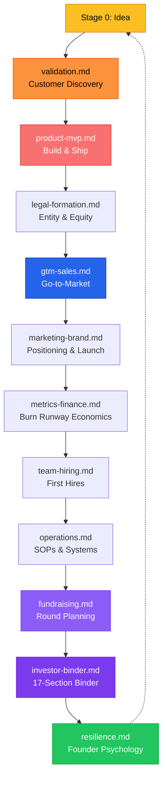

# Playbooks Directory

## Startup Lifecycle Coverage

## Files in This Directory

| File | Focus | Stage |
|------|-------|-------|
| `validation.md` | Customer discovery, assumption mapping, PMF signals | 0-1 |
| `product-mvp.md` | Roadmap, prioritization, shipping fast | 0-1 |
| `legal-formation.md` | Entity, equity, vesting, QSBS, 409A | 1-2 |
| `gtm-sales.md` | Outreach, pipeline, pricing, closing | 1-2 |
| `marketing-brand.md` | Positioning, content, SEO, launch | 1-3 |
| `metrics-finance.md` | Burn, runway, unit economics, financial model | 2-3 |
| `team-hiring.md` | First hire, co-founder, equity, culture | 2-3 |
| `operations.md` | SOPs, automation, tool stack, systems | 2-4 |
| `fundraising.md` | Fundraising strategy and round planning | 2-4 |
| `investor-binder.md` | Full 17-section binder build system + templates | 2-4 |
| `resilience.md` | Founder psychology, rejection, pivots, burnout | All |

## Loading Rule

Load only the playbook relevant to the founder's current stage and topic. Never load all playbooks at once.
