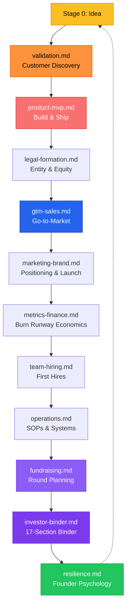

# Playbooks Directory

## Startup Lifecycle Coverage

## Files in This Directory

### Core Lifecycle Playbooks

| File | Focus | Stage |
|------|-------|-------|
| `validation.md` | Customer discovery, assumption mapping, PMF signals | 0-1 |
| `product-mvp.md` | Roadmap, prioritization, shipping fast | 0-1 |
| `legal-formation.md` | Entity, equity, vesting, QSBS, 409A | 1-2 |
| `gtm-sales.md` | Outreach, pipeline, pricing, closing | 1-2 |
| `marketing-brand.md` | Positioning, content, SEO, launch | 1-3 |
| `metrics-finance.md` | Burn, runway, unit economics, financial model | 2-3 |
| `team-hiring.md` | First hire, co-founder, equity, culture | 2-3 |
| `operations.md` | SOPs, automation, tool stack, systems | 2-4 |
| `fundraising.md` | Fundraising strategy and round planning | 2-4 |
| `investor-binder.md` | Full 17-section binder build system + templates | 2-4 |
| `resilience.md` | Founder psychology, rejection, pivots, burnout | All |

### Specialized Playbooks

| File | Focus | Stage |
|------|-------|-------|
| `first-revenue.md` | Pre-revenue to first dollar strategies | 0-1 |
| `customer-discovery.md` | Interview scripts, discovery frameworks | 0-1 |
| `pricing-strategy.md` | Pricing models, packaging, optimization | 1-3 |
| `competitive-intelligence.md` | Competitor research, positioning, battlecards | 1-3 |
| `network-building.md` | Relationship building, intros, community | All |
| `ninety-day-sprints.md` | 90-day execution plans by stage | All |
| `automation.md` | Workflow automation, tools, integrations | 2-4 |
| `tool-stack.md` | Recommended tools by stage and function | All |
| `funding-types.md` | Funding options: bootstrap to Series A+ | 1-4 |
| `time-blocking.md` | Founder time management and scheduling | All |

### Advanced Deep-Dives (Progressive Disclosure)

These files extend a parent playbook with advanced content. Load when the founder goes deeper.

| File | Extends | Content |
|------|---------|---------|
| `investor-binder-product-team.md` | `investor-binder.md` | Sections 6–11: product/demo, business model, traction, GTM, competitive analysis, team |
| `investor-binder-due-diligence.md` | `investor-binder.md` | Sections 12–17: financial model, cap table, the ask, legal, customer evidence, Q&A prep, data room |
| `validation-advanced.md` | `validation.md` | Jobs To Be Done framing, 1-week validation sprint plan |
| `first-revenue-scalable.md` | `first-revenue.md` | Paths 4–6: waitlist deposits, services wrapper, info products, path comparison, $1K sprint |
| `customer-discovery-advanced.md` | `customer-discovery.md` | Scripts 5–6: power user + cold outreach, general rules, interview tracking template |
| `pricing-strategy-advanced.md` | `pricing-strategy.md` | Pricing page design, psychology, common mistakes, testing methods, stage guidance, worksheet |
| `competitive-intelligence-management.md` | `competitive-intelligence.md` | Ongoing monitoring, quarterly review template, talking about competitors |
| `network-building-advanced.md` | `network-building.md` | Networks 4–5 (peer, talent), give-first framework, conference strategy, online communities |
| `network-building-advisors.md` | `network-building.md` | Mentor/advisor asks, advisory agreement terms, equity, relationship tracking |
| `ninety-day-sprints-growth.md` | `ninety-day-sprints.md` | Stages 2–3 sprint plans, scale-readiness scorecard, weekly checkpoint template |
| `automation-advanced.md` | `automation.md` | Admin automation, quick wins, stack by stage, monthly audit, common traps |
| `resilience-advanced.md` | `resilience.md` | Co-founder conflict, isolation, impostor syndrome, identity, crisis protocols |

## Loading Rule

Load only the playbook relevant to the founder's current stage and topic. Never load all playbooks at once. When a topic goes deep, load the advanced companion file as needed.
