# Startup Automation Playbook

```mermaid
graph TD
    A["Startup Automation"] --> B["Sales"]
    A --> C["Operations"]
    A --> D["Marketing"]
    A --> E["Admin"]
    B --> B1["Follow-up Sequences"]
    B --> B2["Lead Scoring"]
    B --> B3["CRM Auto-Updates"]
    C --> C1["Invoice Generation"]
    C --> C2["Onboarding Emails"]
    C --> C3["Recurring Reports"]
    D --> D1["Social Scheduling"]
    D --> D2["Newsletter Automation"]
    D --> D3["Review Collection"]
    E --> E1["Receipt Capture"]
    E --> E2["Contract Signatures"]
    E --> E3["Meeting Scheduling"]
    style A fill:#2563eb,stroke:#1e40af,color:#fff
    style B fill:#d97706,stroke:#b45309,color:#fff
    style C fill:#059669,stroke:#047857,color:#fff
    style D fill:#7c3aed,stroke:#5b21b6,color:#fff
    style E fill:#dc2626,stroke:#b91c1c,color:#fff
    style B1 fill:#fbbf24,stroke:#d97706,color:#000
    style B2 fill:#fbbf24,stroke:#d97706,color:#000
    style B3 fill:#fbbf24,stroke:#d97706,color:#000
    style C1 fill:#34d399,stroke:#059669,color:#000
    style C2 fill:#34d399,stroke:#059669,color:#000
    style C3 fill:#34d399,stroke:#059669,color:#000
    style D1 fill:#a78bfa,stroke:#7c3aed,color:#000
    style D2 fill:#a78bfa,stroke:#7c3aed,color:#000
    style D3 fill:#a78bfa,stroke:#7c3aed,color:#000
    style E1 fill:#f87171,stroke:#dc2626,color:#000
    style E2 fill:#f87171,stroke:#dc2626,color:#000
    style E3 fill:#f87171,stroke:#dc2626,color:#000
```



## Core Rule
**Automate the repetitive. Protect your time for the irreplaceable.** Every hour you spend on a task a computer can do is an hour stolen from customers, product, and strategy.

---

## When to Automate

```
Do I do this more than 3 times per week?  → Automate it.
Does it follow the same steps every time?  → Automate it.
Does it require zero judgment?             → Automate it.
Does it require nuance or relationship?    → Keep it manual. Add a template.
```

---

## Category 1: Sales Automation

### Auto-Follow-Up Sequences

**Manual process:** After a demo or sales call, you manually write and send follow-up emails at day 1, day 3, and day 7. You forget half the time. Leads go cold.

**Automated version:** A trigger fires when a deal moves to "Demo Completed" in your CRM. A 3-email sequence sends automatically with personalized merge fields.

**Sequence template:**
```
Email 1 (Day 0, 1 hour after demo):
  Subject: Great meeting, [FIRST_NAME] — next steps
  Body: Recap key points. Attach any promised materials. Clear CTA.

Email 2 (Day 3):
  Subject: Quick follow-up on [COMPANY] + [YOUR PRODUCT]
  Body: Address common objection. Share relevant case study. Ask for reply.

Email 3 (Day 7):
  Subject: Still interested, [FIRST_NAME]?
  Body: Short. Direct. "Should I close this out or is there still interest?"
```

| Detail | Value |
|--------|-------|
| Tools | HubSpot (free), Mailshake, Apollo, or Instantly |
| Setup time | 2 hours |
| Time saved | 3-5 hours/week |

### Lead Scoring Rules

**Manual process:** You scan your CRM and guess which leads are hot. You waste time on unqualified prospects.

**Automated version:** Assign points based on actions. Sort leads by score. Work top-down.

**Scoring rules:**
```
+10  Visited pricing page
+10  Opened 3+ emails
+15  Booked a demo
+20  Replied to outreach
+5   Downloaded resource
-10  No activity in 14 days
-20  Bounced email / invalid domain

Hot lead:    40+ points → Call today
Warm lead:   20-39 points → Email sequence
Cold lead:   Under 20 → Nurture or archive
```

| Detail | Value |
|--------|-------|
| Tools | HubSpot, Salesforce, or Pipedrive (all support lead scoring) |
| Setup time | 1 hour |
| Time saved | 2-3 hours/week |

### CRM Auto-Updates

**Manual process:** After every call, you manually update the deal stage, add notes, and log the activity. You fall behind. Your CRM becomes unreliable.

**Automated version:** Connect your calendar and email to your CRM. Calls auto-log. Email threads sync. Deal stages update based on triggers.

**Trigger rules:**
```
Meeting completed        → Move to "Demo Done"
Proposal sent (email)    → Move to "Proposal Sent"
Contract opened          → Move to "Negotiation"
Invoice paid             → Move to "Closed Won"
No activity for 30 days  → Move to "Stale" + alert
```

| Detail | Value |
|--------|-------|
| Tools | HubSpot + Zapier, Pipedrive, or Close CRM |
| Setup time | 1-2 hours |
| Time saved | 2-4 hours/week |

---

## Category 2: Operations Automation

### Invoice Generation on Deal Close

**Manual process:** A deal closes. You open QuickBooks or Wave. You manually create an invoice, fill in the client details, line items, and payment terms. You send it. You forget to follow up.

**Automated version:** When a deal moves to "Closed Won" in your CRM, an invoice auto-generates with the deal amount and client info, sends to the customer, and schedules reminders for overdue payment.

| Detail | Value |
|--------|-------|
| Tools | Stripe Invoicing, QuickBooks + Zapier, or Wave |
| Setup time | 1-2 hours |
| Time saved | 1-2 hours/week |

**Zapier recipe:**
```
Trigger: HubSpot deal stage → "Closed Won"
Action 1: Create invoice in QuickBooks (pull company name, amount, email)
Action 2: Send invoice via email
Action 3: Schedule Slack reminder if unpaid after 7 days
```

### Onboarding Email Sequences for New Customers

**Manual process:** New customer signs up. You personally send a welcome email, setup instructions, a check-in at day 3, and a feedback request at day 14. You lose track with more than 5 customers.

**Automated version:** A signup or payment trigger kicks off a timed email sequence that guides the customer through setup and checks in at key milestones.

**Onboarding sequence:**
```
Email 1 (Immediate):
  Subject: Welcome to [PRODUCT] — here's how to get started
  Body: Login link, 3-step quick start, link to docs, support contact.

Email 2 (Day 2):
  Subject: Did you complete setup?
  Body: Link to most-used feature. Quick video walkthrough.

Email 3 (Day 7):
  Subject: How's it going with [PRODUCT]?
  Body: Check-in. Link to book a call if stuck. Share a tip.

Email 4 (Day 14):
  Subject: Quick feedback — 2 questions
  Body: "What's working? What's confusing?" Simple reply-based survey.
```

| Detail | Value |
|--------|-------|
| Tools | ConvertKit, Customer.io, HubSpot, or Loops |
| Setup time | 2-3 hours |
| Time saved | 3-5 hours/week |

### Recurring Report Generation

**Manual process:** Every Monday morning, you open 4 tabs. You screenshot dashboards. You paste numbers into a Google Doc. You send it to your cofounder. This takes 45 minutes and you dread it.

**Automated version:** A scheduled workflow pulls data from Stripe, Google Analytics, and your CRM, formats it into a summary, and posts it to Slack or emails it every Monday at 8 AM.

| Detail | Value |
|--------|-------|
| Tools | Zapier + Google Sheets, or Databox, or Geckoboard |
| Setup time | 2-3 hours |
| Time saved | 2-3 hours/week |

**Report template:**
```
WEEKLY METRICS — Week of [DATE]

Revenue:     $[X] MRR  |  Change: [+/-]%
New customers: [X]     |  Churned: [X]
Pipeline:    $[X]      |  Demos booked: [X]
Website:     [X] visits |  Signups: [X]
Burn rate:   $[X]/mo   |  Runway: [X] months

Top win: [Auto-pulled or manual note]
Top risk: [Auto-pulled or manual note]
```

---

## Category 3: Marketing Automation

### Social Media Scheduling

**Manual process:** You write a post. You open LinkedIn. You post it. Then you remember you should also post on Twitter. You open Twitter. You rewrite it. Tomorrow you forget entirely.

**Automated version:** Batch-write 5-10 posts in one sitting. Schedule them across platforms for the week. Done in 1 hour instead of scattered across 7 days.

| Detail | Value |
|--------|-------|
| Tools | Buffer (free tier), Typefully, or Hootsuite |
| Setup time | 30 minutes |
| Time saved | 2-3 hours/week |

**Batching process:**
```
1. Block 1 hour on Friday afternoon.
2. Write 5 posts (one per weekday).
3. Schedule: Mon, Tue, Wed, Thu, Fri at 9 AM.
4. Repurpose: Each post gets a LinkedIn version and a Twitter version.
5. Done. Don't touch social media again until next Friday.
```

### Newsletter Automation

**Manual process:** You decide to send a newsletter. You stare at a blank screen for 40 minutes. You finally send something mediocre on Wednesday instead of Tuesday. Your audience forgets you exist.

**Automated version:** Use a template. Fill in 3 sections. Schedule it to go out the same day and time every week.

**Newsletter template:**
```
Subject: [PRODUCT] Weekly — [ONE INTERESTING HOOK]

1. What we shipped this week: [1-2 sentences + link]
2. One useful insight: [Tip, stat, or lesson — 3-4 sentences]
3. One ask: [CTA — reply, share, sign up, book demo]

That's it. See you next [DAY].
— [YOUR NAME]
```

| Detail | Value |
|--------|-------|
| Tools | ConvertKit (free under 1K subs), Buttondown, or Beehiiv |
| Setup time | 1 hour |
| Time saved | 1-2 hours/week |

### Review / Testimonial Collection

**Manual process:** You remember that you need testimonials. You manually email 5 customers. Two reply. You forget to follow up with the other three. You never actually put the testimonials on your website.

**Automated version:** After a positive interaction (NPS score > 8, support ticket resolved, 30 days post-purchase), auto-send a request for a review with a direct link to leave it.

**Request template:**
```
Subject: Quick favor — 30 seconds?

Hi [FIRST_NAME],

Glad [PRODUCT] is working well for you. Would you mind leaving a quick
review? It takes about 30 seconds and helps other [TARGET AUDIENCE]
find us.

[LINK TO REVIEW FORM]

Thanks — it means a lot.
— [YOUR NAME]
```

| Detail | Value |
|--------|-------|
| Tools | Zapier + Typeform, Senja, or Testimonial.to |
| Setup time | 1 hour |
| Time saved | 1-2 hours/week |

---

**Admin automation, quick wins, automation stack by stage, the monthly audit template, and common traps continue in [`automation-advanced.md`](automation-advanced.md).**

---

*This playbook covers workflows, not strategy. Automation handles the repeatable so you can focus on the unrepeatable: customer relationships, product decisions, and creative problem-solving. Start with one Quick Win this week.*
