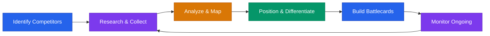

# Competitive Intelligence Framework



## Core Rule
**Know your competitors well enough to respect them — then outmaneuver them.** Awareness is strength. Obsession is a trap.

---

## Step 1: Identify Your Competitors

Every startup faces three kinds of competition:

### Direct Competitors
Companies solving the same problem for the same customer with a similar product.

```
How to find them:
- Google your core problem phrase ("inventory management for restaurants")
- Search Product Hunt, G2, Capterra for your category
- Ask your customers: "What else did you evaluate?"
- Check industry reports and analyst lists
```

### Indirect Competitors
Companies solving the same problem differently (different approach, different product type).

```
How to find them:
- Think about the job the customer hires your product to do
- Search for alternative approaches to the same outcome
- Ask: "If our product didn't exist, what would they use instead?"
```

### The "Do Nothing" Alternative
The most common competitor. The customer keeps using spreadsheets, manual processes, or ignores the problem.

```
This is often your biggest competitor at early stage.
You're not just selling against other tools — you're selling
against inertia, habit, and "good enough."
```

**List your competitors now:**

```
Direct:
1. [COMPETITOR A]
2. [COMPETITOR B]
3. [COMPETITOR C]

Indirect:
1. [ALTERNATIVE APPROACH A]
2. [ALTERNATIVE APPROACH B]

Do Nothing:
- [CURRENT WORKAROUND YOUR CUSTOMERS USE]
```

---

## Step 2: Research Framework

For each competitor, gather intelligence across five dimensions.

### Product Intelligence
```
Feature set:        [Core features, recent launches]
Pricing:            [Plans, price points, free tier?]
Positioning:        [Tagline, homepage headline, who they say they serve]
UX quality:         [Sign up for free trial. Use it. Screenshot everything.]
Tech stack:         [Check BuiltWith, Wappalyzer, job postings]
Integrations:       [What do they connect to?]
```

**Do this:** Sign up for every competitor's free trial or demo. Use their product for at least 30 minutes. Take notes like a customer, not a founder.

### Market Intelligence
```
Target customer:    [Who do they sell to? Check case studies, testimonials]
Market share:       [Any public signals — revenue, customer count?]
Growth trajectory:  [Hiring pace, office expansion, press mentions]
Partnerships:       [Who do they partner with? Channel, tech, agency?]
```

### Online Presence
```
Website traffic:    [SimilarWeb — monthly visits, traffic sources, geography]
Social following:   [LinkedIn, Twitter/X, YouTube — size + engagement]
Review sites:       [G2, Capterra, Trustpilot — star rating, review volume]
Content output:     [Blog cadence, podcast, newsletter, YouTube frequency]
Job postings:       [LinkedIn Jobs, their careers page — hiring = growth signal]
```

### Funding & Financials
```
Total raised:       [Crunchbase, PitchBook]
Last round:         [Date, size, investors]
Burn signals:       [Layoffs? Pivots? Office downsizing?]
Revenue estimates:  [Job postings mentioning ARR, press mentions, analyst reports]
```

### Weaknesses
```
Review complaints:  [Read 1-star reviews on G2/Capterra — patterns?]
Feature gaps:       [What do users request that they don't offer?]
Churn signals:      [Reddit complaints, Twitter gripes, cancellation reviews]
Support quality:    [Response time, help docs quality, community forums]
Pricing complaints: [Too expensive? Confusing? Hidden fees?]
```

---

## Step 3: Competitive Matrix

Map yourself against competitors across the dimensions that matter to your customers.

| Dimension | Your Product | Competitor A | Competitor B | Competitor C |
|-----------|-------------|-------------|-------------|-------------|
| Core feature 1 | [RATING/NOTES] | [RATING/NOTES] | [RATING/NOTES] | [RATING/NOTES] |
| Core feature 2 | [RATING/NOTES] | [RATING/NOTES] | [RATING/NOTES] | [RATING/NOTES] |
| Pricing (entry) | [PRICE] | [PRICE] | [PRICE] | [PRICE] |
| Pricing (mid-tier) | [PRICE] | [PRICE] | [PRICE] | [PRICE] |
| Ease of setup | [RATING] | [RATING] | [RATING] | [RATING] |
| Integrations | [COUNT/LIST] | [COUNT/LIST] | [COUNT/LIST] | [COUNT/LIST] |
| Support quality | [RATING] | [RATING] | [RATING] | [RATING] |
| Mobile experience | [RATING] | [RATING] | [RATING] | [RATING] |
| Target customer | [SEGMENT] | [SEGMENT] | [SEGMENT] | [SEGMENT] |
| Key weakness | [WEAKNESS] | [WEAKNESS] | [WEAKNESS] | [WEAKNESS] |

**Rating scale:** Use a simple system: Strong / Adequate / Weak. Avoid vanity scoring.

**Update this matrix quarterly.** Markets shift. Competitors ship.

---

## Step 4: Positioning Against Competitors

### The "We're the X for Y" Formula

Fill in:
```
We're the [known reference point] for [your specific audience/use case].

Examples:
- "We're the Stripe for healthcare payments."
- "We're the Canva for data visualization."
- "We're the HubSpot for local service businesses."
```

Keep it to one sentence. If you can't, your positioning isn't clear enough.

### Three Positioning Strategies

**1. Head-to-Head**
You compete directly and claim to be better on key dimensions.
```
When to use: You genuinely outperform on things customers care about.
Risk: You need proof. Claims without evidence hurt credibility.
Example: "Faster setup, half the price, better support than [Competitor]."
```

**2. Niche Down**
You serve a specific segment better than anyone else.
```
When to use: You can't win the whole market but can own a corner of it.
Risk: Market may be too small. Can feel limiting.
Example: "The only project management tool built for construction crews."
```

**3. Category Creation**
You define a new category and position yourself as the leader of it.
```
When to use: Existing categories don't describe what you do.
Risk: Expensive. Requires educating the market.
Example: "We invented revenue operations automation."
```

**For most early-stage startups, Niche Down wins.** Own a wedge, then expand.

### Battlecard Template

Create one page per competitor for your sales team:

```
═══════════════════════════════════════════
BATTLECARD: [COMPETITOR NAME]
═══════════════════════════════════════════

OVERVIEW
- What they do: [1 sentence]
- Founded: [YEAR]  |  HQ: [LOCATION]  |  Raised: [$AMOUNT]
- Target customer: [THEIR ICP]
- Pricing: [RANGE]

THEIR STRENGTHS (be honest)
- [STRENGTH 1]
- [STRENGTH 2]
- [STRENGTH 3]

THEIR WEAKNESSES (from real data)
- [WEAKNESS 1 — source: G2 reviews]
- [WEAKNESS 2 — source: customer feedback]
- [WEAKNESS 3 — source: product gap]

WHERE WE WIN
- [ADVANTAGE 1 + proof point]
- [ADVANTAGE 2 + proof point]
- [ADVANTAGE 3 + proof point]

WHERE WE LOSE (and how to handle it)
- [AREA] — Response: "[TALK TRACK]"

LANDMINE QUESTIONS (ask prospects to highlight their weakness)
- "How important is [thing we do well and they don't]?"
- "Have you had issues with [their known weakness]?"

CUSTOMER SWITCH STORIES
- "[CUSTOMER] switched from [COMPETITOR] because [REASON]."
═══════════════════════════════════════════
```

---

**Ongoing monitoring, quarterly review template, and how to talk about competitors (with investors and in sales calls) continue in [`competitive-intelligence-management.md`](competitive-intelligence-management.md).**

---

## Quick-Start Checklist

- [ ] List your direct, indirect, and "do nothing" competitors
- [ ] Sign up for free trials of your top 3 direct competitors
- [ ] Build your competitive matrix
- [ ] Choose your positioning strategy
- [ ] Create battlecards for your top 2 competitors
- [ ] Set up Google Alerts for competitor names
- [ ] Schedule quarterly competitive review

> **This playbook is for educational purposes.** Competitive intelligence should be gathered from publicly available sources. Do not misrepresent yourself to access competitor information, and respect all terms of service.
