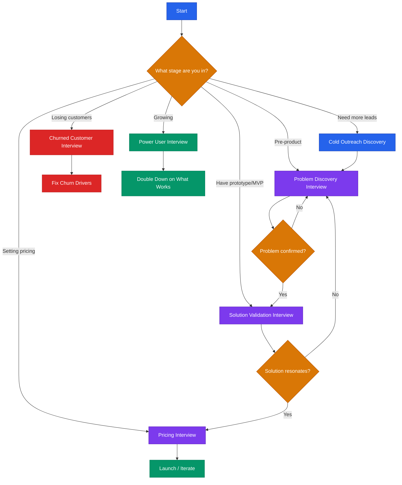

# Customer Discovery Scripts



## Core Rule
**Shut up and listen.** The goal of every discovery conversation is to learn, not to sell. If you are talking more than 30% of the time, you are doing it wrong.

---

## 1. Problem Discovery Interview (15 min)

**Goal:** Understand if the problem is real, painful, and worth solving.

**Who to interview:** People in your target segment who have not seen your product.

### Questions to Ask

1. "Tell me about your role and what a typical day/week looks like."
2. "When was the last time you dealt with [PROBLEM AREA]? Walk me through what happened."
3. "What made that frustrating or difficult?"
4. "How are you solving this today? What tools or workarounds do you use?"
5. "How much time do you spend on this per week/month?"
6. "What does this cost you — in dollars, time, or missed opportunities?"
7. "Have you looked for a better solution? What did you find?"
8. "If you could wave a magic wand and fix one thing about this, what would it be?"
9. "Who else on your team deals with this problem?"
10. "Is there anything I should have asked but didn't?"

### What to Listen For
- Emotional language ("I hate," "it drives me crazy," "I dread")
- Specific dollar amounts or time costs
- Multiple failed attempts to solve the problem
- They bring up the problem before you do

### Green Flags
- They lean forward and talk faster when describing the pain
- They have already spent money trying to fix it
- They ask if you are building something to solve it
- They offer to introduce you to others with the same problem

### Red Flags
- Vague answers ("Yeah, I guess that's annoying sometimes")
- They have never tried to solve it
- The problem only comes up once a year
- They cannot put a number on the cost

### Do NOT Say
- "We're building a product that..." (do not pitch)
- "Would you use a tool that does X?" (leading question)
- "Don't you think it would be better if..." (leading question)
- "Our solution is..." (you are here to learn, not sell)
- "That's a great idea" in response to their suggestions (stay neutral)

### Follow-Up Template
```
Subject: Thanks for chatting about [PROBLEM AREA]

Hi [NAME],

Thanks for taking 15 minutes to talk with me about [PROBLEM AREA].
What you shared about [SPECIFIC THING THEY SAID] was really helpful.

I may follow up in a few weeks as we learn more. In the meantime,
would you be open to connecting me with [PERSON/ROLE THEY MENTIONED]?

Thanks,
[YOUR_NAME]
```

---

## 2. Solution Validation Interview (20 min)

**Goal:** Test whether your proposed solution resonates and would change their behavior.

**Who to interview:** People who confirmed the problem in Script 1, or new targets in the same segment.

### Questions to Ask

1. "Last time we talked (or: I've been hearing from people like you that) [PROBLEM] is a real challenge. Does that ring true?"
2. "Let me show you something we're working on. [SHOW PROTOTYPE/MOCKUP/DEMO — max 3 min]. What's your first reaction?"
3. "What part of this, if any, would be most useful to you?"
4. "What's confusing or missing?"
5. "How would this fit into what you already do day-to-day?"
6. "What would have to be true for you to switch from your current approach to this?"
7. "Who else would need to approve this purchase at your company?"
8. "If this existed today, what would you expect to pay for it?"
9. "On a scale of 1-10, how likely would you be to use this in the next 30 days? (If not 9-10:) What would make it a 10?"
10. "Can I follow up in [X] weeks when we have more to show?"

### What to Listen For
- Specific use cases they describe unprompted
- Questions about availability, timeline, or pricing (buying signals)
- Comparisons to tools they already use (means they are evaluating seriously)
- Pushback on specific features (means they are engaged, not polite)

### Green Flags
- "When can I get this?"
- "Can I be a beta tester?"
- They pull in a colleague to see the demo
- They describe how they would use it in a specific workflow

### Red Flags
- "That's cool" with no follow-up questions
- They focus on edge cases instead of the core value
- They cannot articulate when they would use it
- "Let me know when it's ready" (polite dismissal)

### Do NOT Say
- "Isn't this amazing?" (fishing for compliments)
- "This will save you so much time" (let them tell you the value)
- "Everyone we've shown this to loves it" (social pressure distorts feedback)
- "Would you buy this?" (hypothetical; ask about behavior, not intent)
- "We just need to add [FEATURE] and it'll be perfect" (do not make promises)

### Follow-Up Template
```
Subject: Following up on [PRODUCT_NAME] demo

Hi [NAME],

Thanks for looking at what we're building and giving honest feedback.

You mentioned [SPECIFIC FEEDBACK]. We're taking that seriously and
working on it.

I'd love to show you the next version in [X] weeks. Would [DATE]
work for a 15-minute call?

[YOUR_NAME]
```

---

## 3. Pricing Interview (10 min)

**Goal:** Determine willingness to pay and acceptable price range.

**Who to interview:** People who validated the problem and showed interest in the solution.

### Questions to Ask

1. "You mentioned [PROBLEM] costs you roughly [THEIR ESTIMATE]. Is that still about right?"
2. "If a tool solved this problem completely, at what price would it be so cheap you'd question the quality?"
3. "At what price would it be a great deal — you'd buy it without hesitating?"
4. "At what price would it feel expensive, but you'd still seriously consider it?"
5. "At what price would it be so expensive you'd never consider it?"
6. "Would you prefer to pay monthly, annually, or per-use? Why?"
7. "What do you currently spend on tools or workarounds for this problem?"
8. "Who controls the budget for a purchase like this? What's the approval process?"
9. "If I could offer you early access at [PRICE], would you sign up today?"
10. "What would make this a no-brainer purchase?"

### What to Listen For
- Anchoring to existing spend (tells you the mental budget)
- Whether they talk in terms of ROI or just cost
- Who the real buyer is (may not be the person you are talking to)
- Reaction to question 9 — hesitation vs. immediate yes

### Green Flags
- They give specific numbers without hesitating
- Their "great deal" price is higher than your planned price
- They ask about annual discounts or team pricing (buying signal)
- They offer to do a paid pilot

### Red Flags
- "I'd have to check with..." and they cannot name who
- Their "too expensive" price is below your cost to serve
- They will only pay if it is free or nearly free
- They compare you to a free tool and expect the same price

### Do NOT Say
- "We're thinking of charging $X" before they answer (anchoring bias)
- "That's too low" (do not react to their numbers)
- "Other customers said they'd pay $X" (do not anchor with social proof)
- "It's really affordable" (let them decide what's affordable)
- "Don't worry about the price for now" (you need this data)

### Follow-Up Template
```
Subject: Early access to [PRODUCT_NAME]

Hi [NAME],

Thanks for the honest pricing conversation. Based on feedback from
people like you, we're finalizing our pricing.

As someone who gave early input, I'd like to offer you [EARLY ACCESS
OFFER — e.g., founding member pricing, extended trial, or discount].

Interested? Just reply and I'll set it up.

[YOUR_NAME]
```

---

## 4. Churned Customer Interview (10 min)

**Goal:** Understand why they left so you can fix the root cause.

**Who to interview:** Customers who cancelled or stopped using the product in the last 30-90 days.

### Questions to Ask

1. "Thanks for taking a few minutes. I'm trying to make [PRODUCT] better and your honest feedback helps. There are no wrong answers."
2. "What originally made you sign up for [PRODUCT]?"
3. "Walk me through what happened between signing up and deciding to cancel."
4. "Was there a specific moment when you thought 'this isn't working for me'?"
5. "What would have had to be different for you to stay?"
6. "What are you using now instead? How's that going?"
7. "Did you ever contact our support team? How was that experience?"
8. "If we fixed [THE ISSUE THEY RAISED], would you consider coming back?"
9. "On a scale of 1-10, how likely are you to recommend [PRODUCT] to someone else, even though you cancelled?"
10. "Is there anything else you want us to know?"

### What to Listen For
- The gap between their expectation at signup and their actual experience
- Whether the failure was product (features), process (onboarding), or people (support)
- Patterns — if 3 churned customers say the same thing, that is your priority
- Whether they churned to a competitor or to nothing (very different signals)

### Green Flags
- They are willing to talk at all (they still care)
- They give specific, actionable feedback
- They say "If you fix X, I'd come back"
- Their issue is something you can actually fix

### Red Flags
- "I just didn't need it" (bad targeting, not a product problem)
- "I forgot about it" (onboarding/engagement failure)
- They are angry about billing or support (trust is broken — hard to recover)
- "It was fine, I just found something cheaper" (commodity positioning)

### Do NOT Say
- "But did you try [FEATURE]?" (do not get defensive)
- "We actually fixed that last month" (listen first, inform later)
- "Most of our customers love that part" (invalidating their experience)
- "Can I offer you a discount to come back?" (not during the interview)
- "That's not how it's supposed to work" (they are telling you how it actually works)

### Follow-Up Template
```
Subject: We heard you — here's what we're changing

Hi [NAME],

I appreciated your candid feedback about [PRODUCT]. You mentioned
[SPECIFIC ISSUE] was the main reason you left.

I wanted to let you know we [SHIPPED FIX / ARE WORKING ON FIX].

No pressure, but if you'd like to give us another shot, here's
[OFFER — e.g., free month, extended trial].

Either way, thanks for helping us improve.

[YOUR_NAME]
```

---

**Scripts 5–6 (Power User + Cold Outreach), general rules, and the interview tracking template continue in [`customer-discovery-advanced.md`](customer-discovery-advanced.md).**

---

> **Disclaimer:** This playbook is educational information, not professional research advice. Customer discovery methods should be adapted to your specific industry, customer base, and legal requirements (e.g., recording consent laws vary by jurisdiction). Consult qualified advisors for decisions with significant business impact.
