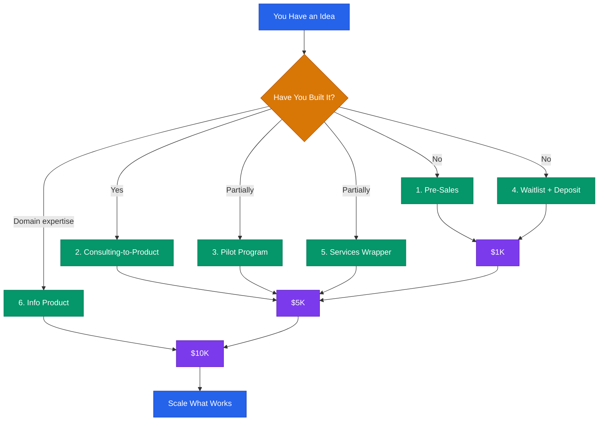

# First Revenue Playbook



## Core Rule
**Revenue is validation.** A paying customer tells you more than 100 survey responses. Your only job right now is to get one person to give you money for something you can deliver.

> **Disclaimer:** This is educational information for startup revenue generation. Results vary. This is not financial or legal advice.

---

## Dollar Targets

| Milestone | What It Proves | Typical Timeline |
|---|---|---|
| $1K | Someone will pay for this | 1-4 weeks |
| $5K | Multiple people will pay — you have a market | 1-3 months |
| $10K | You have a repeatable sales motion | 2-6 months |

Every path below is designed to get you from $0 to $1K, then to $5K, then to $10K.

---

## Path 1: Pre-Sales (Sell Before You Build)

### When to Use
- You have a clear product idea but have not built it yet
- You have access to potential customers (even a small network)
- You want to validate demand before investing time in development

### Step-by-Step

```
1. Define the offer clearly (what they get, when they get it, what it costs)
2. Set a delivery timeline (4-8 weeks is credible)
3. Create a one-page description or landing page
4. Generate a Stripe payment link (see integrations/stripe-setup.md)
5. Reach out to 20 potential customers personally
6. Offer early-access pricing (30-50% off future price)
7. Set a minimum threshold (e.g., "I build if 5 people commit")
8. Deliver or refund — no exceptions
```

### The Pre-Sale Script

```
Hi [Name],

I am building [Product] — it [one sentence on what it does and who it helps].

Based on our conversation about [their specific problem], I think this
could save you [specific benefit: time, money, headaches].

I am offering early access to the first [NUMBER] customers at
$[DISCOUNTED_PRICE] (regular price will be $[FULL_PRICE]).

You would get:
- [Benefit 1]
- [Benefit 2]
- [Priority support / input on features / etc.]

If I do not deliver by [DATE], you get a full refund.

Interested? You can reserve your spot here: [PAYMENT_LINK]

[Your Name]
```

### Revenue Timeline
- Week 1: Outreach to 20 contacts
- Week 2: Follow up, handle objections
- Week 3-4: Close 3-5 sales at $200-500 each
- **Target: $1K-2.5K in pre-sales**

### Example
A founder building a scheduling tool for therapists emails 25 therapists from a professional group. Offers early access at $199/year (planned price: $399/year). 7 buy in. Revenue before writing code: $1,393.

---

## Path 2: Consulting-to-Product (Sell Expertise, Productize Later)

### When to Use
- You have domain expertise others pay for
- You are not sure exactly what to build yet
- You need revenue now while you figure out the product

### Step-by-Step

```
1. Define your expertise in one sentence
2. Package it into a deliverable (audit, strategy session, implementation)
3. Set a price ($500-2,500 for a focused engagement)
4. Deliver for 3-5 clients
5. Document the repeating patterns (what you do every time)
6. Build a product that automates the repetitive parts
7. Transition clients from services to software
```

### Pricing Structure

```
Offer 1 — Strategy Session (1 hour)
  Price: $250-500
  Deliverable: Recorded call + written summary with action items

Offer 2 — Audit + Recommendations
  Price: $1,000-2,500
  Deliverable: Written report with findings and prioritized fixes

Offer 3 — Implementation (done-with-you)
  Price: $2,500-5,000
  Deliverable: Hands-on work over 2-4 weeks
```

### Revenue Timeline
- Week 1: Post your offer on LinkedIn / relevant communities
- Week 2-3: Book 2-3 strategy sessions ($500-1,500)
- Month 2: Deliver first audit ($1,000-2,500)
- Month 3: Begin implementation engagements
- **Target: $5K in 60 days, $10K in 90 days**

### Example
A cybersecurity professional offers "SaaS Security Audits" to early-stage startups. Charges $1,500 per audit. After 6 audits, notices every company has the same 4 problems. Builds a tool that automates 3 of them. First 6 clients become first 6 software customers.

### Template — Consulting Offer Post

```
I am offering [NUMBER] [deliverable] for [target audience] this month.

What you get:
- [Specific deliverable 1]
- [Specific deliverable 2]
- [Specific deliverable 3]

Price: $[AMOUNT]
Slots available: [NUMBER]

DM me or book here: [CALENDLY_OR_PAYMENT_LINK]

[One sentence credential or proof point.]
```

---

## Path 3: Pilot Programs (Paid Betas)

### When to Use
- You have a working prototype or MVP
- You need real users to test with but cannot afford free users
- You want committed beta testers who give real feedback

### Step-by-Step

```
1. Define pilot scope (what is included, what is not)
2. Set pilot duration (30-90 days is standard)
3. Price at 50-70% of planned full price
4. Limit spots (scarcity is real — 5-15 pilot customers max)
5. Require weekly check-ins or feedback sessions
6. Document every bug, feature request, and success story
7. Convert pilot customers to full-price at end of pilot
```

### Pilot Agreement Template

```
[COMPANY] Pilot Program Agreement

Pilot Period: [START_DATE] to [END_DATE]
Pilot Price: $[AMOUNT] (regular price: $[FULL_PRICE])

What is included:
- Full access to [Product] for the pilot period
- [Weekly/biweekly] check-in calls with the founding team
- Priority support via [email/Slack/etc.]
- Input on product roadmap

What we ask from you:
- Use the product at least [FREQUENCY]
- Provide honest feedback during check-ins
- Report bugs or issues within 24 hours
- Participate in a brief case study at pilot end (optional)

At pilot end:
- Continue at $[FULL_PRICE]/month with no setup fee
- Or cancel with no obligation

Signed: ________________  Date: ________
```

### Revenue Timeline
- Week 1-2: Recruit 5-10 pilot customers
- Week 3: Start pilot at $50-200/month each
- Month 2-3: Collect feedback, iterate
- Month 3-4: Convert 60-80% to full price
- **Target: $2.5K-5K during pilot, then $5K+/month recurring**

### Example
A project management tool for construction teams recruits 8 small contractors for a 60-day pilot at $99/month (planned price: $199/month). Revenue during pilot: $1,584. After pilot, 6 convert to full price. Month 4 MRR: $1,194.

---

## Path 4: Waitlist with Deposit

### When to Use
- You have strong interest but the product is not ready
- You want to gauge demand with real money, not just email signups
- You are building in public and have an audience

### Step-by-Step

```
1. Create a simple landing page (Carrd, Notion, or one-page HTML)
2. Explain what you are building and who it is for
3. Set a refundable deposit ($25-100)
4. Create a Stripe payment link for the deposit
5. Promote to your network and relevant communities
6. Send weekly build updates to depositors (keep them warm)
7. Apply deposit to first payment when you launch
```

### Deposit Tiers

```
Tier 1 — Reserve ($25-50 deposit)
  - Early access when ready
  - Deposit applied to first payment

Tier 2 — Founding Member ($100-250 deposit)
  - Everything in Tier 1
  - Lifetime discount (20-30% off)
  - Direct access to founding team
  - Name in credits / founding member badge
```

### Revenue Timeline
- Week 1: Launch waitlist page
- Week 2-4: Promote, collect 20-50 deposits
- **Target: $1K-5K in refundable deposits before building**

### Example
A developer building an AI writing tool for legal professionals posts a waitlist with a $50 refundable deposit. Shares in 3 legal-tech communities and on LinkedIn. 47 people deposit. Revenue (held): $2,350. Proof of demand secured.

### Template — Waitlist Landing Page Copy

```
# [Product Name]

[One sentence: what it does, who it is for.]

## The Problem
[2-3 sentences describing the pain point.]

## What We Are Building
[2-3 sentences describing the solution.]

## Reserve Your Spot
We are launching to [NUMBER] founding members first.

$[DEPOSIT_AMOUNT] refundable deposit secures your spot.
- Early access before public launch
- [Founding member benefit]
- [Founding member benefit]
- Full refund if we do not deliver by [DATE]

[PAYMENT BUTTON]

## Timeline
- [MONTH]: Beta launch
- [MONTH]: Full launch
- [MONTH]: [Feature milestone]
```

---

## Path 5: Services Wrapper (Manual While You Automate)

### When to Use
- Your product requires automation you have not built yet
- You can deliver the result manually in the short term
- You want real customers and revenue while building the tech

### Step-by-Step

```
1. Define the outcome your product will deliver
2. Deliver that outcome manually (concierge MVP)
3. Charge full product price (do not discount for manual delivery)
4. Track your time per customer (this is your automation roadmap)
5. Automate the most time-consuming steps first
6. Gradually reduce manual work while keeping the same price
7. When fully automated, your margins go from ~30% to 80%+
```

### How to Price a Services Wrapper

```
1. Estimate fully-automated product price: $[PRODUCT_PRICE]/month
2. Estimate your manual time per customer: [HOURS]/month
3. Minimum viable hourly rate: $75-150/hour
4. Manual cost: [HOURS] × $[RATE] = $[MANUAL_COST]

If MANUAL_COST > PRODUCT_PRICE:
  → Raise product price, or
  → Limit customers until you automate, or
  → Only automate the most time-expensive step first

Target: 3-5 manual customers to fund development
```

### Revenue Timeline
- Week 1-2: Sign 2-3 customers at full product price
- Month 1-2: Deliver manually, document processes
- Month 3: Automate top time-sink, take on 2 more customers
- Month 4-6: Continue automating, margins improve each month
- **Target: $3K-5K/month by month 2, improving margins over time**

### Example
A founder wants to build an automated social media management tool. Instead of building the automation first, they offer "done-for-you social media management" at $500/month. Sign 5 clients ($2,500/month). Use revenue to fund development. Over 6 months, automate scheduling, analytics, and reporting. Manual time drops from 10 hours/client/month to 2 hours. Same revenue, fraction of the work.

---

## Path 6: Info Product (Course, Guide, or Template Pack)

### When to Use
- You have deep expertise in a specific domain
- You want revenue with near-zero marginal cost
- You are building an audience or community around your topic
- You want to fund your SaaS/product development

### Step-by-Step

```
1. Pick one specific problem your audience has
2. Choose a format:
   - Mini-course (video, 1-3 hours): $49-199
   - Comprehensive course (5-10 hours): $199-997
   - Written guide / playbook (PDF): $29-99
   - Template pack (spreadsheets, docs, Notion): $19-79
   - Workshop (live, 2-4 hours): $99-299
3. Outline the content (8-12 sections or lessons)
4. Create it (target: 1-2 weeks for a mini-course, 1 week for a guide)
5. Host on Gumroad, Teachable, Podia, or your own site
6. Sell via Stripe payment link or platform checkout
7. Promote in communities where your audience hangs out
```

### Pricing Guide

| Format | Price Range | Effort to Create | Revenue per 100 Sales |
|---|---|---|---|
| Template pack | $19-79 | 2-5 days | $1,900-7,900 |
| Written guide | $29-99 | 1-2 weeks | $2,900-9,900 |
| Mini-course | $49-199 | 1-3 weeks | $4,900-19,900 |
| Live workshop | $99-299 | 1 week + delivery | $9,900-29,900 |
| Full course | $199-997 | 3-6 weeks | $19,900-99,700 |

### Revenue Timeline
- Week 1: Outline and create content
- Week 2: Set up sales page and payment
- Week 3: Launch to your network (email, social, communities)
- Week 4: Ongoing promotion
- **Target: $1K-5K in first month, scaling with audience growth**

### Example
A data engineer creates a "SQL for Analytics Engineers" mini-course. 6 video lessons, 2 hours total. Prices at $79 on Gumroad. Posts in 3 data engineering communities and on LinkedIn. Sells 40 copies in the first month ($3,160). Sells 15-20 per month ongoing with minimal promotion.

### Template — Info Product Launch Email

```
Subject: [Number] [lessons/templates/strategies] for [specific outcome]

Hi [Name],

I just published [Product Name] — a [format] that walks you through
[specific outcome] step by step.

It covers:
- [Topic 1]
- [Topic 2]
- [Topic 3]

I built this because [1 sentence on why — personal experience or
common pain you have seen].

Launch price: $[AMOUNT] (goes up to $[HIGHER_AMOUNT] on [DATE])

Get it here: [LINK]

[Your Name]

P.S. [Social proof, guarantee, or urgency — pick one.]
```

---

## Choosing Your Path

| Factor | Best Path |
|---|---|
| No product, have network | Pre-sales |
| No product, have expertise | Consulting-to-product |
| MVP exists, need testers | Pilot program |
| Building in public, have audience | Waitlist with deposit |
| Can deliver result manually | Services wrapper |
| Deep domain knowledge | Info product |
| Need money this week | Consulting or info product |
| Need to validate before building | Pre-sales or waitlist |

### Combining Paths

These paths are not mutually exclusive. Common combinations:

```
1. Info product → generates leads → consulting clients → fund product dev
2. Pre-sales → pilot program → full launch
3. Services wrapper → automate → SaaS product
4. Waitlist deposits → pre-sales → pilot → launch
```

---

## The $1K Sprint

If you need $1K in the next 14 days, do this:

```
Day 1: Pick your path (30 minutes)
Day 1: Define your offer in writing (1 hour)
Day 1: Create a Stripe payment link (20 minutes)
Day 2: List 25 people who might buy or know someone who would
Day 2-3: Send 25 personal messages (not mass email — personal)
Day 4-7: Follow up with everyone who did not respond
Day 7-10: Handle objections, close interested buyers
Day 10-14: Deliver value, ask for referrals

Expected result: 3-8 sales, depending on price point
  - At $150: 7 sales = $1,050
  - At $250: 4 sales = $1,000
  - At $500: 2 sales = $1,000
```

The only way this fails is if you do not send the 25 messages.
