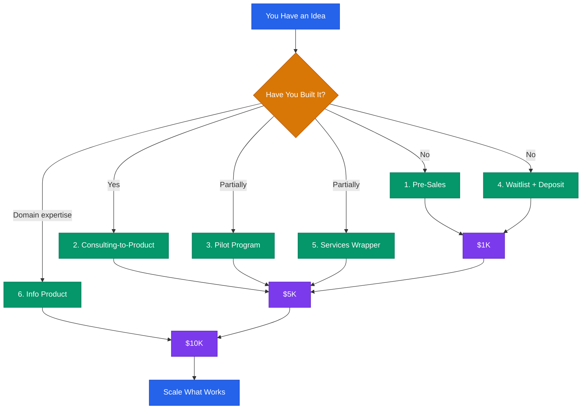

# First Revenue Playbook



## Core Rule
**Revenue is validation.** A paying customer tells you more than 100 survey responses. Your only job right now is to get one person to give you money for something you can deliver.

> **Disclaimer:** This is educational information for startup revenue generation. Results vary. This is not financial or legal advice.

---

## Dollar Targets

| Milestone | What It Proves | Typical Timeline |
|---|---|---|
| $1K | Someone will pay for this | 1-4 weeks |
| $5K | Multiple people will pay — you have a market | 1-3 months |
| $10K | You have a repeatable sales motion | 2-6 months |

Every path below is designed to get you from $0 to $1K, then to $5K, then to $10K.

---

## Path 1: Pre-Sales (Sell Before You Build)

### When to Use
- You have a clear product idea but have not built it yet
- You have access to potential customers (even a small network)
- You want to validate demand before investing time in development

### Step-by-Step

```
1. Define the offer clearly (what they get, when they get it, what it costs)
2. Set a delivery timeline (4-8 weeks is credible)
3. Create a one-page description or landing page
4. Generate a Stripe payment link (see integrations/stripe-setup.md)
5. Reach out to 20 potential customers personally
6. Offer early-access pricing (30-50% off future price)
7. Set a minimum threshold (e.g., "I build if 5 people commit")
8. Deliver or refund — no exceptions
```

### The Pre-Sale Script

```
Hi [Name],

I am building [Product] — it [one sentence on what it does and who it helps].

Based on our conversation about [their specific problem], I think this
could save you [specific benefit: time, money, headaches].

I am offering early access to the first [NUMBER] customers at
$[DISCOUNTED_PRICE] (regular price will be $[FULL_PRICE]).

You would get:
- [Benefit 1]
- [Benefit 2]
- [Priority support / input on features / etc.]

If I do not deliver by [DATE], you get a full refund.

Interested? You can reserve your spot here: [PAYMENT_LINK]

[Your Name]
```

### Revenue Timeline
- Week 1: Outreach to 20 contacts
- Week 2: Follow up, handle objections
- Week 3-4: Close 3-5 sales at $200-500 each
- **Target: $1K-2.5K in pre-sales**

### Example
A founder building a scheduling tool for therapists emails 25 therapists from a professional group. Offers early access at $199/year (planned price: $399/year). 7 buy in. Revenue before writing code: $1,393.

---

## Path 2: Consulting-to-Product (Sell Expertise, Productize Later)

### When to Use
- You have domain expertise others pay for
- You are not sure exactly what to build yet
- You need revenue now while you figure out the product

### Step-by-Step

```
1. Define your expertise in one sentence
2. Package it into a deliverable (audit, strategy session, implementation)
3. Set a price ($500-2,500 for a focused engagement)
4. Deliver for 3-5 clients
5. Document the repeating patterns (what you do every time)
6. Build a product that automates the repetitive parts
7. Transition clients from services to software
```

### Pricing Structure

```
Offer 1 — Strategy Session (1 hour)
  Price: $250-500
  Deliverable: Recorded call + written summary with action items

Offer 2 — Audit + Recommendations
  Price: $1,000-2,500
  Deliverable: Written report with findings and prioritized fixes

Offer 3 — Implementation (done-with-you)
  Price: $2,500-5,000
  Deliverable: Hands-on work over 2-4 weeks
```

### Revenue Timeline
- Week 1: Post your offer on LinkedIn / relevant communities
- Week 2-3: Book 2-3 strategy sessions ($500-1,500)
- Month 2: Deliver first audit ($1,000-2,500)
- Month 3: Begin implementation engagements
- **Target: $5K in 60 days, $10K in 90 days**

### Example
A cybersecurity professional offers "SaaS Security Audits" to early-stage startups. Charges $1,500 per audit. After 6 audits, notices every company has the same 4 problems. Builds a tool that automates 3 of them. First 6 clients become first 6 software customers.

### Template — Consulting Offer Post

```
I am offering [NUMBER] [deliverable] for [target audience] this month.

What you get:
- [Specific deliverable 1]
- [Specific deliverable 2]
- [Specific deliverable 3]

Price: $[AMOUNT]
Slots available: [NUMBER]

DM me or book here: [CALENDLY_OR_PAYMENT_LINK]

[One sentence credential or proof point.]
```

---

## Path 3: Pilot Programs (Paid Betas)

### When to Use
- You have a working prototype or MVP
- You need real users to test with but cannot afford free users
- You want committed beta testers who give real feedback

### Step-by-Step

```
1. Define pilot scope (what is included, what is not)
2. Set pilot duration (30-90 days is standard)
3. Price at 50-70% of planned full price
4. Limit spots (scarcity is real — 5-15 pilot customers max)
5. Require weekly check-ins or feedback sessions
6. Document every bug, feature request, and success story
7. Convert pilot customers to full-price at end of pilot
```

### Pilot Agreement Template

```
[COMPANY] Pilot Program Agreement

Pilot Period: [START_DATE] to [END_DATE]
Pilot Price: $[AMOUNT] (regular price: $[FULL_PRICE])

What is included:
- Full access to [Product] for the pilot period
- [Weekly/biweekly] check-in calls with the founding team
- Priority support via [email/Slack/etc.]
- Input on product roadmap

What we ask from you:
- Use the product at least [FREQUENCY]
- Provide honest feedback during check-ins
- Report bugs or issues within 24 hours
- Participate in a brief case study at pilot end (optional)

At pilot end:
- Continue at $[FULL_PRICE]/month with no setup fee
- Or cancel with no obligation

Signed: ________________  Date: ________
```

### Revenue Timeline
- Week 1-2: Recruit 5-10 pilot customers
- Week 3: Start pilot at $50-200/month each
- Month 2-3: Collect feedback, iterate
- Month 3-4: Convert 60-80% to full price
- **Target: $2.5K-5K during pilot, then $5K+/month recurring**

### Example
A project management tool for construction teams recruits 8 small contractors for a 60-day pilot at $99/month (planned price: $199/month). Revenue during pilot: $1,584. After pilot, 6 convert to full price. Month 4 MRR: $1,194.

---

**Paths 4–6 (Waitlist, Services Wrapper, Info Product), the path comparison guide, and the $1K Sprint continue in [`first-revenue-scalable.md`](first-revenue-scalable.md).**
