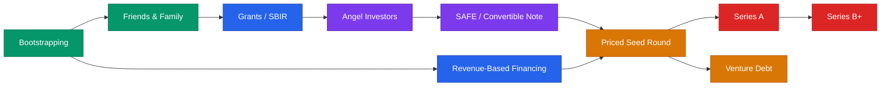

# Funding Types Playbook



## Core Rule
**Match the funding type to your stage, speed, and tolerance for dilution.** There is no single best way to fund a startup. The right answer depends on your business model, growth trajectory, and what you're willing to give up.

---

## Funding Types Comparison

| Type | Typical Amount | Dilution | Speed to Close | Legal Complexity | Best Stage |
|------|---------------|----------|----------------|-----------------|------------|
| Bootstrapping | $0–$100K (savings) | 0% | Immediate | None | Pre-idea to PMF |
| Friends & Family | $10K–$150K | 0–10% | Days to weeks | Low | Pre-seed |
| Angel Investors | $25K–$500K | 5–15% | 2–8 weeks | Low–Medium | Pre-seed to Seed |
| SAFE (Post-Money) | $100K–$2M | Defined at conversion | 1–2 weeks | Low | Pre-seed to Seed |
| SAFE (Pre-Money) | $100K–$2M | Undefined until conversion | 1–2 weeks | Low | Pre-seed to Seed |
| Convertible Note | $100K–$2M | Defined at conversion | 2–4 weeks | Medium | Pre-seed to Seed |
| Priced Seed | $500K–$4M | 15–25% | 4–8 weeks | High | Seed |
| Series A | $4M–$15M | 20–30% | 6–12 weeks | High | Growth |
| Series B+ | $15M–$100M+ | 15–25% | 8–16 weeks | Very High | Scale |
| Revenue-Based Financing | $50K–$3M | 0% (repayment from revenue) | 1–4 weeks | Low–Medium | Post-revenue |
| Grants (SBIR/State) | $50K–$2M | 0% | 3–9 months | Medium (application) | R&D / early stage |
| Venture Debt | $1M–$20M | 0% + small warrant | 4–8 weeks | Medium–High | Post-Series A |

---

## Detailed Breakdown

### Bootstrapping (Self-Funded)

**How it works:** You fund the business from savings, side income, or early customer revenue.

- **Typical amount:** $0–$100K
- **Dilution:** None
- **Pros:** Full control. No investor obligations. Forces revenue discipline. No board meetings.
- **Cons:** Limited runway. Slower growth. Personal financial risk. Can't outspend competitors.
- **When to use:** You have a business model that can generate revenue quickly. You want full ownership. You're building a lifestyle or capital-efficient business.
- **Graduate when:** You've validated PMF and need capital to scale faster than revenue allows.

### Friends & Family

**How it works:** People who trust you invest based on the relationship, not a formal diligence process.

- **Typical amount:** $10K–$150K
- **Dilution:** 0–10% (often structured as a loan or simple SAFE)
- **Pros:** Fast. Flexible terms. Based on trust.
- **Cons:** Relationship risk is real. Unsophisticated investors may have unrealistic expectations. Can create legal issues if not documented.
- **When to use:** You need a small amount to get to a proof point. You have people willing and able to lose the money.
- **Key rule:** Always use proper legal documents. Treat it like a real investment. Never take money someone can't afford to lose.

### Angel Investors

**How it works:** High-net-worth individuals invest personal capital, typically in exchange for equity via SAFEs or convertible notes.

- **Typical amount:** $25K–$500K (individual checks of $5K–$100K)
- **Dilution:** 5–15%
- **Pros:** Fast decisions. Bring industry connections and credibility. Less formal than VC.
- **Cons:** Limited follow-on capital. Varies wildly in quality of advice. Can be hard to manage a large angel syndicate.
- **When to use:** Pre-seed to seed stage. You want capital plus strategic value from specific individuals.
- **Where to find them:** AngelList, local angel groups, LinkedIn, founder referrals, accelerator demo days.

### SAFE Notes

**How it works:** A Simple Agreement for Future Equity. Not debt. Converts to equity at the next priced round.

**Post-Money SAFE (YC standard, recommended):**
- Dilution is known upfront. If you raise $1M on a $10M post-money cap, investors own 10%.
- Easier to manage cap table. Founders know exactly how much they're giving up.
- Use the standard docs from ycombinator.com/documents.

**Pre-Money SAFE (older format):**
- Dilution depends on how much total you raise before a priced round. More SAFEs = more dilution.
- Harder to model ownership. Can surprise founders at conversion.
- Still used, but post-money is now the standard.

| | Post-Money SAFE | Pre-Money SAFE |
|---|---|---|
| Dilution known? | Yes, at signing | No, only at conversion |
| Founder-friendly? | More predictable | Can be worse with multiple rounds |
| Standard? | YC standard since 2018 | Older format |
| Cap table clarity | High | Low |

- **Typical terms:** $5M–$15M valuation cap. Sometimes includes a 15–25% discount. MFN clause for early investors.
- **Pros:** Fast (1 page). Low legal cost ($0–$2K). No interest, no maturity date. Investor-friendly for early bets.
- **Cons:** Can stack dilution if you raise multiple SAFEs. No voting rights until conversion. Some institutional investors won't use them.

### Convertible Notes

**How it works:** A loan that converts to equity at the next priced round, usually with a valuation cap and discount.

- **Typical amount:** $100K–$2M
- **Dilution:** Defined at conversion (cap + discount)
- **Key terms:** Interest rate (typically 5–8%), maturity date (18–24 months), valuation cap, discount rate.
- **Pros:** Well-understood by investors. Creates urgency via maturity date. Interest accrues in favor of investor.
- **Cons:** It's debt — if you don't raise a priced round by maturity, you owe the money. More legal complexity than a SAFE. Costs $3K–$10K in legal fees.
- **When to use:** Investor prefers notes over SAFEs. You're raising from a mix of institutional and angel investors. You're comfortable with a maturity deadline.

### Priced Rounds (Seed, Series A, Series B+)

**How it works:** You set a company valuation and sell a specific percentage of equity, typically preferred stock with negotiated rights.

- **Seed:** $500K–$4M. Institutional seed funds + angels. Pre-money valuations of $5M–$20M.
- **Series A:** $4M–$15M. Lead VC sets terms. Pre-money valuations of $20M–$80M. Requires repeatable growth.
- **Series B+:** $15M–$100M+. Growth-stage VCs. Clear path to market leadership.

| Term | What It Means | Watch Out For |
|------|--------------|---------------|
| Liquidation preference | Investors get paid first in an exit | Anything above 1x non-participating is aggressive |
| Board seat | Investor gets a vote on major decisions | Keep board at 3 (2 founders + 1 investor) at Seed |
| Anti-dilution | Protects investor if next round is a down round | Broad-based weighted average is standard |
| Pro-rata rights | Right to maintain ownership % in future rounds | Standard for lead investors |
| Drag-along | Majority can force a sale | Standard, but review threshold |

- **Pros:** Clean cap table. Clear ownership. Institutional credibility. Larger amounts.
- **Cons:** Slow (2–4 months). Expensive ($15K–$50K+ in legal). Board obligations. Investor expectations for venture-scale returns.
- **When to use:** You have strong traction and need significant capital. You want institutional partners and governance.

### Revenue-Based Financing (RBF)

**How it works:** You receive capital and repay a fixed multiple (typically 1.3x–2x) as a percentage of monthly revenue until repaid.

- **Typical amount:** $50K–$3M
- **Dilution:** Zero. This is repayment, not equity.
- **Typical terms:** Repay 1.3x–2x the amount. Monthly payments = 2–8% of revenue. No fixed timeline.
- **Providers:** Clearco, Pipe, Arc, Lighter Capital, Capchase.
- **Pros:** No dilution. Fast approval. Payments scale with revenue. No board seats.
- **Cons:** Reduces cash flow during repayment. More expensive than traditional debt. Requires existing revenue.
- **When to use:** You have consistent monthly revenue ($10K+ MRR). You need capital for a specific growth initiative (inventory, marketing, hiring). You don't want dilution.

### Grants (SBIR, State Programs)

**How it works:** Government or nonprofit programs award non-dilutive capital, typically for research, innovation, or economic development.

- **SBIR/STTR Phase I:** ~$275K for 6–12 months of R&D feasibility.
- **SBIR/STTR Phase II:** ~$1M–$2M for full R&D and commercialization.
- **State programs:** Vary widely. Missouri examples: Arch Grants ($50K), Missouri Technology Corporation, ITEN.
- **Pros:** Non-dilutive. Validates your technology. Builds credibility.
- **Cons:** Slow (3–9 month application cycles). Competitive. Reporting requirements. Restricted use of funds.
- **When to use:** You're building deep tech, health tech, or research-driven products. You have patience for long timelines. You want to preserve equity.

### Venture Debt

**How it works:** A loan (typically from specialized lenders) taken alongside or after an equity round. Secured against company assets or backed by VC investor relationships.

- **Typical amount:** $1M–$20M (usually 25–50% of last equity round)
- **Dilution:** Minimal — typically a small warrant for 0.1–0.5% equity
- **Typical terms:** 2–4 year term. Interest rate 8–15%. May require revenue or equity milestones.
- **Providers:** Silicon Valley Bank, Western Technology Investment, Lighter Capital, Trinity Capital.
- **Pros:** Extends runway without significant dilution. Useful bridge between rounds. Keeps cap table clean.
- **Cons:** Requires existing VC backing or strong revenue. Must be repaid regardless of outcome. Covenants and reporting requirements.
- **When to use:** Post-Series A. You need 6–12 months of extra runway. You have strong revenue or a committed VC syndicate.

---

## Which Funding Is Right for You?

Answer these questions honestly:

**1. Do you have revenue?**
- No revenue → Bootstrapping, F&F, Angels, SAFEs, Grants
- Some revenue ($5K–$50K MRR) → RBF, Angels, Seed round
- Strong revenue ($50K+ MRR) → RBF, Series A, Venture Debt

**2. How fast do you need capital?**
- This week → Bootstrapping, F&F
- Within 1 month → SAFE, Angels, RBF
- Within 3 months → Priced round, Venture Debt
- Within 6–9 months → Grants

**3. How much dilution can you accept?**
- Zero → Bootstrapping, Grants, RBF, Venture Debt
- Minimal (5–15%) → Angels, SAFEs
- Significant (15–30%) → Priced rounds

**4. What's your growth model?**
- Lifestyle / steady growth → Bootstrapping, RBF, Grants
- Venture-scale (10x+ returns possible) → SAFEs, Priced rounds, Venture Debt

**5. What stage are you at?**

```
Pre-idea       → Bootstrap
Idea + team    → F&F, Grants, Angels
MVP + users    → SAFE, Angels
PMF + revenue  → Seed round, RBF
Scaling        → Series A, Venture Debt
Market leader  → Series B+, Venture Debt
```

---

## Common Mistakes

1. **Raising too early.** You give up too much equity before you have leverage.
2. **Raising too much.** High valuation sets expectations you may not meet. Down rounds are painful.
3. **Raising too little.** Running out of money mid-execution is worse than not raising at all.
4. **Wrong instrument.** Using a priced round when a SAFE would suffice costs time and legal fees.
5. **Stacking SAFEs without tracking dilution.** Multiple pre-money SAFEs can dilute founders far more than expected.
6. **Ignoring non-dilutive options.** Grants and RBF exist. Use them.
7. **Taking money from wrong investors.** Misaligned investors create years of friction. Check references.

---

## Quick Reference: Legal Cost by Instrument

| Instrument | Founder Legal Cost | Typical Timeline |
|------------|-------------------|-----------------|
| SAFE (YC standard) | $0–$2K | 1–2 weeks |
| Convertible Note | $3K–$10K | 2–4 weeks |
| Priced Seed Round | $15K–$30K | 4–8 weeks |
| Series A | $25K–$50K+ | 6–12 weeks |
| RBF | $0–$5K | 1–4 weeks |
| Grant application | $0 (time cost) | 3–9 months |
| Venture Debt | $10K–$25K | 4–8 weeks |

**Disclaimer:** This is educational information only. Consult a startup attorney before signing any investment document or term sheet. Specific terms, amounts, and availability vary by market and change over time.
