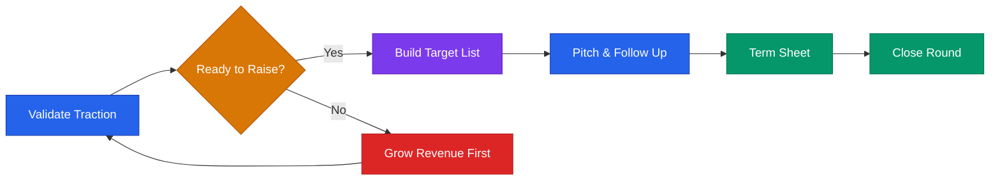

# Fundraising Playbook



## Core Rule
**Raise when you have traction, not when you're desperate.** Investors fund momentum.  
Your binder is the paperwork. Your traction is the pitch.

---

## Should You Raise?

Ask honestly:
- Do I have a clear use of funds that will 10x the business?
- Have I validated PMF, or am I raising to find it? (If the latter — wait)
- Am I comfortable with dilution, board seats, and investor obligations for 7–10 years?
- Is venture-scale (10x+ return) the right model for this business?

**Alternatives to VC:**
- Revenue-based financing (Clearco, Pipe, Arc)
- SBIR / STTR grants (up to $2M for tech + research)
- State/local non-dilutive grants and accelerators (check your regional playbook)
- Grow to ramen profitability → raise from position of strength
- Angel investors — faster, less dilutive than institutional

---

## Funding Stages

| Stage | Amount | Instrument | What Investors Want |
|-------|--------|-----------|---------------------|
| Pre-Seed | $150K–$750K | SAFE / Angel round | Founder + idea + early signal |
| Seed | $750K–$3M | SAFE or Priced Round | PMF signal + early revenue + team |
| Series A | $4M–$15M | Priced Round | Repeatable GTM + growing MRR |
| Series B+ | $15M+ | Priced Round | Efficient growth + strong NRR |

---

## SAFE Note Basics

Key terms:
- **Valuation Cap:** The max valuation at conversion (lower = better for investor)
- **Discount Rate:** % off the next round price (typically 15–25%)
- **MFN Clause:** Early investors get better terms if you offer them to others
- **Pro-rata rights:** Right to invest in future rounds to maintain %

Use YC's standard Postmoney SAFE: ycombinator.com/documents

---

## Pitch Process (End-to-End)

```
Step 1: Build binder (references/investor-binder.md)
Step 2: Build target list (50+ investors)
Step 3: Warm intro campaign (priority) + cold outreach (parallel)
Step 4: First meetings — listen more than you pitch
Step 5: Send materials (exec summary → deck → data room if interest)
Step 6: Follow-up cadence — persistent but not annoying
Step 7: Diligence — provide data room, reference calls
Step 8: Term sheet → negotiate → close
Step 9: Post-close investor relations (monthly updates)
```

---

## Building Your Investor Target List

Filter by: stage match, thesis match, check size, portfolio fit.

**Target 50 names in 3 tiers:**
- Tier 1 (dream): 10–15 — best fit, most active in your space
- Tier 2 (strong): 20–25 — good fit, less active
- Tier 3 (backup): 10–15 — loose fit, use to build momentum

Strategy: Start with Tier 2 to practice. Save Tier 1 for when you're sharp.

Tools: Crunchbase, Signal (NFX), Landscape.VC

---

## Warm Intro vs Cold Outreach

### Warm Intro (strongly preferred)
Ask for a "forward intro" using this blurb:
```
"I'm building [Company] — we help [ICP] [outcome]. We have [traction signal].
Raising [amount] and would love an intro to [Investor].
Here's my exec summary: [link]"
```

### Cold Outreach
```
Subject: [Company] — [One-line value prop]

Hi [Name],
[1 sentence — why them specifically. Reference portfolio or thesis.]
[Company] helps [ICP] [outcome] — [traction signal].
Raising [amount] on a [SAFE]. Worth 20 minutes?
[Name] | [Email] | [Deck link]
```

---

## Meeting Prep

Before: research portfolio + thesis. Know your top 5 metrics cold. Prep for top 10 Qs.  
During: lead with traction. Ask *"What would make this a yes for you?"*  
After (within 24 hours): send follow-up addressing their specific questions + clear next step.

---

## Handling Rejection

When you get a "no": thank them, ask what held them back (data, not argument), ask for a referral, log and follow up in 6 months with traction update.

**Typical seed funnel:** 50 outreach → 25 first meetings → 10 second meetings → 5 diligence → 1–3 term sheets

---

## Due Diligence Checklist

- [ ] Clean cap table (fully diluted)
- [ ] All legal docs (incorporation, vesting, IP assignments, SAFEs)
- [ ] Financial model (12–24 months)
- [ ] Key metrics dashboard
- [ ] Customer contracts or LOIs
- [ ] Product demo
- [ ] Team bios + LinkedIn
- [ ] References: 2–3 customers willing to take a call

Full data room structure → see `references/investor-binder.md`

---

## Post-Funding Investor Relations

Monthly update (send even when things are hard):
```
Subject: [Company] — [Month] Update
Highlights: [Win 1] / [Win 2]
MRR: $X (↑ X% MoM) | Customers: X | Runway: X months
Challenges: [Honest]
Ask: [Specific intro, feedback, or connection]
```

---

## Missouri + Regional Funding Resources

| Resource | Type | Amount |
|----------|------|--------|
| Arch Grants | Non-dilutive grant | $50K |
| Capital Innovators | Accelerator | ~$50K |
| ITEN | Network + support | Varies |
| Cultivation Capital | VC (St. Louis) | Seed–Series A |
| Missouri Technology Corporation | Grant/loan | Varies |
| SBA SBIR/STTR | Federal grant | Phase I: $275K |

Verify details directly — program availability changes.

**Disclaimer:** Educational context only. Consult a startup attorney before signing any term sheet or investment document.
